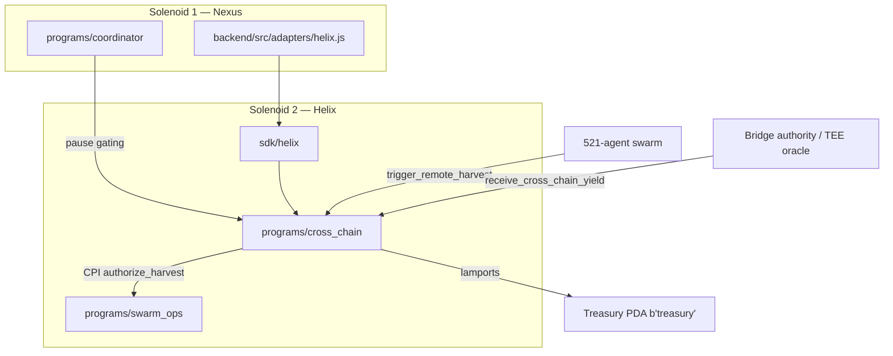

# YieldSwarm Helix — Solenoid 2 Cross-Chain Bridge

> **Solenoid 2** extends the Nexus Chain coordinator (Solenoid 1) with on-chain cross-chain yield harvesting, treasury settlement, and agent-gated execution via `swarm_ops`.

## Architecture



## Programs

| Program | ID (local/devnet) | Role |
|---------|-------------------|------|
| `cross_chain` | `9RoCmfzrPkbpSCr9a74cJJPGbXtzcQos6bbcePu7aSUt` | Harvest triggers, yield callbacks, treasury |
| `swarm_ops` | `6BbH4rvmxERTbcAbEat9SzT3N3P9fEFWvoAD3EsJ3BAz` | Agent registry, daily limits, permissions |
| `coordinator` | `DXGVx4HsitGdFawg5KL68SAq9URhTaNL9tZAWWGGbo7p` | Global / bridge pause (Nexus) |

> Run `anchor keys sync` after `anchor build` to align IDs with your keypairs.

## PDA seeds

| Account | Seeds |
|---------|-------|
| Treasury | `["treasury"]` |
| Bridge state | `["bridge_state"]` |
| Harvest request | `["harvest", agent, nonce_le_bytes]` |
| Agent registry | `["agent", agent]` |
| Swarm config | `["swarm_config"]` |
| Coordinator | `["coordinator"]` |

## Instructions (`cross_chain`)

| Instruction | Signer | Description |
|-------------|--------|-------------|
| `initialize_treasury` | authority | Create treasury PDA |
| `initialize_bridge` | authority | Wire bridge to coordinator + swarm_ops |
| `update_bridge_config` | authority | Update limits, fees, bridge authority |
| `set_bridge_pause` | authority | Emergency pause |
| `trigger_remote_harvest` | agent | Start cross-chain harvest (CPI → swarm_ops) |
| `receive_cross_chain_yield` | bridge_authority | Verified callback; deposits to treasury |

## Bootstrap (localnet)

```bash
# Prerequisites: Solana CLI, Anchor 0.30.1, Rust 1.79+
solana-keygen new -o ~/.config/solana/id.json   # if needed
anchor build
anchor deploy

# 1. Initialize coordinator (Nexus)
anchor run initialize-coordinator   # or use SDK/admin script

# 2. Initialize treasury + bridge
# 3. swarm_ops: initialize_swarm_config + register_agent per agent
```

## TypeScript SDK

```bash
cd sdk/helix
npm install
npm run build
npm test
```

```typescript
import { Connection, Keypair } from '@solana/web3.js';
import { HelixClient, CHAIN_IDS } from '@yieldswarm/helix-sdk';

const connection = new Connection('https://api.devnet.solana.com');
const agent = Keypair.generate();

const client = new HelixClient({
  connection,
  wallet: { publicKey: agent.publicKey, signTransaction: async (tx) => tx },
});

const sig = await client.triggerRemoteHarvest(agent, {
  originChainId: CHAIN_IDS.HELIX,
  targetChainId: CHAIN_IDS.SOLANA,
  amount: 1_000_000n,
});
```

### React hooks

```tsx
import { useHelixBridge, useHelixGasEstimate, useCrossChainYield } from '@yieldswarm/helix-sdk/hooks';

const { config, paused, triggerHarvest } = useHelixBridge({ connection, wallet });
const { estimate } = useHelixGasEstimate({ connection, wallet, harvestParams });
const { snapshot, subscribe } = useCrossChainYield({ connection, wallet });
```

## Security

- **Pause layers:** `coordinator` global/bridge pause + `cross_chain.set_bridge_pause`
- **Agent limits:** `swarm_ops.authorize_harvest` CPI enforces daily caps + permission bits
- **Signatures:** `receive_cross_chain_yield` verifies ed25519 pre-instruction over canonical message hash
- **Reentrancy:** `bridge_state.processing` guard during harvest/receive
- **Slippage:** max 500 bps (0.5%) enforced on-chain

## Integration map

| Layer | Path | Integration |
|-------|------|-------------|
| Nexus backend | `backend/src/adapters/helix.js` | Activation + readiness; call SDK for settlement quotes |
| Python executor | `services/cross_chain/executor.py` | Off-chain strategy jobs → SDK harvest triggers |
| Arena API | `backend/src/adapters/crossChain.js` | Telemetry ingestion |
| Phase 1 env | `.env.template` | `HELIX_CHAIN_BRIDGE_KEY`, `KV_SECRET_REF` for bridge authority |
| Gospel constants | `agents/governance/gospel.py` | `TREASURY_SPLIT_BPS` 50/30/15/5 |

## Build notes

```bash
anchor build          # generates target/idl/cross_chain.json
cp target/idl/cross_chain.json sdk/helix/src/idl/
cd sdk/helix && npm run build
```

IDL discriminators in the committed SDK IDL are placeholders until first `anchor build`.

## Related docs

- `docs/cursor-prompts/PHASE2_HELIX_CHAIN_BRIDGE.md` — off-chain Azure TEE bridge (Phase 2 TS engine)
- `docs/cursor-prompts/PHASE2_SWARM_OPS_INTEGRATION.md` — testing + swarm_ops follow-up prompt
- `docs/PHASE1_SECURE_ENV.md` — Key Vault injection
- `docs/CROSS_CHAIN_MVP.md` — Python Jupiter / Uniswap MVP
