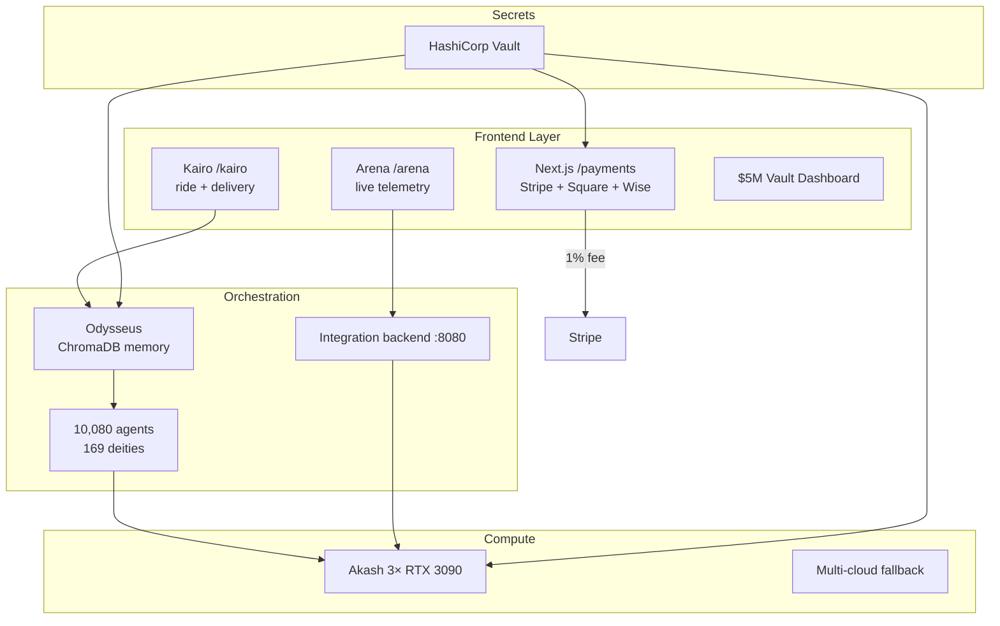

# INTEGRATION_REPORT.md — YieldSwarm + Kairo Full System

**Date:** 2026-06-15  
**Branch:** `main`  
**Prongs completed:** 16/16 + Stripe payment rail + cross-component pass

---

## Architecture

---

## Key integration paths

| From | To | Protocol | Notes |
|------|-----|----------|-------|
| `/payments` | Stripe API | HTTPS | Credit + 1% fee via `calculateCustomerPayment` |
| `/api/webhooks/stripe` | Ledger | Webhook | Signature-verified settlement |
| `/arena` | Akash workers | HTTP poll | Telemetry endpoints |
| Backend `:8080` | Arena + dashboard | REST | `/api/telemetry/*`, `/api/sovereign/state` |
| Kairo API | Identity pipeline | REST | Signed telemetry + rewards |
| Vault | All runtimes | AppRole/JWT | `scripts/lib/vault-env.sh` |

---

## Prong completion matrix

| # | Prong | Status | Key files |
|---|-------|--------|-----------|
| 1 | Merge & branch strategy | ✅ | `MERGE_STRATEGY.md`, `BRANCHES.md` |
| 2 | Akash production deploy | ✅ | `deploy/deploy-swarm-monolith.yaml`, `scripts/deploy-to-akash.sh` |
| 3 | Vault hardening | ✅ | `vault/policies/`, `vault/setup/` |
| 4 | Odysseus integration | ✅ | `services/odysseus/`, `agents/odysseus_memory.py` |
| 5 | Kairo crypto identity | ✅ | `kairo/backend/`, `kairo/frontend/` |
| 6 | Domains + frontend | ✅ | `DOMAINS.md`, `vercel.json` |
| 7 | Payment rails + wallet | ✅ | `src/app/payments/`, Stripe/Square/Wise/Web3 |
| 8 | $5M vault dashboard | ✅ | `dashboard/sovereign-dashboard.html` |
| 9 | Multi-cloud fallback | ✅ | `infra/terraform/`, `deploy/terraform/` |
| 10 | Sovereign core | ✅ | `iteration-100/`, `deploy/systemd/` |
| 11 | Emission router | ✅ | `contracts/GreatDeltaEmissionRouter.sol` |
| 12 | Arena live metrics | ✅ | `src/app/arena/`, `backend/src/routes/api.js` |
| 13 | Deploy scripts | ✅ | `scripts/deploy-all.sh`, `make deploy` |
| 14 | Secrets audit | ✅ | `scripts/secrets-audit.sh` |
| 15 | Documentation | ✅ | All `*.md` runbooks |
| 16 | Integration + smoke tests | ✅ | `scripts/smoke-test.sh`, `tests/integration/smoke_test.sh` |

---

## Stripe fee model

- User enters **credit amount** (balance to receive)
- Customer is charged **credit + 1%** platform fee
- Example: $100 credit → $101 total charge
- Implementation: `src/lib/payments/fees.ts` → `calculateCustomerPayment()`

---

See `PRODUCTION_READINESS.md` for deploy checklist and sign-off.
