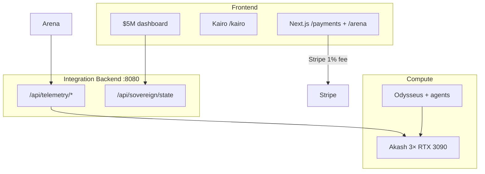

# INTEGRATION_REPORT.md — YieldSwarm + Kairo Full System

**Date:** 2026-06-15  
**Branch:** `main`  
**Prongs completed:** 16/16 + Stripe + cross-component pass

---

## Architecture

---

## Key integration paths

| From | To | Notes |
|------|-----|-------|
| `/payments` | Stripe API | Credit + 1% via `calculateCustomerPayment()` |
| `/api/webhooks/stripe` | Ledger | Signature-verified settlement |
| `/arena` | Akash workers | HTTP telemetry poll |
| Backend `:8080` | Arena + dashboard | Live Akash/Odysseus aggregation |
| Vault | All runtimes | `scripts/lib/vault-env.sh` |

---

## Prong completion (16/16)

All God Prompt prongs have deliverable artifacts. See `MERGE_STRATEGY.md` for
branch consolidation history. Stripe payment rail added in final merge.

---

See `PRODUCTION_READINESS.md` for test results, deploy checklist, and sign-off.
