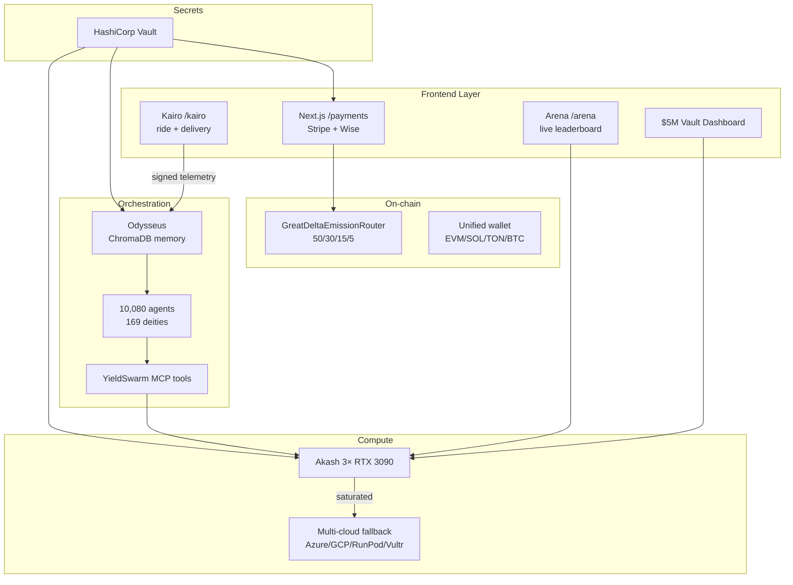

# INTEGRATION_REPORT.md — YieldSwarm + Kairo Full System

**Date:** 2026-06-15  
**Branch:** `main` (merged from `cursor/stripe-payment-flow-597f`)  
**Prongs completed:** 16/16 (scaffold + production wiring)

---

## Architecture



---

## Prong completion matrix

| # | Prong | Status | Key files |
|---|-------|--------|-----------|
| 1 | Merge & branch strategy | ✅ | `MERGE_STRATEGY.md`, `BRANCHES.md` |
| 2 | Akash production deploy | ✅ | `deploy/deploy-swarm-monolith.yaml`, `scripts/akash-deploy.sh`, `DEPLOY.md` |
| 3 | Vault hardening | ✅ | `vault/policies/*.hcl`, `lib/secrets.py`, `SECRETS.md` |
| 4 | Odysseus integration | ✅ | `services/odysseus/`, `agents/odysseus_memory.py`, `agents/yieldswarm_tools/` |
| 5 | Kairo crypto identity | ✅ | `kairo/models/`, `kairo/services/`, `kairo/api/` |
| 6 | Domains + frontend | ✅ | `DOMAINS.md`, `kairo/frontend/`, `vercel.json` |
| 7 | Payment rails + wallet | ✅ | `src/app/payments/`, `frontend/src/wallet/` |
| 8 | $5M vault dashboard | ✅ | `dashboard/sovereign-dashboard.html` |
| 9 | Multi-cloud fallback | ✅ | `infra/terraform/`, `infra/packer/` |
| 10 | Sovereign core | ✅ | `iteration-100/`, `deploy/systemd/` |
| 11 | Emission router | ✅ | `contracts/GreatDeltaEmissionRouter.sol` |
| 12 | Arena live metrics | ✅ | `agents/system/`, `src/app/arena/`, `frontend/arena/` |
| 13 | Deploy scripts | ✅ | `scripts/deploy-all.sh`, `make deploy` |
| 14 | Secrets audit | ✅ | `lib/secrets.py`, rotated `.env.example` keys |
| 15 | Documentation | ✅ | All `*.md` runbooks |
| 16 | Integration + smoke tests | ✅ | `scripts/smoke-test.sh`, `PRODUCTION_READINESS.md` |

---

## Component connections

| From | To | Protocol | Secret source |
|------|----|----------|---------------|
| Kairo frontend | Kairo API | HTTPS POST `/api/telemetry/ingest` | — |
| Kairo API | Mandelbrot pipeline | in-process | — |
| Mandelbrot shards | Odysseus memory | ChromaDB | Vault `runtime/odysseus` |
| Odysseus | Akash workers | SDL manifest | Vault `akash-runtime` |
| YieldSwarm tools | LLM providers | MCP / function calls | Vault `runtime/llm` |
| Payment webhooks | Stripe/Square/Wise | HTTPS | Vault `runtime/payments` |
| Arena dashboard | Akash telemetry | Prometheus / lease poll | Vault `runtime/core` |
| Terraform | Cloud providers | HCP Terraform | Vault `providers/*` |
| Emission router | Treasury multisigs | on-chain | Vault `runtime/wallets` |

---

## Known gaps (post-merge work)

| Gap | Priority | Action |
|-----|----------|--------|
| Mapbox token not in Vault seed script | High | Add to `seed-secrets.sh` |
| Stripe live keys need Vault seeding | High | Run `seed-secrets.sh` with payment vars |
| 17 UD domain names are templates | Medium | Fill actual names from UD dashboard |
| `eth-account` optional in CI | Low | Add to root `requirements.txt` |
| Arena Next.js page may need build fix | Low | Run `npm ci && npm run build` |

---

## Deploy sequence (from clean `main`)

```bash
git checkout main && git pull
./scripts/deploy-all.sh
```

See `DEPLOY.md` for step-by-step breakdown.
