```mermaid
---
title: YieldSwarm Helix Chain + 35-Layer Neural Mesh - Single Pane of Glass v2.0
config:
  theme: dark
  flowchart:
    curve: basis
---

flowchart TB
    %% ======================== INGRESS LAYER ========================
    subgraph Ingress ["USER / INGRESS LAYER (17 Domains)"]
        direction LR
        Vercel["Vercel (Next.js)<br/>Payments + Frontend dApp"]
        Render["Render<br/>Integration Backend API"]
        AkashWorkers["Akash RTX 3090 Workers<br/>Bittensor + Inference"]
        MultiCloud["Multi-Cloud Fallback<br/>Azure • GCP • RunPod • Vultr"]
        Unstoppable["Unstoppable Domains<br/>17 Custom Domains"]
    end

    Ingress --> EdgeRouting["17-DOMAIN EDGE ROUTING + API LAYER<br/>(9 Frontend Zones + 8 Backend Fluid Compute)"]

    %% ======================== HELIX CHAIN / 35-LAYER CORE ========================
    subgraph HelixCore ["HELIX CHAIN / 35-LAYER NEURAL MESH CORE"]
        direction TB

        L1_3["Layers 1-3<br/>Foundational Ingress + TEE Verification + JPL HORIZONS"]
        L4_6["Layers 4-6<br/>Precessional Oracle + Agent Performance Index"]
        L7_9["Layers 7-9<br/>Multi-Cloud DePIN Synthesizer + Akash Lease Manager + Vault Injection"]
        L10["Layer 10<br/>MASTER SOLENOID ANCHOR (Core Orchestration)"]
        L11_13["Layers 11-13<br/>Renaissance Polymath Refiners<br/>(Tesla Resonance • da Vinci Schematic • Michelangelo Structural)"]
        L14_22["Layers 14-22<br/>Sovereign Self-Healing Loops + Great Delta Emission Router<br/>(50/30/15/5) + Dimensional Singularity"]
        L23_28["Layers 23-28<br/>Agent Mutation Engine + 10,080 Mutated Agents + 169 Deity Manifests"]
        L29_31["Layers 29-31<br/>Odysseus Central Memory (ChromaDB) + RTX 3090 Model Router"]
        L32_34["Layers 32-34<br/>Kairo Driver Pipeline<br/>(Crypto Identity + Signed Telemetry → Mandelbrot/Tree of Life)"]
        L35["Layer 35<br/>OMNI APEX<br/>Sovereign Core + $5M Vault Telemetry + Agent Marketplace"]

        L1_3 --> L4_6 --> L7_9 --> L10 --> L11_13 --> L14_22 --> L23_28 --> L29_31 --> L32_34 --> L35
    end

    %% Data Flow
    KairoTelemetry["Kairo Signed Telemetry"] --> Mandelbrot["Mandelbrot / Tree of Life"]
    Mandelbrot --> SovereignLoops["Sovereign Loops"]
    SovereignLoops --> Treasury["Treasury Rebalancer<br/>(50/30/15/5)"]

    %% ======================== INTELLIGENCE LAYER ========================
    subgraph Intelligence ["INTELLIGENCE + EXECUTION LAYER"]
        Odysseus["Odysseus<br/>(LiteLLM + ChromaDB)"]
        ModelRouter["Model Router<br/>(Akash RTX 3090 aware)"]
        SovereignRuntime["Sovereign Runtime<br/>(Self-Healing Leases)"]
        GreatDelta["Great Delta Emission Router"]
        AgentMarketplace["Agent Marketplace"]
    end

    %% ======================== SECRETS + INFRA ========================
    subgraph Infra ["SECRETS + INFRA LAYER"]
        Vault["HashiCorp Vault<br/>(Runtime Injection + AppRoles)"]
        AkashInfra["Akash RTX 3090 Workers"]
        MultiCloudInfra["Multi-Cloud Capacity"]
    end

    %% ======================== REVENUE LAYER ========================
    subgraph Revenue ["REVENUE + PAYMENTS LAYER"]
        Payments["Payments Stack<br/>Square + Wise + Web3"]
        KairoPay["Kairo 1% Fee + 2× Driver Pay"]
        VaultDashboard["$5M Vault Telemetry Dashboard"]
    end

    %% Connections
    EdgeRouting --> L1_3
    L32_34 --> KairoTelemetry
    L35 --> Odysseus
    Treasury --> SovereignRuntime
    Odysseus --> Vault
    ModelRouter --> Vault
    SovereignRuntime --> Vault
    GreatDelta --> Vault
    Vault --> AkashInfra
    AkashInfra --> MultiCloudInfra
    MultiCloudInfra --> Payments
    AgentMarketplace --> Payments
    Payments --> KairoPay
    KairoPay --> VaultDashboard

    %% Styling
    classDef ingress fill:#1a1a2e,stroke:#00d4ff,color:#fff
    classDef core fill:#0f3460,stroke:#00ff9f,color:#fff
    classDef intel fill:#16213e,stroke:#48dbfb,color:#fff
    classDef infra fill:#16213e,stroke:#feca57,color:#fff
    classDef revenue fill:#1a1a2e,stroke:#ff6b6b,color:#fff

    class Ingress,EdgeRouting ingress
    class HelixCore,L1_3,L4_6,L7_9,L10,L11_13,L14_22,L23_28,L29_31,L32_34,L35,KairoTelemetry,Mandelbrot,SovereignLoops,Treasury core
    class Intelligence,Odysseus,ModelRouter,SovereignRuntime,GreatDelta,AgentMarketplace intel
    class Infra,Vault,AkashInfra,MultiCloudInfra infra
    class Revenue,Payments,KairoPay,VaultDashboard revenue
```

# YieldSwarm — Single Pane of Glass v2.0

Canonical architecture visual: **Helix Chain + 35-Layer Neural Mesh + 17 Domains**.

See also: [`docs/ARCHITECTURE.md`](docs/ARCHITECTURE.md) (investor view + repo anchors) · [`docs/HELIX_SINGLE_PANE.md`](docs/HELIX_SINGLE_PANE.md) (layer detail).

---

---

## Legend

| Term | Meaning |
|------|---------|
| **Helix Chain** | Ascending computational solenoid — data accelerates through layers |
| **35-Layer Neural Mesh** | Full sovereign stack from ingress to Omni Apex |
| **17 Domains** | 9 frontend zones + 8 backend fluid compute |
| **Layer 10** | Master Solenoid Anchor — core orchestration |
| **Layers 14–22** | Self-healing + Great Delta + dimensional singularity |
| **Layer 35** | Omni Apex — sovereign core + marketplace |

## Data flow

**Kairo Signed Telemetry → Mandelbrot / Tree of Life → Sovereign Loops → Treasury (50/30/15/5)**

## Live surfaces

| Pane | URL / command |
|------|----------------|
| Helix | `GET /api/helix/status` · `./scripts/activate-helix.sh` |
| Arena | `/arena?workers=<lease-uri>` |
| Council | `/council/status.html` |
| Sovereign | `GET /api/sovereign/state` |
| Akash deploy | `make deploy-akash-europlots` |
| Vault runtime | `docs/VAULT_AKASH_RUNTIME.md` |
