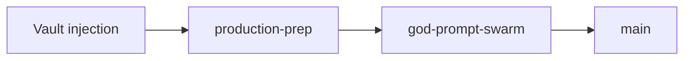

# Swarm Coordination — Cursor Multi-Agent Rules

How to run the 6 God Prompt tasks (and more) in parallel **without conflicts**.

## Branch naming

```
cursor/<topic>-9c82
```

Examples: `cursor/mcp-setup-9c82`, `cursor/async-hardening-9c82`

**Never** push directly to `main`. One PR per stream.

## File ownership (avoid merge conflicts)

| Stream | Owns these paths | Do NOT touch |
|--------|------------------|--------------|
| MCP setup | `.cursor/`, `MCP_SETUP.md` | `akash/`, `terraform/` |
| Deployment | `scripts/deploy*.sh`, `Makefile`, `DEPLOYMENT.md` | `funding/` |
| Async/cron | `backend/src/lib/`, `backend/src/jobs/` | `akash/lease-manager.py` |
| Akash lease | `akash/lease-manager.py`, `deploy/akash*.yml` | `backend/` |
| Funding | `funding/` | All code paths |
| Coordination | `TODAY_TASKS.md`, `PRODUCTION_READINESS_REPORT.md` | Feature code |

## Merge order



1. `cursor/vault-akash-injection-9c82`
2. `cursor/production-prep-9c82`
3. `cursor/god-prompt-swarm-9c82`
4. Feature branches (MCP, async, etc.)

## Pre-merge checklist (each agent)

- [ ] `make preflight` or relevant tests pass
- [ ] No secrets in diff
- [ ] PR targets `main` as draft
- [ ] Update `TODAY_TASKS.md` checkbox if task complete

## Communication protocol

- **Status:** Comment on PR with `STREAM: <name> STATUS: <done|blocked>`
- **Blockers:** Tag human for credentials only — never paste secrets in PR
- **Overlap:** If two agents need the same file, **sequential merge** — second agent rebases after first lands

## 7th coordination prompt (copy to meta-agent)

```
You are the YieldSwarm Swarm Coordinator.

Monitor open PRs on branch prefix cursor/*-9c82.
Enforce file ownership from SWARM_COORDINATION.md.
Merge in order: vault → production-prep → god-prompt → feature branches.
After each merge: run make preflight, update TODAY_TASKS.md, sync environment branches.
Block any PR that contains literal API keys or mnemonics.
Report status in PRODUCTION_READINESS_REPORT.md.
```

## Secrets rule

| Platform | Where secrets live |
|----------|-------------------|
| Vault | `vault/scripts/seed-secrets.sh` source env |
| Akash containers | Wrapped SecretID → Vault Agent |
| Vercel | Project env dashboard |
| Render | `render.yaml` sync: false + dashboard |
| Azure | Vault `providers/azure` → Terraform |
| Local dev | `.env` (gitignored) |

**Zero secrets in git. Ever.**

## When to stop parallel work

- Two agents failed the same test → one agent fixes, others pause that file
- `main` is broken → all streams freeze; coordinator runs `make preflight` + smoke tests
- Human says "ship X first" → reprioritize `TODAY_TASKS.md` P0
