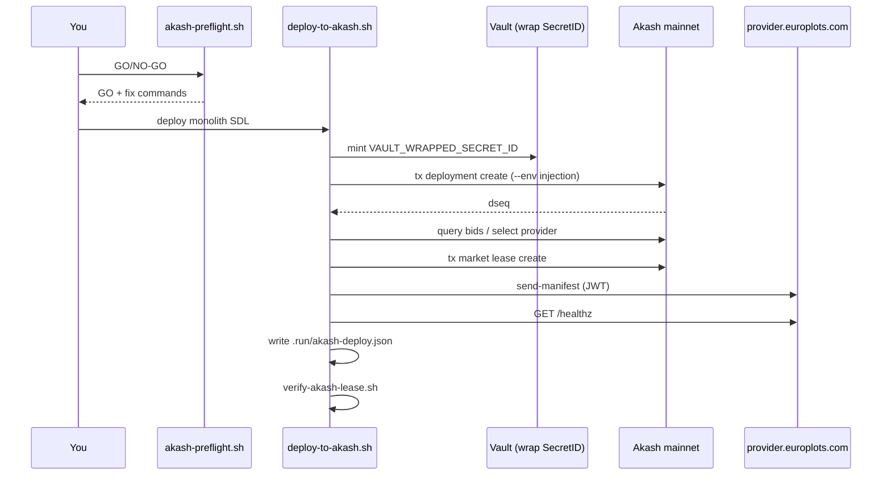

# Akash Production Deployment

Deploy YieldSwarm workers to **Akash mainnet** using `provider-services` with
**JWT authentication** and **Vault runtime secret injection**.

| Item | Value |
|------|-------|
| **Script** | `scripts/deploy-to-akash.sh` |
| **Preflight** | `scripts/akash-preflight.sh` |
| **Verify** | `scripts/verify-akash-lease.sh` |
| **SDL** | `deploy/deploy-swarm-monolith.yaml` (3× RTX 3090) |
| **Preferred provider** | `akash18ga02jzaq8cw52anyhzkwta5wygufgu6zsz6xc` (provider.europlots.com) |

**Vault + SDL catalog:** [`docs/VAULT_AKASH_DEPLOY.md`](VAULT_AKASH_DEPLOY.md) — backend, Bittensor miner, Odysseus render-time secrets.

---

## Codespace quick start (copy-paste)

```bash
# 0. Install CLI (if missing)
curl -sSfL https://raw.githubusercontent.com/akash-network/provider/main/install.sh | bash

# 1. Wallet + config
cp deploy/akash.env.example deploy/akash.env
# Edit deploy/akash.env — set AKASH_KEY_NAME, keyring backend

# 2. Fund wallet (need >= 0.5 AKT before deploy)
provider-services keys show yieldswarm -a --keyring-backend os
provider-services query bank balances <akash1...> --node https://rpc.akashnet.net:443

# 3. Vault (operator token — never commit)
export VAULT_ADDR=https://vault.yieldswarm.io:8200
export VAULT_TOKEN=<your-vault-token>
export AGENT_SHARD_ID=0

# 4. Preflight GO/NO-GO
./scripts/akash-preflight.sh

# 5. Live deploy to europlots (full pipeline + state files)
export AKASH_PROVIDER=akash18ga02jzaq8cw52anyhzkwta5wygufgu6zsz6xc
./scripts/deploy-to-akash.sh deploy deploy/deploy-swarm-monolith.yaml

# Or one Make target:
make deploy-akash-europlots

# 6. Verify + wire Arena
./scripts/verify-akash-lease.sh
source .run/akash-lease.env
echo "Arena: /arena?workers=${AKASH_WORKER_URLS}"
```

---

## Preflight (God Prompt A)

`scripts/akash-preflight.sh` prints a **GO/NO-GO** report:

| Check | What it validates |
|-------|-------------------|
| `provider-services` | CLI installed |
| `wallet-keyring` | Key exists in keyring |
| `wallet-balance` | ≥ 0.5 AKT (500000 uakt) |
| `auth-jwt` | JWT mode ready (default) |
| `sdl-primary` | `deploy-swarm-monolith.yaml` exists, no plaintext secrets |
| `sdl-bittensor` | `akash-bittensor-miner.sdl.yml` present |
| `vault-bootstrap` | `VAULT_TOKEN` can mint wrapped SecretID (or pre-exported wrap) |
| `provider-target` | europlots provider address |

```bash
./scripts/akash-preflight.sh              # human-readable report
./scripts/akash-preflight.sh --json       # machine-readable
make akash-preflight
```

---

## Full deploy pipeline



### State files

| File | Contents |
|------|----------|
| `.run/akash-deploy.json` | Full record (dseq, provider, URIs, health) |
| `.run/akash-lease.env` | `AKASH_OWNER`, `AKASH_DSEQ`, `AKASH_PROVIDER`, `AKASH_WORKER_URLS` |
| `.run/vault-akash-bootstrap.json` | Audit metadata (no wrap token) |

### Step-by-step (manual)

```bash
./scripts/akash-preflight.sh
CREATE=$(./scripts/deploy-to-akash.sh create deploy/deploy-swarm-monolith.yaml)
DSEQ=$(echo "$CREATE" | jq -r .dseq)

export AKASH_PROVIDER=akash18ga02jzaq8cw52anyhzkwta5wygufgu6zsz6xc
SELECT=$(./scripts/deploy-to-akash.sh select-provider "$DSEQ")
PROVIDER=$(echo "$SELECT" | jq -r .provider)

./scripts/deploy-to-akash.sh lease "$DSEQ" "$PROVIDER"
./scripts/deploy-to-akash.sh health "$DSEQ" "$PROVIDER"
./scripts/verify-akash-lease.sh
```

---

## Vault injection (production)

Runtime secrets never appear in SDLs. At `deployment create`, the script mints a
**one-shot wrapped SecretID** and passes bootstrap env via `--env`:

```bash
export VAULT_INJECT_RUNTIME_SECRETS=yes
export VAULT_AKASH_ROLE=akash-runtime
./scripts/akash-deploy-with-vault.sh deploy/deploy-swarm-monolith.yaml
```

Inside the container, `akash/entrypoint.sh` unwraps → Vault Agent → `/run/secrets/agent.env`.

See `docs/VAULT_AKASH_RUNTIME.md`.

---

## Post-deploy verification (God Prompt D)

```bash
./scripts/verify-akash-lease.sh
./scripts/verify-akash-lease.sh https://<lease-host>:8080
./scripts/verify-akash-lease.sh --json
make akash-verify
```

Checks per worker URL:

- `/healthz`, `/health`, `/telemetry`
- `/api/health`, `/api/telemetry/akash`
- `/api/telemetry/odysseus` (optional)
- Kairo `:8091` (optional)
- Local backend `/api/health` (optional)

---

## Arena live wiring (God Prompt E)

Three ways to point the Arena dashboard at a live lease:

1. **Query param** (fastest for testing):
   ```
   /arena?workers=https://<lease-uri>:8080
   ```

2. **Deploy state** (Codespace / local Next.js):
   - After deploy, Next.js reads `.run/akash-lease.env` via `GET /api/akash/lease`

3. **Vercel env** (production):
   ```bash
   export NEXT_PUBLIC_AKASH_WORKER_URLS="$(grep AKASH_WORKER_URLS .run/akash-lease.env | cut -d= -f2)"
   ```

Static Arena (`frontend/arena/`) also honors `?workers=` via `frontend/shared/config.js`.

---

## Configuration

Copy `deploy/akash.env.example` → `deploy/akash.env`.

| Variable | Default | Description |
|----------|---------|-------------|
| `AKASH_KEY_NAME` | `yieldswarm` | Keyring key |
| `AKASH_AUTH_MODE` | `jwt` | JWT (recommended) or `mtls` |
| `AKASH_PROVIDER` | europlots address | Force provider; unset for cheapest bid |
| `AKASH_MIN_BALANCE_UAKT` | `500000` | Preflight minimum (0.5 AKT) |
| `AKASH_MAX_BID_PRICE` | `700000` | Max uakt/block when auto-selecting |
| `VAULT_INJECT_RUNTIME_SECRETS` | `auto` | Mint wrap at deploy when SDL needs Vault |
| `HEALTH_PATH` | `/healthz` | Container health endpoint |

---

## Troubleshooting

| Symptom | Fix |
|---------|-----|
| Preflight NO-GO balance | Fund wallet to ≥ 0.5 AKT |
| Preflight NO-GO vault | `export VAULT_TOKEN=...` or run `./vault/setup/bootstrap.sh` |
| No bids from europlots | Temporarily unset `AKASH_PROVIDER` for auto-select; raise `AKASH_MAX_BID_PRICE` |
| `send-manifest` 401 | Ensure `AKASH_AUTH_MODE=jwt`; upgrade `provider-services` |
| Health timeout | Image pull on GPU node — increase `HEALTH_TIMEOUT_SECONDS=600` |
| Wrap token used | Re-run deploy (mint fresh wrap; tokens are single-use) |

### Close deployment

```bash
source .run/akash-lease.env
./scripts/deploy-to-akash.sh close "$AKASH_DSEQ"
```

---

## Related docs

- `docs/VAULT_AKASH_RUNTIME.md` — Vault wrap → container injection
- `docs/AKASH_DEPLOY_WAVE_COORDINATION.md` — parallel agent swarm rules
- `akash/README.md` — lease manager
- `DEPLOY.md` — full stack orchestrator
