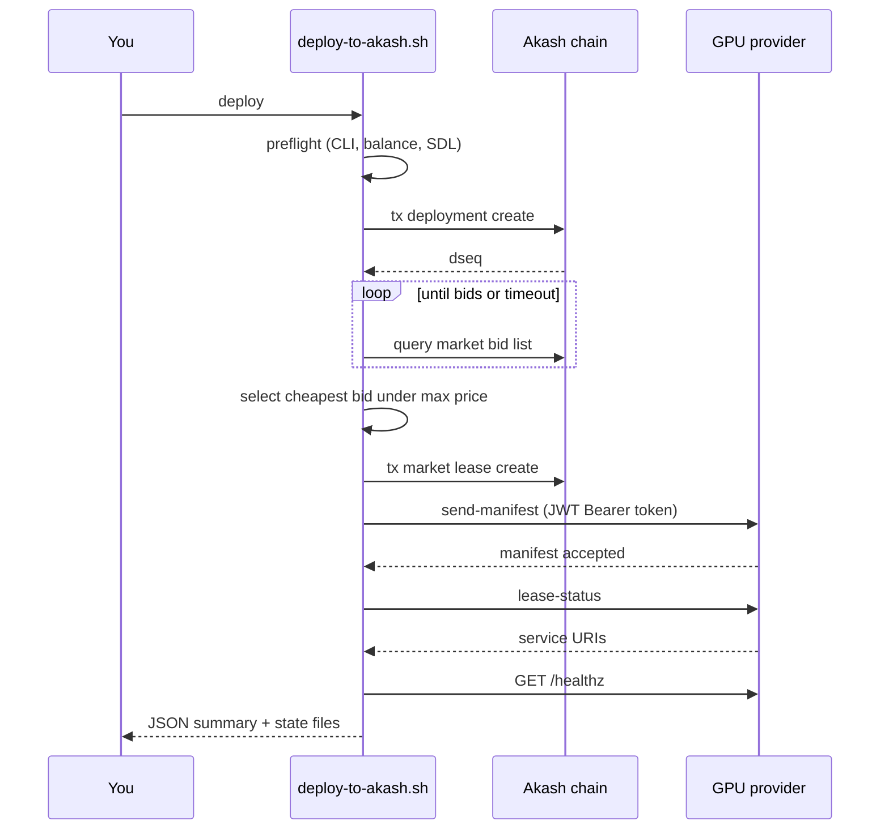

# Akash Production Deployment

Deploy YieldSwarm workers to Akash Network using `provider-services` with
**JWT authentication** (default for provider-services v0.10+).

**Script:** `scripts/deploy-to-akash.sh`  
**SDL:** `deploy/deploy-swarm-monolith.yaml` (3× RTX 3090)

---

## Quick start

```bash
# 1. Install provider-services
curl -sSfL https://raw.githubusercontent.com/akash-network/provider/main/install.sh | bash

# 2. Import or create wallet
provider-services keys add yieldswarm   # or keys import ...
provider-services query bank balances $(provider-services keys show yieldswarm -a)

# 3. Configure
cp deploy/akash.env.example deploy/akash.env
$EDITOR deploy/akash.env              # set AKASH_KEY_NAME, pricing, etc.

# 4. Deploy (full pipeline)
chmod +x scripts/deploy-to-akash.sh
./scripts/deploy-to-akash.sh deploy
```

On success, state is written to:

| File | Contents |
|------|----------|
| `.run/akash-deploy.json` | Full deployment record (dseq, provider, URIs, health) |
| `.run/akash-lease.env` | Shell exports for `AKASH_OWNER`, `AKASH_DSEQ`, `AKASH_PROVIDER`, URLs |

---

## What the script does



### Steps in detail

| Step | Command | Description |
|------|---------|-------------|
| 1 | `preflight` | Verify `provider-services`, `jq`, `curl`; check wallet balance |
| 2 | `create` | `tx deployment create` with SDL + deposit |
| 3 | `bids` | Poll `query market bid list` until open bids appear |
| 4 | `select-provider` | Pick cheapest bid ≤ `AKASH_MAX_BID_PRICE` |
| 5 | `lease` | `tx market lease create` + `send-manifest` |
| 6 | `health` | Resolve URIs from `lease-status`; `curl` `HEALTH_PATH` |

Run the full pipeline with one command:

```bash
./scripts/deploy-to-akash.sh deploy
```

Or step-by-step:

```bash
./scripts/deploy-to-akash.sh preflight
CREATE=$(./scripts/deploy-to-akash.sh create)
DSEQ=$(echo "$CREATE" | jq -r .dseq)

BIDS=$(./scripts/deploy-to-akash.sh bids "$DSEQ")
PROVIDER=$(echo "$BIDS" | jq -r 'sort_by(.price) | .[0].provider')

./scripts/deploy-to-akash.sh lease "$DSEQ" "$PROVIDER"
./scripts/deploy-to-akash.sh health "$DSEQ" "$PROVIDER"
```

---

## JWT authentication

`provider-services` v0.10+ uses **JWT (ES256K self-attested tokens)** by default
for provider API calls (`send-manifest`, `lease-status`). The CLI:

1. Signs a JWT with your wallet's secp256k1 key (same key as chain txs)
2. Sends `Authorization: Bearer <token>` to the provider
3. Provider verifies against your on-chain public key

**No on-chain certificate publish is required** when `AKASH_AUTH_MODE=jwt` (default).

```bash
export AKASH_AUTH_MODE=jwt   # default — recommended
./scripts/deploy-to-akash.sh deploy
```

### Legacy mTLS mode

Only use if your provider requires on-chain certificates:

```bash
export AKASH_AUTH_MODE=mtls
./scripts/deploy-to-akash.sh deploy   # auto-runs cert generate + publish
```

---

## Vault integration (optional)

Load Akash deploy config from HashiCorp Vault before deploying. Supports
**JWT**, AppRole, or static token auth (via `scripts/lib/vault-env.sh`).

```bash
export VAULT_LOAD_AKASH=true
export VAULT_ADDR=https://vault.yieldswarm.internal:8200
export VAULT_AUTH_METHOD=jwt
export VAULT_JWT_ROLE=yieldswarm-akash-deploy
export VAULT_JWT_FILE=/var/run/secrets/kubernetes.io/serviceaccount/token
export VAULT_AKASH_SECRET_PATH=yieldswarm/data/runtime/akash

./scripts/deploy-to-akash.sh deploy
```

Seed the Vault path:

```bash
vault kv put yieldswarm/runtime/akash \
  akash_key_name=yieldswarm \
  akash_node=https://rpc.akashnet.net:443 \
  akash_chain_id=akashnet-2 \
  akash_max_bid_price=700000
```

---

## Configuration reference

Copy `deploy/akash.env.example` → `deploy/akash.env`.

| Variable | Default | Description |
|----------|---------|-------------|
| `AKASH_KEY_NAME` | `yieldswarm` | Keyring key for signing txs + JWT |
| `AKASH_AUTH_MODE` | `jwt` | `jwt` or `mtls` |
| `AKASH_SDL` | `deploy/deploy-swarm-monolith.yaml` | Deployment manifest |
| `AKASH_DEPOSIT` | `5000000uakt` | Escrow deposit |
| `AKASH_MAX_BID_PRICE` | `700000` | Max uakt/block for auto-select |
| `AKASH_BID_WAIT_SECONDS` | `180` | Bid polling timeout |
| `AKASH_PROVIDER` | — | Force specific provider (skip auto-select) |
| `HEALTH_PATH` | `/healthz` | HTTP path for health checks |
| `HEALTH_TIMEOUT_SECONDS` | `300` | Max wait for URIs + healthy response |

---

## SDL: RTX 3090 monolith

`deploy/deploy-swarm-monolith.yaml` deploys **3 workers** with:

- GPU: NVIDIA RTX 3090
- CPU: 8 units, RAM: 32Gi
- Storage: 200Gi state + 500Gi model cache
- Health: `/healthz` on port 8080 (readiness + liveness probes)

Override SDL:

```bash
./scripts/deploy-to-akash.sh deploy akash/worker.sdl.yml
```

---

## Health checks

After manifest delivery, the script:

1. Polls `lease-status` until service URIs appear
2. HTTP GET `{uri}/healthz` on each endpoint
3. Passes if at least one URI returns 2xx

Manual check:

```bash
source .run/akash-lease.env
./scripts/deploy-to-akash.sh status "$AKASH_DSEQ" "$AKASH_PROVIDER"
curl -sf "${AKASH_WORKER_URLS%%,*}/healthz"
```

---

## Troubleshooting

| Symptom | Fix |
|---------|-----|
| No bids within timeout | Raise `AKASH_MAX_BID_PRICE` in SDL pricing section; wait and retry |
| `send-manifest` 401/403 | Ensure `AKASH_AUTH_MODE=jwt`; update `provider-services` to v0.10+ |
| Health check fails | Worker image may still be pulling; increase `HEALTH_TIMEOUT_SECONDS` |
| Insufficient funds | `provider-services tx bank send ...` or faucet; check `AKASH_DEPOSIT` |
| Wrong provider | Set `AKASH_PROVIDER=akash1...` to force a specific host |

### Close a deployment

```bash
./scripts/deploy-to-akash.sh close "$AKASH_DSEQ"
```

### View active deployments

```bash
provider-services query deployment list \
  --owner "$(provider-services keys show yieldswarm -a)" \
  --state active \
  --node https://rpc.akashnet.net:443
```

---

## Integration with YieldSwarm stack

| Component | Integration |
|-----------|-------------|
| Lease manager | `akash/lease-manager.py` reads `.run/akash-lease.env` |
| Auto-heal | `deploy/akash/auto-heal.sh` uses `AKASH_DSEQ` + `AKASH_PROVIDER` |
| Monitoring | Add URIs to `deploy/monitoring/targets.json` |
| Domains | Point `api.yieldswarm.crypto` CNAME at stable proxy → worker URI |
| Full stack | `make deploy` or `./scripts/deploy-all.sh` |

---

## Related docs

- `DEPLOY.md` — full 5-step production orchestrator
- `akash/README.md` — lease manager + GPU worker SDL
- `SECRETS.md` — Vault bootstrap for runtime secrets
- `DOMAINS.md` — API subdomain wiring
