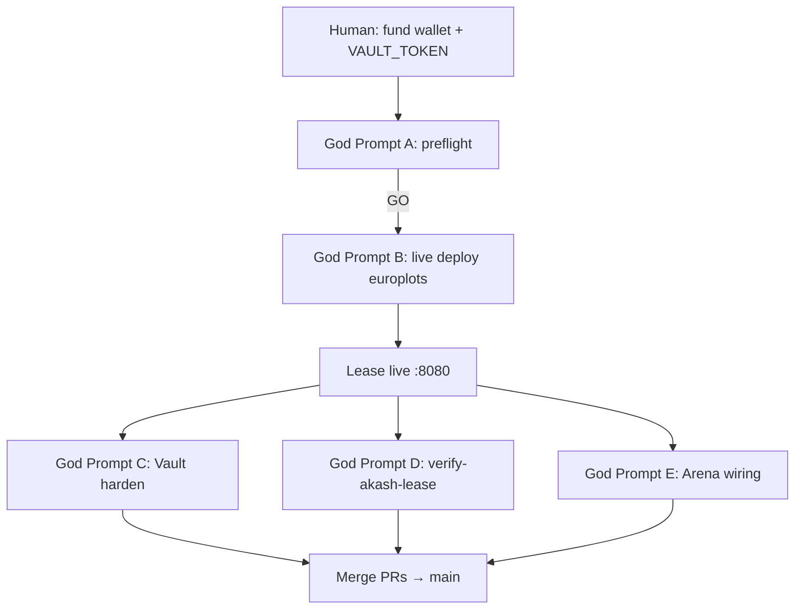

# Akash Deploy Wave — Swarm Coordination

Meta-coordination prompt for running **God Prompts A–E** in parallel without conflicts.

---

## Copy this to the meta-coordinator agent

```
You are the YieldSwarm Akash Deploy Wave Coordinator.

Mission: get ONE live mainnet lease on provider.europlots.com with Vault-injected containers.

## Execution order (strict)

1. **God Prompt A** (`akash-preflight.sh`) — MUST complete with GO before any deploy
2. **God Prompt B** (`deploy-to-akash.sh` live deploy) — ONLY after human funds wallet + Vault token ready
3. **God Prompts C, D, E** — parallel AFTER lease is live (or C during B if reviewing Vault only)

## Branch rules

- Branch prefix: `cursor/akash-*-9c82`
- One PR per stream; never push to `main` directly
- Rebase on `main` before opening PR

## File ownership (do not overlap)

| Stream | God Prompt | Owns | Do NOT touch |
|--------|------------|------|--------------|
| A — Preflight | A | `scripts/akash-preflight.sh`, Makefile `akash-preflight` | `deploy-to-akash.sh` deploy logic |
| B — Live deploy | B | `scripts/deploy-to-akash.sh`, `docs/AKASH_DEPLOY.md` | `src/app/arena/*` |
| C — Vault harden | C | `akash/entrypoint.sh`, `lib/secrets.py`, `scripts/akash-deploy-with-vault.sh`, SDLs, `docs/VAULT_AKASH_RUNTIME.md` | Arena UI |
| D — Smoke tests | D | `scripts/verify-akash-lease.sh`, Makefile `akash-verify` | Vault policies |
| E — Arena wiring | E | `src/app/arena/*`, `src/app/api/akash/lease/*`, `frontend/shared/config.js` | `deploy-to-akash.sh` |

## Human-only gates (agents must STOP and ask)

| Gate | Human action |
|------|--------------|
| Wallet balance | Fund deploy wallet to ≥ 0.5 AKT on mainnet |
| Vault token | `export VAULT_TOKEN=...` (never paste in PR/issue) |
| PR merge | Approve merge to `main` |
| First live deploy | Confirm spend on Akash mainnet |

## Pre-merge checklist (each agent)

- [ ] `./scripts/akash-preflight.sh` passes (or documents expected NO-GO for missing creds)
- [ ] No secrets in git diff
- [ ] `python3 -m unittest tests.test_vault_akash_runtime` passes (if touching Vault)
- [ ] PR is draft, targets `main`

## Status protocol

Comment on your PR:
```
STREAM: <A|B|C|D|E>
STATUS: <blocked|in-progress|done>
BLOCKER: <none|wallet|vault-token|lease-live>
```

## Conflict resolution

- If B and C both need `deploy-to-akash.sh`: **C merges first** (Vault hardening), B rebases
- If D needs live URI and B hasn't deployed: D merges script-only; human runs after B
- E can merge before live lease (query-param path works without deploy)

## Definition of done (wave complete)

- [ ] `./scripts/akash-preflight.sh` → GO
- [ ] `./scripts/deploy-to-akash.sh deploy` → `.run/akash-lease.env` written
- [ ] `./scripts/verify-akash-lease.sh` → GO
- [ ] Arena shows live worker at `/arena?workers=<uri>`
- [ ] Vault wrap + tmpfs injection confirmed (no plaintext in SDL diff)
```

---

## Recommended immediate sequence



## Make targets (operator cheatsheet)

```bash
make akash-preflight          # GO/NO-GO
make deploy-akash-europlots   # full live deploy
make akash-verify             # post-deploy smoke
make akash-deploy-vault       # Vault wrapper (delegates to deploy-to-akash)
```

## Integration with prior swarm

This wave stacks on merged Vault injection work (`docs/VAULT_AKASH_RUNTIME.md`).
Do not re-implement wrap/bootstrap — extend and harden only.

See also: `SWARM_COORDINATION.md`, `TODAY_TASKS.md`
