# YieldSwarm Architecture

High-level system architecture for **YieldSwarm AgentSwarm OS v2** — Helix Chain, 35-layer neural mesh, and 17-domain edge.

---

## Single Pane of Glass (full)

The canonical diagram lives at **[`SINGLE_PANE_OF_GLASS.md`](../SINGLE_PANE_OF_GLASS.md)** — copy or link from README, funding deck, and investor materials.

```mermaid
---
title: YieldSwarm Helix Chain + 35-Layer Neural Mesh (Single Pane of Glass)
config:
  theme: dark
---

flowchart TB
    subgraph Ingress ["USER / INGRESS LAYER (17 Domains)"]
        Vercel["Vercel (Next.js)<br/>Payments + Frontend dApp"]
        Render["Render<br/>Integration Backend API"]
        Akash["Akash (RTX 3090)<br/>GPU Workers + Bittensor Miners"]
        MultiCloud["Azure / GCP / RunPod<br/>Multi-cloud fallback"]
        Domains["Unstoppable Domains<br/>17 custom domains"]
    end

    Ingress --> Edge["17-DOMAIN EDGE ROUTING + API LAYER<br/>(9 Frontend Zones + 8 Backend Fluid Compute)"]

    Edge --> Helix["HELIX CHAIN / 35-LAYER NEURAL MESH CORE"]

    subgraph HelixCore ["35-Layer Neural Mesh"]
        direction TB
        L1_3["Layers 1–3: Foundational Ingress + TEE + JPL HORIZONS"]
        L4_6["Layers 4–6: Precessional Oracle + Agent Performance + Pre-load Models"]
        L7_9["Layers 7–9: Multi-Cloud DePIN + Akash Lease Manager + Vault Injection"]
        L10["Layer 10: MASTER SOLENOID ANCHOR (Core Orchestration)"]
        L11_13["Layers 11–13: Renaissance Polymath Refiners<br/>(Tesla + da Vinci + Michelangelo)"]
        L14_16["Layers 14–16: Sub-Space Telemetry + Sovereign Self-Healing Loops"]
        L17_19["Layers 17–19: Cross-Epoch Bridges + Great Delta Emission Router (50/30/15/5)"]
        L20_21["Layers 20–21: Quantum-Resistant Vectors + Treasury Rebalancer"]
        L22["Layer 22: DIMENSIONAL SINGULARITY ANCHOR"]
        L23_28["Layers 23–28: Agent Mutation Engine + 10,080 Agents + 169 Deities"]
        L29_31["Layers 29–31: Odysseus Central Memory (ChromaDB) + RTX 3090 Model Router"]
        L32_34["Layers 32–34: Kairo Driver Pipeline (Crypto Identity + Signed Telemetry)"]
        L35["Layer 35: OMNI APEX — Sovereign Core + $5M Vault Telemetry + Agent Marketplace"]
        L1_3 --> L4_6 --> L7_9 --> L10 --> L11_13 --> L14_16 --> L17_19 --> L20_21 --> L22 --> L23_28 --> L29_31 --> L32_34 --> L35
    end

    Helix --> L1_3
    L35 --> Intelligence["INTELLIGENCE + EXECUTION LAYER<br/>Odysseus • Model Router • Sovereign Runtime • Great Delta • Kairo Pipeline"]

    Intelligence --> Secrets["SECRETS + INFRA LAYER<br/>HashiCorp Vault (Runtime Injection) • Multi-Cloud • Akash RTX 3090 • GHCR"]

    Secrets --> Revenue["REVENUE + PAYMENTS LAYER<br/>Payments (Square + Wise + Web3) • 1% Fee + 2× Driver Pay • Agent Marketplace • Holographic Coffee Variables • $5M Vault Dashboard"]

    style Ingress fill:#1a1a2e,stroke:#00d4ff
    style HelixCore fill:#16213e,stroke:#00ff9f
    style Intelligence fill:#0f3460,stroke:#ff6b6b
    style Secrets fill:#1a1a2e,stroke:#feca57
    style Revenue fill:#16213e,stroke:#48dbfb
```

---

## Investor view (simplified)

```mermaid
flowchart TB
    User["Users / Kairo Drivers / Investors"] --> Edge["17-Domain Edge + API Layer"]
    Edge --> Helix["Helix Chain + 35-Layer Neural Mesh"]
    Helix --> Core["Odysseus + 10,080 Agents + Sovereign Loops + Great Delta"]
    Core --> Infra["Akash RTX 3090 + Multi-Cloud + HashiCorp Vault"]
    Infra --> Revenue["Payments + Agent Marketplace + $5M Vault Telemetry"]

    style User fill:#1a1a2e,stroke:#00d4ff
    style Helix fill:#16213e,stroke:#00ff9f
    style Revenue fill:#16213e,stroke:#48dbfb
```

---

## Stack map (implementation)

| Layer (concept) | Repo anchor |
|-----------------|-------------|
| Helix Chain genesis | `backend/src/adapters/helix.js`, `scripts/activate-helix.sh` |
| 35-layer blueprint | `docs/YieldSwarm_v1_v2_Trident_Layer35_Blueprint.md` |
| Sovereign loops | `services/sovereign_runtime.py`, `iteration-100/` |
| Vault → Akash injection | `docs/VAULT_AKASH_RUNTIME.md`, `akash/entrypoint.sh` |
| Akash deploy | `scripts/deploy-to-akash.sh`, `make deploy-akash-europlots` |
| Kairo Mandelbrot | `kairo/services/pipeline.py` |
| 169 deities | `agents/system/deity_manifests.py` |
| 17 domains DNS | `DOMAINS.md` |
| Payments | `src/app/payments/`, Stripe/Square/Wise/Web3 |
| Arena telemetry | `src/app/arena/page.tsx` |

---

## Related docs

| Doc | Purpose |
|-----|---------|
| [`SINGLE_PANE_OF_GLASS.md`](../SINGLE_PANE_OF_GLASS.md) | Canonical full diagram |
| [`HELIX_SINGLE_PANE.md`](HELIX_SINGLE_PANE.md) | Layer detail + domain breakdown |
| [`STACK_STATUS.md`](../STACK_STATUS.md) | Health board + endpoints |
| [`DOMAINS.md`](../DOMAINS.md) | UD wiring runbook |
| [`HELIX-EXECUTION.md`](../HELIX-EXECUTION.md) | Activation tracks |
