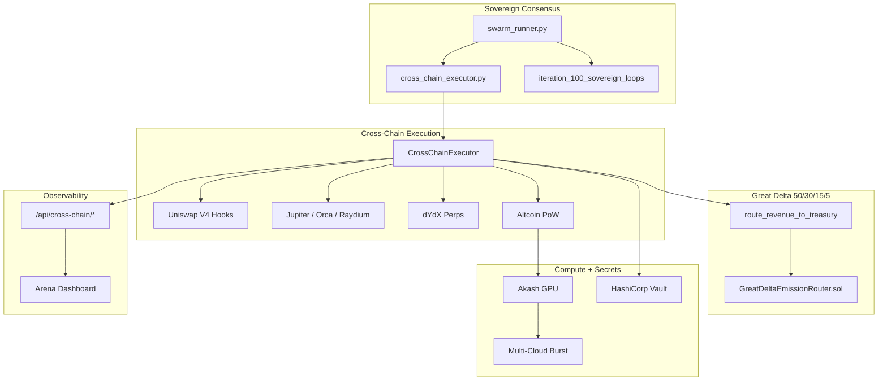

# YieldSwarm Architecture v2.1 — Cross-Chain Execution Layer

Canonical architecture including **God Prompt P** cross-chain expansion.

---

## System overview



---

## Layer map

| Layer | Components | Status |
|-------|------------|--------|
| L0 Gospel | `agents/governance/gospel.py` | 50/30/15/5 invariants |
| L1 Sovereign | `swarm_runner.py`, `cross_chain_executor.py` | Live supervisor |
| L2 Execution | `services/cross_chain/` | Scaffold → production |
| L3 Treasury | `great_delta.py`, emission router | Split math live; on-chain pending |
| L4 Compute | Akash, Vast, RunPod, Azure, GCP | Multi-cloud plan |
| L5 Observability | Backend adapters, Arena | `/api/cross-chain/overview` |

---

## Revenue flow

All cross-chain gross revenue **must** pass through Great Delta before settlement:

```
Strategy PnL → route_revenue_to_treasury() → 50/30/15/5 buckets → EmissionRouter (on-chain)
```

---

## Related docs

- `docs/CROSS_CHAIN_EXECUTION.md` — full God Prompt P spec
- `docs/YieldSwarm_v1_v2_Trident_Layer35_Blueprint.md` — Layer 0–6 blueprint
- `HELIX-EXECUTION.md` — Helix activation tracks
- `config/cross_chain/strategies.yaml` — strategy registry
