# YieldSwarm Architecture

High-level system architecture for **YieldSwarm AgentSwarm OS v2** — Helix Chain, 35-layer neural mesh, and 17-domain edge.

**Canonical diagram:** [`SINGLE_PANE_OF_GLASS.md`](../SINGLE_PANE_OF_GLASS.md) (v2.0)

---

## Single Pane of Glass v2.0 (full)

```mermaid
---
title: YieldSwarm Helix Chain + 35-Layer Neural Mesh - Single Pane of Glass v2.0
config:
  theme: dark
  flowchart:
    curve: basis
---

flowchart TB
    subgraph Ingress ["USER / INGRESS LAYER (17 Domains)"]
        direction LR
        Vercel["Vercel (Next.js)<br/>Payments + Frontend dApp"]
        Render["Render<br/>Integration Backend API"]
        AkashWorkers["Akash RTX 3090 Workers<br/>Bittensor + Inference"]
        MultiCloud["Multi-Cloud Fallback<br/>Azure • GCP • RunPod • Vultr"]
        Unstoppable["Unstoppable Domains<br/>17 Custom Domains"]
    end

    Ingress --> EdgeRouting["17-DOMAIN EDGE ROUTING + API LAYER<br/>(9 Frontend Zones + 8 Backend Fluid Compute)"]

    subgraph HelixCore ["HELIX CHAIN / 35-LAYER NEURAL MESH CORE"]
        direction TB
        L1_3["Layers 1-3<br/>Foundational Ingress + TEE Verification + JPL HORIZONS"]
        L4_6["Layers 4-6<br/>Precessional Oracle + Agent Performance Index"]
        L7_9["Layers 7-9<br/>Multi-Cloud DePIN Synthesizer + Akash Lease Manager + Vault Injection"]
        L10["Layer 10<br/>MASTER SOLENOID ANCHOR (Core Orchestration)"]
        L11_13["Layers 11-13<br/>Renaissance Polymath Refiners<br/>(Tesla Resonance • da Vinci Schematic • Michelangelo Structural)"]
        L14_22["Layers 14-22<br/>Sovereign Self-Healing Loops + Great Delta Emission Router<br/>(50/30/15/5) + Dimensional Singularity"]
        L23_28["Layers 23-28<br/>Agent Mutation Engine + 10,080 Mutated Agents + 169 Deity Manifests"]
        L29_31["Layers 29-31<br/>Odysseus Central Memory (ChromaDB) + RTX 3090 Model Router"]
        L32_34["Layers 32-34<br/>Kairo Driver Pipeline<br/>(Crypto Identity + Signed Telemetry → Mandelbrot/Tree of Life)"]
        L35["Layer 35<br/>OMNI APEX<br/>Sovereign Core + $5M Vault Telemetry + Agent Marketplace"]
        L1_3 --> L4_6 --> L7_9 --> L10 --> L11_13 --> L14_22 --> L23_28 --> L29_31 --> L32_34 --> L35
    end

    KairoTelemetry["Kairo Signed Telemetry"] --> Mandelbrot["Mandelbrot / Tree of Life"]
    Mandelbrot --> SovereignLoops["Sovereign Loops"]
    SovereignLoops --> Treasury["Treasury Rebalancer<br/>(50/30/15/5)"]

    subgraph Intelligence ["INTELLIGENCE + EXECUTION LAYER"]
        Odysseus["Odysseus<br/>(LiteLLM + ChromaDB)"]
        ModelRouter["Model Router<br/>(Akash RTX 3090 aware)"]
        SovereignRuntime["Sovereign Runtime<br/>(Self-Healing Leases)"]
        GreatDelta["Great Delta Emission Router"]
        AgentMarketplace["Agent Marketplace"]
    end

    subgraph Infra ["SECRETS + INFRA LAYER"]
        Vault["HashiCorp Vault<br/>(Runtime Injection + AppRoles)"]
        AkashInfra["Akash RTX 3090 Workers"]
        MultiCloudInfra["Multi-Cloud Capacity"]
    end

    subgraph Revenue ["REVENUE + PAYMENTS LAYER"]
        Payments["Payments Stack<br/>Square + Wise + Web3"]
        KairoPay["Kairo 1% Fee + 2× Driver Pay"]
        VaultDashboard["$5M Vault Telemetry Dashboard"]
    end

    EdgeRouting --> L1_3
    L32_34 --> KairoTelemetry
    L35 --> Odysseus
    Treasury --> SovereignRuntime
    Odysseus --> Vault
    Vault --> AkashInfra --> MultiCloudInfra --> Payments
    Payments --> KairoPay --> VaultDashboard

    classDef ingress fill:#1a1a2e,stroke:#00d4ff,color:#fff
    classDef core fill:#0f3460,stroke:#00ff9f,color:#fff
    classDef infra fill:#16213e,stroke:#feca57,color:#fff
    classDef revenue fill:#1a1a2e,stroke:#ff6b6b,color:#fff
    class Ingress,EdgeRouting ingress
    class HelixCore,L1_3,L35 core
    class Infra,Vault,AkashInfra infra
    class Revenue,Payments revenue
```

---

## Investor view (simplified)

```mermaid
flowchart TB
    User["Users / Kairo Drivers / Investors"] --> Edge["17-Domain Edge + API Layer"]
    Edge --> Helix["Helix Chain + 35-Layer Neural Mesh"]
    Helix --> Core["Odysseus + 10,080 Agents + Sovereign Loops + Great Delta"]
    Core --> Infra["Akash RTX 3090 + Multi-Cloud + HashiCorp Vault"]
    Infra --> Revenue["Payments + Agent Marketplace + $5M Vault Telemetry"]

    style User fill:#1a1a2e,stroke:#00d4ff
    style Helix fill:#16213e,stroke:#00ff9f
    style Revenue fill:#16213e,stroke:#48dbfb
```

---

## Deployment status (current PR stack)

| Component | Status | Branch / artifact |
|-----------|--------|-------------------|
| Vault → Akash injection | In PR | `cursor/vault-akash-injection-9c82` |
| Sovereign loops live | In PR | `cursor/sovereign-loops-live-9c82` |
| Akash preflight + europlots deploy | In PR | `cursor/akash-real-deploy-9c82` |
| God Prompt swarm (MCP, deploy-all, funding) | In PR | `cursor/god-prompt-swarm-9c82` |
| Production multi-platform spin-up | PR #25 | `cursor/production-prep-9c82` |
| Helix genesis API | On `main` | `scripts/activate-helix.sh` |
| Live Akash lease (europlots) | **Human-blocked** | Fund wallet + `VAULT_TOKEN` |

---

## Stack map (implementation)

| Layer (concept) | Repo anchor |
|-----------------|-------------|
| Helix Chain genesis | `backend/src/adapters/helix.js`, `scripts/activate-helix.sh` |
| 35-layer blueprint | `docs/YieldSwarm_v1_v2_Trident_Layer35_Blueprint.md` |
| Sovereign loops | `services/sovereign_runtime.py`, `iteration-100/` |
| Vault → Akash injection | `docs/VAULT_AKASH_RUNTIME.md`, `akash/entrypoint.sh` |
| Akash deploy | `scripts/deploy-to-akash.sh`, `make deploy-akash-europlots` |
| Kairo Mandelbrot | `kairo/services/pipeline.py` |
| 169 deities | `agents/system/deity_manifests.py` |
| 17 domains DNS | `DOMAINS.md` |
| Payments | `src/app/payments/`, Stripe/Square/Wise/Web3 |
| Arena telemetry | `src/app/arena/page.tsx` |

---

## Related docs

| Doc | Purpose |
|-----|---------|
| [`SINGLE_PANE_OF_GLASS.md`](../SINGLE_PANE_OF_GLASS.md) | Canonical v2.0 diagram |
| [`HELIX_SINGLE_PANE.md`](HELIX_SINGLE_PANE.md) | Layer detail + domain breakdown |
| [`STACK_STATUS.md`](../STACK_STATUS.md) | Health board + endpoints |
| [`DOMAINS.md`](../DOMAINS.md) | UD wiring runbook |
| [`HELIX-EXECUTION.md`](../HELIX-EXECUTION.md) | Activation tracks |
