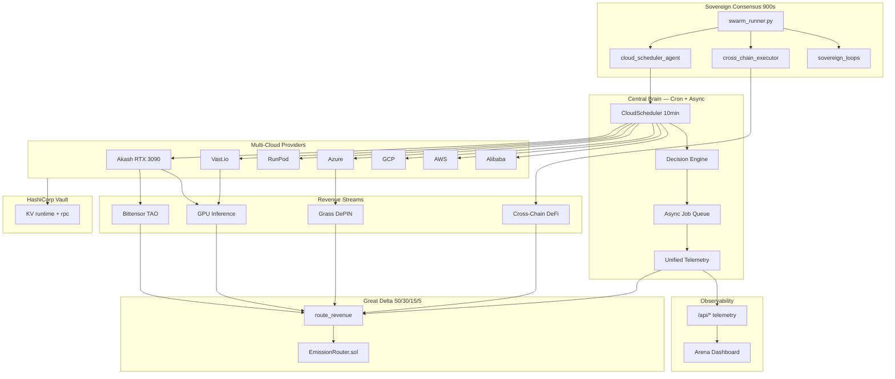

# YieldSwarm Architecture v2.2 — 30-Day Harvest + Cross-Chain

Canonical architecture: **async cloud scheduler**, **Sovereign Consensus**, **Great Delta**, **cross-chain execution**.

---

## System overview



---

## Layer map

| Layer | Components | Cadence |
|-------|------------|---------|
| L0 Gospel | `gospel.py` — harvest phase + 50/30/15/5 | invariant |
| L0.5 Scheduler | `cloud_scheduler/` + `async_jobs/` | **10 min cron** |
| L1 Sovereign | `swarm_runner.py` + agents | **900s tick** |
| L2 Cross-chain | `services/cross_chain/` | per sovereign tick |
| L3 Treasury | Great Delta routing | on revenue event |
| L4 Compute | 7 cloud providers | async jobs |
| L5 Telemetry | `.run/cloud-telemetry.json` | continuous |

---

## Async data flow

```
Cron (10m) → CloudScheduler.tick()
  → DecisionEngine.decide() — ROI + week phase
  → AsyncJobQueue.enqueue() — bittensor, training, grass
  → process_pending() — launch with retry + migration
  → UnifiedTelemetry.ingest_worker()
  → Great Delta rebalance input

Sovereign (900s) → cloud_scheduler_agent.tick() — sync with cron state
                 → cross_chain_executor — DeFi revenue
                 → iteration_100_sovereign_loops — treasury policy
```

---

## Related docs

- `docs/MULTI_CLOUD_30DAY_PLAN.md` — 30-day execution playbook
- `docs/CROSS_CHAIN_EXECUTION.md` — Uniswap V4, Solana, dYdX, PoW
- `config/cloud_scheduler/schedule.yaml` — scheduler config
- `crons/cloud-scheduler.cron.example` — crontab install
