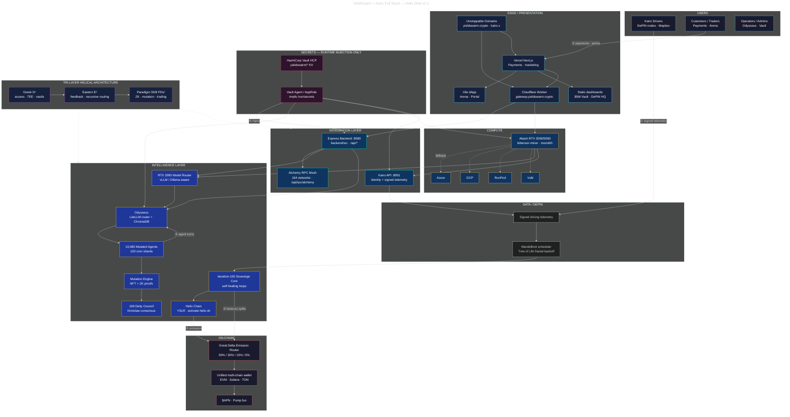
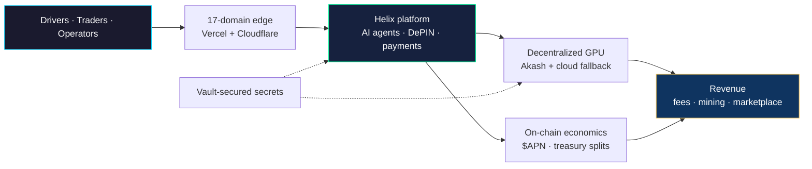
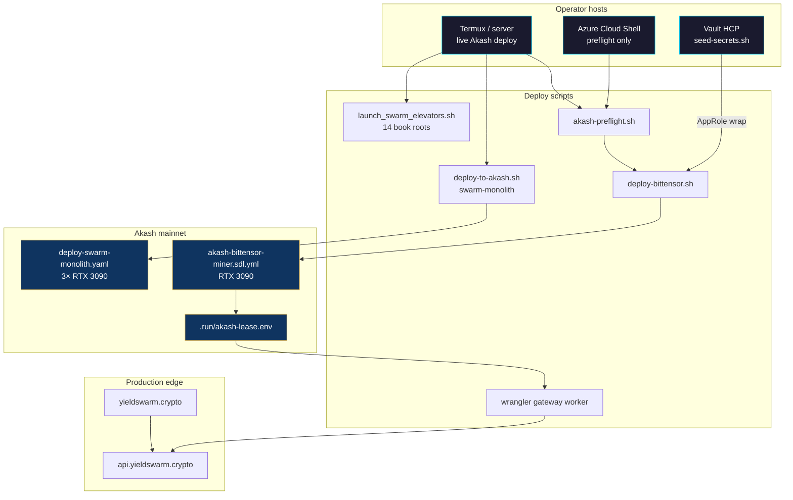
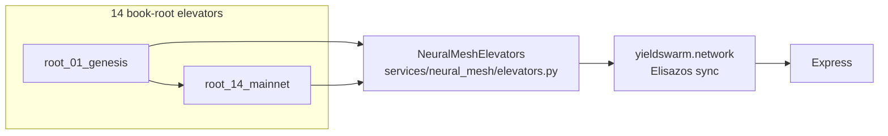
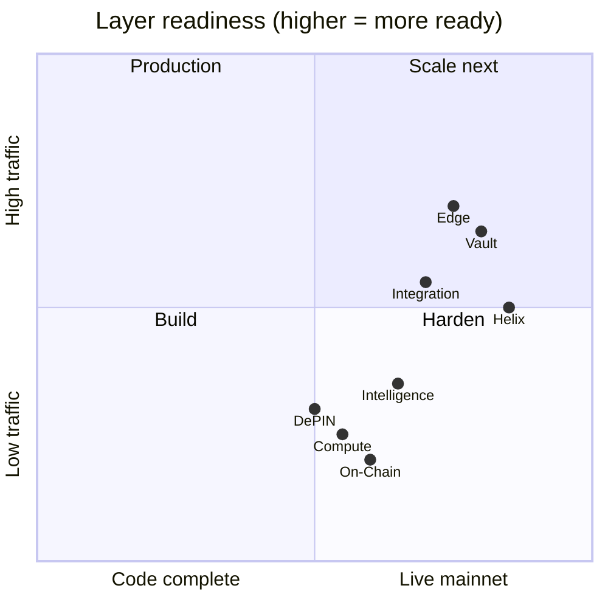

# YieldSwarm + Kairo — Full Stack Architecture (Helix DNA v2.1)

**Canonical architecture diagram** for the entire YieldSwarm + Kairo stack. Unifies ingress, integration, intelligence, DePIN, compute, on-chain economics, Vault injection, and the Tri-Layer helical model across all production branches.

| Audience | Section |
|----------|---------|
| Operators / deploy | [Deployment topology](#deployment-topology) · [`LAUNCH_PLAYBOOK.md`](LAUNCH_PLAYBOOK.md) |
| Investors | [Investor view](#investor-view-simplified) |
| Engineers | [Full diagram](#canonical-diagram) · [Code map](#code--config-map) |

Related: [`SINGLE_PANE_OF_GLASS.md`](../SINGLE_PANE_OF_GLASS.md) (v2.1 RPC + Tri-Solenoid detail) · [`docs/ARCHITECTURE.md`](ARCHITECTURE.md) · [`docs/TRI_LAYER_HELICAL_ARCHITECTURE.md`](TRI_LAYER_HELICAL_ARCHITECTURE.md) · [`DOMAINS.md`](../DOMAINS.md)

---

## Layer status

| Layer | Status | Notes |
|-------|--------|-------|
| **Users** | Active | Kairo drivers, traders, operators |
| **Edge / Presentation** | Staging ready | Vercel Next.js + Vite Arena/Portal + static dashboards |
| **Integration** | Live (code) | Express `:8080` + Kairo API `:8091` — needs live Akash lease for prod traffic |
| **Intelligence** | Needs GPU + Vault | Odysseus + Model Router + Sovereign Core need RTX 3090 lease |
| **Helix Chain** | Activated | YSLR phase — `./scripts/activate-helix.sh` |
| **Data / DePIN** | Alpha | Signed Kairo telemetry → Mandelbrot pipeline (dry-run capable) |
| **Compute** | Needs wallet | Akash: fund wallet + `deploy-bittensor.sh` or monolith SDL |
| **On-Chain** | Pre-mainnet | $APN + Great Delta 50/30/15/5 in code; contracts need mainnet deploy |
| **Secrets** | Bootstrap ready | Vault HCP seed + Akash Agent runtime injection — [`SECRETS.md`](../SECRETS.md) |
| **Tri-Layer Architecture** | Implemented | Greek D¹ · Eastern E¹ · Paradigm Shift PDs¹ env + pillar map |

---

## Six canonical data flows

| # | Flow | Path |
|---|------|------|
| **1** | Kairo driver telemetry | Driver app → signed payload → Mandelbrot / Tree of Life → Sovereign Core |
| **2** | Customer traffic | Customer → Vercel / UD → Express `:8080` → Akash workers + Model Router |
| **3** | Agent intelligence | 10,080 agents → Odysseus (LiteLLM + ChromaDB) → Mutation Engine → 169 Deities |
| **4** | Treasury emission | Sovereign loops → Great Delta Router → 50/30/15/5 splits → on-chain treasury |
| **5** | Helix → $APN | Helix Chain → Emission Router → unified wallet → $APN (Pump.fun) liquidity path |
| **6** | Secrets (all services) | HashiCorp Vault HCP → Vault Agent / AppRole → runtime inject → Express, Odysseus, Akash, Kairo |

---

## Canonical diagram

---

## Investor view (simplified)

---

## Deployment topology

Focused view for Akash + Azure + Vault operators (see [`LAUNCH_PLAYBOOK.md`](LAUNCH_PLAYBOOK.md)).

### Deployment status callouts

| Component | Script / SDL | Vault role | Gate |
|-----------|--------------|------------|------|
| Bittensor miner | `scripts/deploy-bittensor.sh` | `bittensor-runtime` | Funded `akash1…` wallet |
| Integration backend | `scripts/deploy-backend-akash.sh` | `integration-backend` | GHCR image pushed |
| Odysseus brain | `scripts/deploy-odysseus-vault-akash.sh` | `odysseus-runtime` | Vault wrap at deploy |
| Swarm monolith | `scripts/deploy-to-akash.sh` | `akash-runtime` | Phase 4 hardening |
| 14 elevators | `launch_swarm_elevators.sh` | `runtime/swarm` | `SWARM_API_KEY_PRIMARY` |
| CF gateway | `workers/gateway-yieldswarm-crypto.js` | Worker secrets | `AKASH_ORIGIN` from lease |

---

## Code & config map

| Layer | Primary paths |
|-------|----------------|
| Express `:8080` | `backend/src/` · `backend/src/routes/` |
| Kairo `:8091` | `kairo/backend/` · `agents/bittensor_miner.py` |
| Odysseus | `docker/Dockerfile.odysseus-brain` · `scripts/start-odysseus-brain.sh` |
| Model router | `api/yieldswarm_model_routing.py` · `services/akash_worker_sync.py` |
| Sovereign loops | `deploy/scripts/start-sovereign-loops.sh` |
| Helix Chain | `backend/src/adapters/helix.js` · `scripts/activate-helix.sh` |
| Mutation | `services/nft_mutation_engine.py` · `contracts/MutationController.sol` |
| Great Delta | `telemetry/great-delta/` · `SPLIT_*_BPS` env |
| Akash SDLs | `deploy/akash-bittensor-miner.sdl.yml` · `deploy/deploy-swarm-monolith.yaml` |
| Vault inject | `akash/templates/runtime.env.ctmpl` · `vault/scripts/seed-secrets.sh` |
| Tri-Layer env | `GREEK_LAYER__*` · `EASTERN_LAYER__*` · `ZK__*` in `.env.example` |
| 14 pillars | `config/helix/pillars.yaml` |
| Domains | `DOMAINS.md` · `config/domains/registry.json` |
| RPC mesh | `config/alchemy/christophers-first-app.json` · `backend/src/routes/rpc.js` |

---

## Swarm network overlay (14 book roots)

See [`SWARM_ELEVATORS_LAUNCH.md`](SWARM_ELEVATORS_LAUNCH.md).

---

## What is production-ready vs. pending

**Yellow path to green:** fund Akash wallet → `deploy-bittensor.sh` → set `AKASH_ORIGIN` on CF gateway → seed Vault HCP → `./launch_swarm_elevators.sh` → `npx vercel --prod`.

---

## Changelog

| Version | Date | Change |
|---------|------|--------|
| v2.1 | 2026-06 | Canonical full-stack doc; deployment + investor views; status table |
| v2.0 | 2026-06 | `SINGLE_PANE_OF_GLASS.md` Tri-Solenoid + RPC mesh |
| v1.0 | 2026-05 | `docs/ARCHITECTURE.md` initial Helix mesh |
