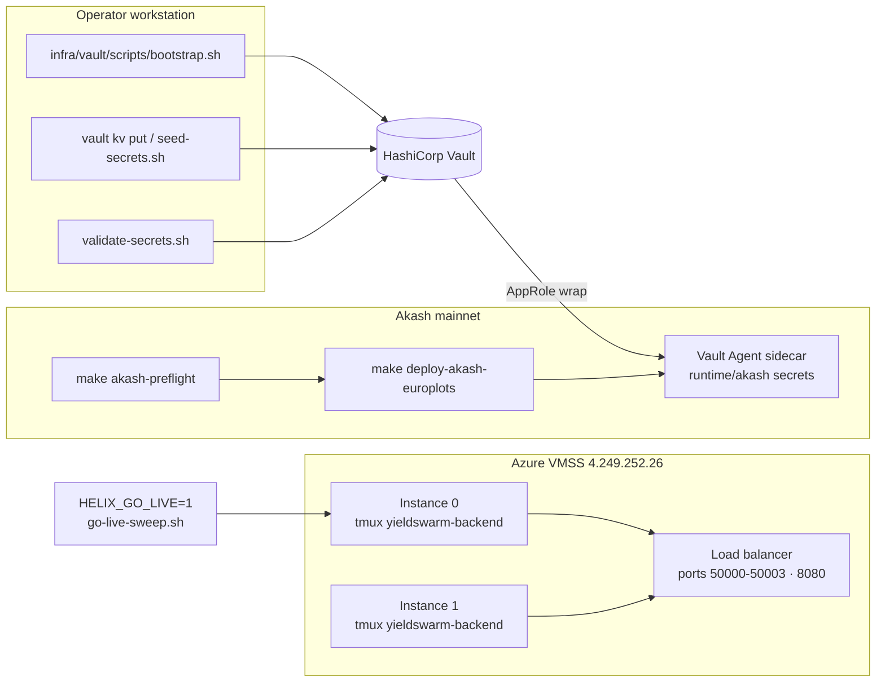
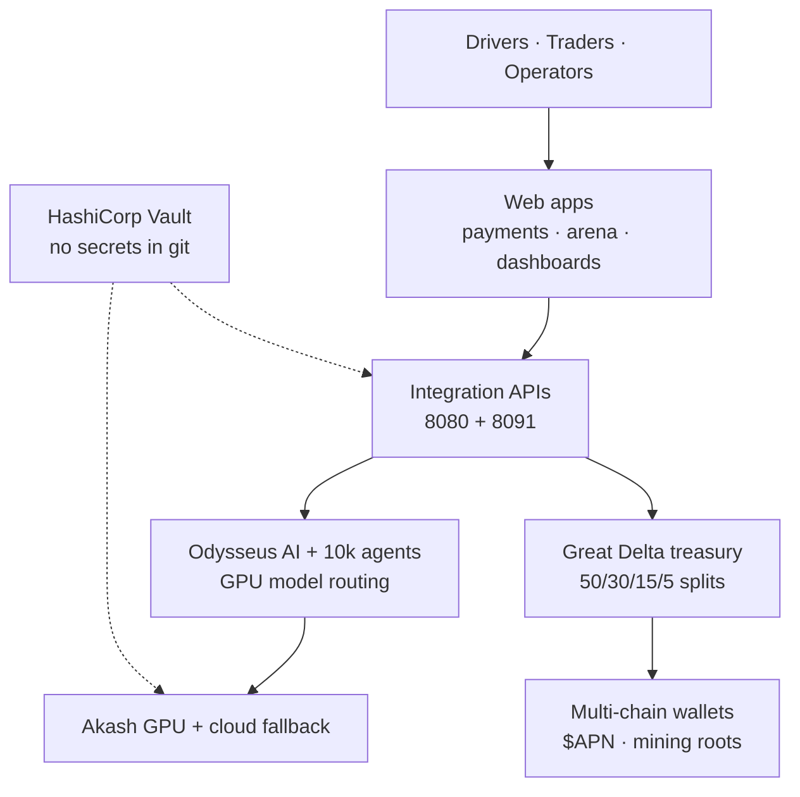

# YieldSwarm + Kairo — Canonical Architecture (Helix DNA v2.1)

**Single source of truth** for the full stack: edge apps, integration APIs, intelligence, DePIN telemetry, compute, on-chain treasury, Vault injection, and Tri-Layer helical design.

| Related | Purpose |
|---------|---------|
| [`SINGLE_PANE_OF_GLASS.md`](../SINGLE_PANE_OF_GLASS.md) | v2.1 single-pane + RPC mesh + tri-solenoid |
| [`docs/ARCHITECTURE.md`](ARCHITECTURE.md) | Investor + layer summaries |
| [`docs/TRI_SOLENOID_ARCHITECTURE.md`](TRI_SOLENOID_ARCHITECTURE.md) | Nexus · Helix · Shadow contracts |
| [`SECRETS.md`](../SECRETS.md) | Vault operator runbook |
| [`docs/REWARDS_RESHARD_SWEEP.md`](REWARDS_RESHARD_SWEEP.md) | Rewards pipeline |

---

## Full stack diagram

```mermaid
---
title: YieldSwarm + Kairo — Helix DNA v2.1 Canonical Architecture
config:
  theme: dark
  flowchart:
    curve: basis
---

flowchart TB
    %% ======================== USERS ========================
    subgraph Users ["USERS"]
        direction LR
        KairoDrivers["Kairo Drivers<br/>DePIN nodes · signed telemetry"]
        Customers["Customers / Traders<br/>Arena · payments · inference"]
        Operators["Operators / Admins<br/>Vault · deploy · go-live"]
    end

    %% ======================== EDGE / PRESENTATION ========================
    subgraph Edge ["EDGE / PRESENTATION"]
        direction TB
        VercelNext["Vercel Next.js<br/>Payments · marketing API · dApp"]
        ViteDApp["Vite dApp<br/>Arena / Portal"]
        StaticDash["Static dashboards<br/>Sovereign · command center"]
        VaultDash["$5M Vault Telemetry Dashboard"]
    end

    %% ======================== INTEGRATION ========================
    subgraph Integration ["INTEGRATION LAYER"]
        Express8080["Express Backend :8080<br/>nexus · helix · shadow · rewards · rpc · iot"]
        KairoAPI["Kairo API :8091<br/>identity · signed telemetry · contribution"]
    end

    %% ======================== INTELLIGENCE ========================
    subgraph Intelligence ["INTELLIGENCE LAYER"]
        direction TB
        Odysseus["Odysseus<br/>LiteLLM + ChromaDB memory"]
        Agents["10,080 mutated agents<br/>+ 169 deity manifests"]
        ModelRouter["RTX 3090 Model Router<br/>/api/yieldswarm/models"]
        SovereignCore["Iteration-100 Sovereign Core<br/>self-healing loops"]
        HelixChain["Helix Chain<br/>YSLR phase · emission routing"]
    end

    %% ======================== DATA / DEPIN ========================
    subgraph DePIN ["DATA / DEPIN"]
        SignedTel["Signed driving telemetry"]
        Mandelbrot["Mandelbrot / Tree of Life"]
        SovereignLoops["Sovereign runtime state"]
    end

    %% ======================== COMPUTE ========================
    subgraph Compute ["COMPUTE"]
        AkashGPU["Akash RTX 3090/4090<br/>monolith · bittensor-miner SDL"]
        MultiCloud["Azure · GCP · RunPod · Vultr<br/>fallback burst"]
    end

    %% ======================== ON-CHAIN ========================
    subgraph OnChain ["ON-CHAIN"]
        APN["$APN Pump.fun"]
        GreatDelta["Great Delta Emission Router<br/>50% / 30% / 15% / 5%"]
        MultiWallet["Unified multi-chain wallet<br/>treasury + mining roots"]
    end

    %% ======================== SECRETS ========================
    subgraph Secrets ["SECRETS — RUNTIME INJECTION ONLY"]
        Vault["HashiCorp Vault<br/>AppRole · KV yieldswarm/ · zero hardcoded secrets"]
    end

    %% ======================== TRI-LAYER ========================
    subgraph TriLayer ["TRI-LAYER HELICAL ARCHITECTURE"]
        direction LR
        Greek["Greek D¹<br/>Nexus governance"]
        Eastern["Eastern E¹<br/>Helix yield matrix"]
        Paradigm["Paradigm PDs¹<br/>Shadow ZK intent"]
    end

    %% ======================== RPC MESH ========================
    subgraph RpcMesh ["RPC MESH"]
        Alchemy164["Alchemy 164 networks<br/>/api/rpc/alchemy/*"]
    end

    %% ---- Key flows (numbered) ----
    KairoDrivers -->|"① signed telemetry"| SignedTel
    SignedTel --> Mandelbrot --> SovereignLoops --> SovereignCore

    Customers --> VercelNext --> Express8080
    Express8080 -->|"② inference route"| ModelRouter
    ModelRouter --> AkashGPU

    Agents --> Odysseus -->|"③ mutation"| Agents
    Odysseus --> Agents

    SovereignCore -->|"④ treasury splits"| GreatDelta
    GreatDelta --> MultiWallet

    HelixChain --> GreatDelta --> APN

    Vault -->|"⑥ runtime inject"| Express8080
    Vault --> Odysseus
    Vault --> AkashGPU
    Vault --> KairoAPI

    Express8080 --> RpcMesh
    Greek --> Eastern --> Paradigm
    TriLayer --> Express8080

    Operators --> Vault
    Operators --> AkashGPU
    MultiCloud -.->|"fallback"| AkashGPU

    classDef users fill:#1a1a2e,stroke:#00d4ff,color:#fff
    classDef edge fill:#16213e,stroke:#48dbfb,color:#fff
    classDef integration fill:#0f3460,stroke:#00ff9f,color:#fff
    classDef intel fill:#1a1a2e,stroke:#feca57,color:#fff
    classDef depin fill:#16213e,stroke:#a29bfe,color:#fff
    classDef compute fill:#0f3460,stroke:#ff6b6b,color:#fff
    classDef chain fill:#1a1a2e,stroke:#ff9ff3,color:#fff
    classDef secrets fill:#16213e,stroke:#feca57,color:#fff
    classDef tri fill:#0f3460,stroke:#00d4ff,color:#fff

    class Users,KairoDrivers,Customers,Operators users
    class Edge,VercelNext,ViteDApp,StaticDash,VaultDash edge
    class Integration,Express8080,KairoAPI integration
    class Intelligence,Odysseus,Agents,ModelRouter,SovereignCore,HelixChain intel
    class DePIN,SignedTel,Mandelbrot,SovereignLoops depin
    class Compute,AkashGPU,MultiCloud compute
    class OnChain,APN,GreatDelta,MultiWallet chain
    class Secrets,Vault secrets
    class TriLayer,Greek,Eastern,Paradigm tri
```

### Six primary data flows

| # | Flow | Path |
|---|------|------|
| ① | Kairo driver telemetry | Driver → signed batch → Mandelbrot / Tree of Life → Sovereign Core |
| ② | Customer inference | Vercel → Express :8080 → Model Router → Akash GPU workers |
| ③ | Agent mutation | Agents → Odysseus → mutation engine → deity manifests |
| ④ | Treasury settlement | Sovereign → Great Delta 50/30/15/5 → mining roots / wallets |
| ⑤ | Helix emissions | Helix Chain → Emission Router → wallet → $APN (Pump.fun) |
| ⑥ | Secret injection | Vault AppRole → Express, Odysseus, Akash sidecar, Kairo API |

---

## Layer status (production tip)

| Layer | Status | Notes |
|-------|--------|-------|
| Users | Active | Kairo drivers, traders, operators |
| Edge / Presentation | Staging ready | Vercel Next.js + Vite dApp + static dashboards |
| Integration | Live | Express `:8080` + Kairo `:8091` (local dev may use `:8100`) |
| Intelligence | Needs GPU + Vault | Odysseus + Model Router + Sovereign need live RTX lease |
| Helix Chain | Activated | YSLR phase; contracts in `contracts/solenoid/` |
| Data / DePIN | Alpha | Kairo telemetry pipeline; `IOT_HUB_DRY_RUN=1` default |
| Compute | Needs wallet | Akash preflight GO + funded wallet + europlots lease |
| On-chain | Pre-mainnet | $APN + Great Delta coded; live sweep needs `HELIX_GO_LIVE=1` |
| Secrets | Bootstrap ready | `infra/vault/scripts/bootstrap.sh` + `validate-secrets.sh` |
| Tri-layer architecture | Implemented | Nexus / Helix / Shadow — see tri-solenoid docs |
| Rewards strand | Dry-run verified | $6,883.92 simulated across 10 roots — `services/rewards/` |
| Marketing vault | Merged | Moltbook / Reddit / X / Email / Twilio — Next.js `:3000` |
| Ecosystem SDK forks | Tooling ready | `scripts/devops/fork_ecosystem_sdks.sh` |

---

## Deployment-focused view

Highlights **Vault → Akash → Azure** paths for operators.

| Step | Command |
|------|---------|
| Vault bootstrap | `./infra/vault/scripts/bootstrap.sh` |
| Secret validation | `./infra/vault/scripts/validate-secrets.sh` |
| Akash GO/NO-GO | `make akash-preflight` |
| Live deploy | `make deploy-akash-europlots` |
| Live rewards | `HELIX_GO_LIVE=1 ./scripts/rewards/go-live-sweep.sh` |
| NSG / LB | `make azure-swarm-nsg` |

---

## Investor view (simplified)

Esoteric Tri-Layer names removed; revenue and compute paths emphasized.

---

## Ecosystem SDK fork matrix

Automated mirroring of upstream SDK repos into `./ecosystem-forks/` for Tri-Solenoid adapter alignment.

| Ecosystem | Directory | Migration branch | Hook |
|-----------|-----------|------------------|------|
| Cosmos | `ecosystem-forks/cosmos-sdk` | `yieldswarm-migration-*` | IBC route interception |
| Uniswap V3 | `ecosystem-forks/uniswap-sdk` | same | Great Delta fee diversion |
| Jupiter | `ecosystem-forks/jupiter-sdk` | same | Solana tx redirection |
| Meteora | `ecosystem-forks/meteora-sdk` | same | DLMM liquidity hooks |
| Pump.fun | `ecosystem-forks/pump-fun-sdk` | same | $APN liquidity routing |
| TAP Protocol | `ecosystem-forks/tap-protocol-sdk` | same | Off-chain compliance hooks |

Run: `./scripts/devops/fork_ecosystem_sdks.sh` (see script header for full target list).

**Note:** Forked upstream repos are **not** committed to this repository; they live under `ecosystem-forks/` (gitignored). Push migration branches to your org remotes manually.
