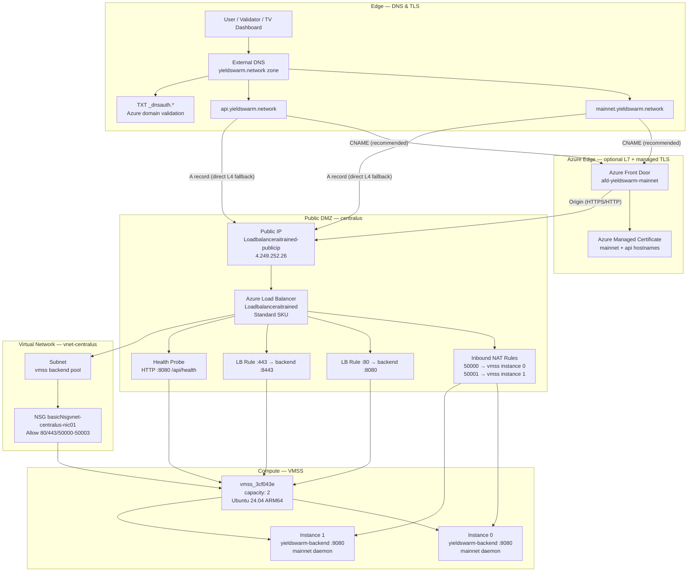

# Azure Mainnet VMSS — Network Topology & Custom Domain Routing

Production reference for the **YieldSwarm** mainnet stack in resource group `YieldSwarm` (`centralus`), as provisioned in deployment screenshots `Screenshot_20260621-191738.png` through `Screenshot_20260621-192100.png`.

## Known infrastructure (from deployment logs)

| Resource | Value |
|----------|-------|
| Resource group | `YieldSwarm` |
| Region | `centralus` |
| Public IP (LB frontend) | `4.249.252.26` |
| Load balancer | `Loadbalanceraitrained` |
| Public IP resource | `Loadbalanceraitrained-publicip` |
| VMSS | `vmss_3cf043e` (2× Ubuntu 24.04 ARM64) |
| VNet | `vnet-centralus` |
| NSG | `basicNsgvnet-centralus-nic01` |
| SSH via Inbound NAT | ports `50000`, `50001` (→ instance 0, 1) |
| SSH key | `vmss_key.pem` (`chmod 400`) |

## Architecture diagram (Mermaid)



## Traffic flow (custom domain → mainnet code)

1. **DNS** — `mainnet.yieldswarm.network` resolves via **CNAME** to Azure Front Door (managed TLS) or **A** record to `4.249.252.26` (direct to load balancer).
2. **TLS termination** — Front Door presents the Azure managed certificate; origin traffic to the LB can be HTTP `:8080` or HTTPS `:8443` on VMSS instances.
3. **Load balancer** — `Loadbalanceraitrained` distributes ports 80/443 to the VMSS backend pool on application ports 8080/8443.
4. **Health probe** — HTTP GET `/api/health` on port 8080 removes unhealthy instances from rotation.
5. **NSG** — `basicNsgvnet-centralus-nic01` permits inbound 80, 443, and SSH/NAT 50000–50003.
6. **VMSS** — `vmss_3cf043e` instances run the YieldSwarm integration backend (`yieldswarm-backend` on `:8080`) and mainnet node processes; operators SSH via `ssh -i vmss_key.pem -p 50000 azureuser@4.249.252.26`.

## DNS records required

### Option A — Azure Front Door + managed certificates (recommended)

| Host | Type | Value |
|------|------|-------|
| `mainnet.yieldswarm.network` | CNAME | `afd-yieldswarm-mainnet-<hash>.z01.azurefd.net` |
| `api.yieldswarm.network` | CNAME | same Front Door endpoint |
| `_dnsauth.mainnet` | TXT | emitted by `az afd custom-domain create` |
| `_dnsauth.api` | TXT | emitted by `az afd custom-domain create` |

### Option B — Direct to load balancer (Layer 4, no Azure-managed TLS at edge)

| Host | Type | Value |
|------|------|-------|
| `mainnet.yieldswarm.network` | A | `4.249.252.26` |
| `api.yieldswarm.network` | A | `4.249.252.26` |
| `_mainnet-challenge` | TXT | optional ACME / domain verification |

> For Option B, terminate TLS on each VMSS instance (e.g. Caddy + Let's Encrypt) or accept HTTP-only on port 80.

## Automation scripts

| Script | Purpose |
|--------|---------|
| `scripts/wire_infrastructure.sh` | Validate RG/LB/VMSS/NSG; open NSG ports; configure LB health probe + rules |
| `scripts/azure/provision-custom-domains.sh` | Front Door profile, origins, routes, managed certs, custom domains |
| `deploy/azure-mainnet.env.example` | All tunable parameters |

## Quick start

```bash
cp deploy/azure-mainnet.env.example deploy/azure-mainnet.env
# edit domains, ports, resource names

az login
az account set --subscription "<your-subscription-id>"

./scripts/wire_infrastructure.sh --env deploy/azure-mainnet.env
./scripts/azure/provision-custom-domains.sh --env deploy/azure-mainnet.env
```

## SSH to VMSS instances

```bash
chmod 400 vmss_key.pem
ssh -i vmss_key.pem -p 50000 azureuser@4.249.252.26   # instance 0
ssh -i vmss_key.pem -p 50001 azureuser@4.249.252.26   # instance 1
```

## Application endpoints (post-wiring)

| Surface | URL |
|---------|-----|
| Command Center | `https://mainnet.yieldswarm.network/command-center` |
| API health | `https://api.yieldswarm.network/api/health` |
| Sovereign loops | `https://api.yieldswarm.network/api/sovereign/loops` |
| Bifröst telemetry | `https://api.yieldswarm.network/api/helix/delta-v5/telemetry` |

## Related

- `docs/AZURE_VM_DASHBOARD.md` — single-VM bootstrap
- `scripts/azure-vm-bootstrap.sh` — instance software install
- `deploy/azure-mainnet.env.example` — infrastructure variables
