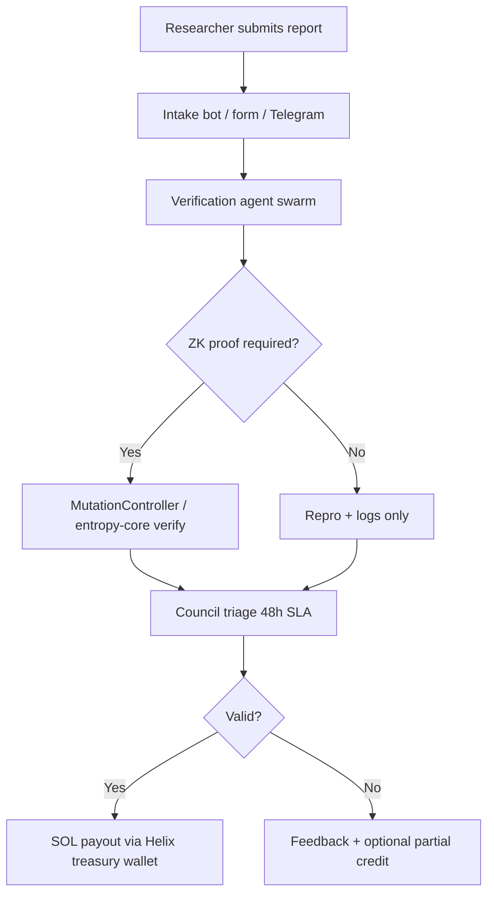

# YieldSwarm Bug Bounty v1 — SOL Rewards via ZK-Verifiable Submissions

> **Status:** Draft v1 — ready for Notion / Linear handoff  
> **Treasury source:** 20% net yield split → bounty pool (Great Delta ops bucket)  
> **Payout rail:** Solana via cross-chain bridges + Agent NFT treasury wallets

## Goals

1. Pay ethical hackers in **SOL** for verified, high-signal security findings.
2. Require **ZK-verifiable evidence** where applicable (Mayhem Mode entropy proofs, MutationController receipts).
3. Avoid dilution: fund from **treasury yield**, not token emissions.
4. Integrate with Arena live telemetry + Mandelbrot bot Neon logs for automated triage.

## Scope (in scope)

| Domain | Examples |
|--------|----------|
| ZK entropy / Mayhem Mode | Proof forgery, policy bypass, circuit input injection |
| MutationController / NFT | Unauthorized mutation, verifier bypass, reentrancy |
| Cross-chain bridges | Oracle manipulation, replay, treasury drain |
| Akash / GPU workers | SDL misconfig, secret leak, prompt injection to agent runtime |
| Emission router / Great Delta | Split manipulation, dust attacks, routing griefing |
| Arena / telemetry | PII leak, auth bypass, quarantine escape |

## Out of scope

- Social engineering, physical attacks, third-party SaaS bugs (report to vendor)
- Known issues in `PRODUCTION_READINESS.md` open items
- Findings on stale PR branches not merged to `main`

## Severity tiers & SOL rewards

Rewards are paid from the **bounty pool** (capped monthly). Amounts are guidelines; council may adjust ±25% for novelty.

| Tier | CVSS-style | SOL range | Examples |
|------|------------|-----------|----------|
| **Critical** | 9.0–10.0 | 250–500 SOL | Remote treasury drain, ZK verifier break, bridge key compromise |
| **High** | 7.0–8.9 | 50–100 SOL | Mutation auth bypass, emission split exploit, worker RCE |
| **Medium** | 4.0–6.9 | 10–25 SOL | Telemetry leak, DoS on sovereign loop, misconfigured Vault ACL |
| **Low** | 0.1–3.9 | 1–5 SOL | Info disclosure, missing rate limits, doc-only misconfig |

**Duplicate policy:** First verified report wins. Partial duplicates receive 10–30% at council discretion.

## Submission flow



### Submission payload (JSON)

```json
{
  "title": "Mayhem Mode accepts out-of-policy VRAM without proof rejection",
  "severity": "high",
  "component": "src/infrastructure/zk-entropy-prover.js",
  "repro_steps": ["..."],
  "proof": {
    "type": "zk_entropy_receipt",
    "commitment": "0x...",
    "publicSignals": ["..."],
    "groth16Proof": { "pi_a": [], "pi_b": [], "pi_c": [] }
  },
  "arena_session_id": "optional-mayhem-session",
  "neon_row_id": 12345,
  "wallet": "Solana pubkey for payout"
}
```

### Verification agents

| Agent | Role |
|-------|------|
| **ZK Guardian** | Re-runs `verifyProofLocally`, checks policy bounds in `entropy-bounds.js` |
| **Arena Auditor** | Correlates `mandelbrot_telemetry` + `helix_chain_snapshots` in Neon |
| **Conflict Crusher** | Ensures fix lands via ethical merge, not force-push |
| **Bounty Architect** | Maps severity → SOL tier, checks pool balance |

## Technical hooks (already in `main`)

| Artifact | Bounty use |
|----------|------------|
| `src/infrastructure/zk-entropy-prover.js` | Local proof verification API |
| `contracts/MutationController.sol` | On-chain mutation receipt |
| `telemetry/neon/schema.sql` | Immutable audit trail for submissions |
| `agents/mandelbrot_bot.py` | Correlation timestamps for Arena sessions |
| `GET /api/arena/overview` | Live chaos / connection health during Mayhem |
| Cross-chain MVP bridges | SOL payout execution |

## Payout sketch

1. **Pool funding:** `opsTreasury` (5% Great Delta) → weekly transfer to `BOUNTY_POOL_SOL` wallet (multisig).
2. **Quote:** Oracle price SOL/USD at payout time (Chainlink / Pyth).
3. **Execute:** `services/cross_chain/` Solana strategy → `transfer` to researcher wallet.
4. **Receipt:** Log to Neon `bounty_payouts` table (v2 schema) + on-chain tx hash.

## Safe harbor

- Good-faith research on `testnet`, `devnets`, and published staging URLs only unless written authorization.
- No mainnet attacks without council approval.
- Report within 24h of discovery; no public disclosure before fix + 90-day embargo.

## Activation checklist

- [ ] Create `BOUNTY_POOL_SOL` multisig + fund from ops treasury
- [ ] Deploy intake form (ValhallA portal) → webhook to verification swarm
- [ ] Add `POST /api/bounty/submit` (auth + rate limit + ZK optional)
- [ ] Neon migration: `bounty_submissions`, `bounty_payouts` tables
- [ ] Publish scope + tiers on `yieldswarm.crypto/security`
- [ ] Wire Telegram bot for researcher ack + status

## References

- `docs/MAYHEM_14_PILLAR_ZK.md`
- `docs/CROSS_CHAIN_MVP.md`
- `telemetry/neon/schema.sql`
- `PRODUCTION_READINESS.md`
