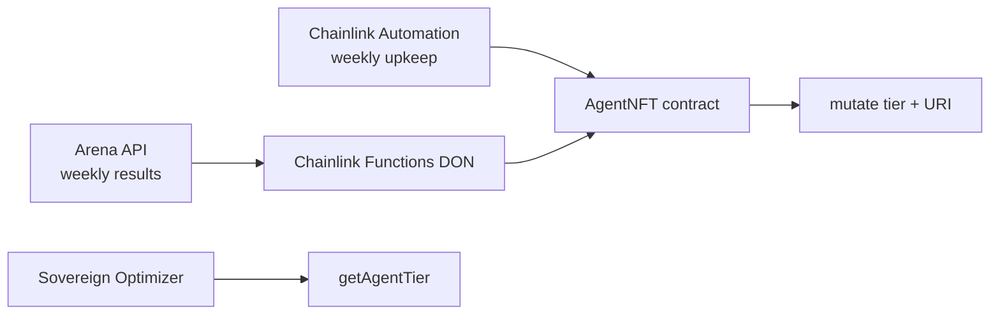

# Chainlink Agent NFT — Automation + Functions

Weekly Mutating Agent NFT updates using **Chainlink Automation** (schedule) + **Chainlink Functions** (Arena fetch + tier calculation).

---

## Architecture



**Hybrid pattern (recommended):**

1. **Automation** triggers `triggerWeeklyMutation()` every week.
2. Contract emits `WeeklyMutationTriggered(week)`.
3. Off-chain service (or batched Functions calls) reads Arena, calls `mutate()` per token.
4. For single-agent updates, **Functions** fetches Arena + returns ABI-encoded `(tokenId, tier, winRate, uri)`.

---

## Chainlink Functions setup (Sepolia)

1. Fund LINK on Sepolia.
2. Create subscription at [functions.chain.link](https://functions.chain.link).
3. Deploy `contracts/agent-nft/AgentNFT.sol` + `MutationController.sol`.
4. Wire `AgentNFT.setMutationController(controller)` and `MutationController.setOracleRelayer(relayer)`.
5. Add **MutationController** as **consumer** on subscription (Functions fulfillment target).
6. Upload encrypted secrets: `ARENA_API_KEY`, `ARENA_API_BASE`.
7. Register JavaScript source: `functions-source/mutate-agent.js`.
8. Set `donId` per Chainlink Sepolia docs (fun-ethereum-sepolia-1).

---

## Automation upkeep

Register upkeep on [automation.chain.link](https://automation.chain.link):

| Field | Value |
|-------|-------|
| Target | `AgentNFT` |
| Trigger | Time-based (weekly, e.g. Sunday 00:00 UTC) |
| Check data | empty |
| Gas limit | 500000+ (emit only; batch mutate off-chain) |

Contract implements:

- `checkUpkeep()` → true when `block.timestamp / 1 weeks > lastMutationWeek`
- `performUpkeep()` → `triggerWeeklyMutation()`

---

## Off-chain oracle bridge (relayer)

`backend/src/infrastructure/oracle-bridge.js` submits proofs to `MutationController.executeAgentMutation`:

```bash
# API dry-run (no private key)
curl -X POST http://127.0.0.1:8080/api/oracle/sync \
  -H 'Content-Type: application/json' \
  -d '{"tokenId":0,"tier":3,"winRateBps":7500,"uri":"https://example.com/meta/0"}'

# Live: set ORACLE_RELAYER_PRIVATE_KEY + MUTATION_CONTROLLER_CONTRACT
```

---

## Off-chain mutation service (batch)

```bash
# After WeeklyMutationTriggered event:
python3 services/nft_mutation_engine.py --week $(date +%U)
```

Responsibilities:

1. Pull Arena leaderboard / per-agent stats.
2. Compute tier (1–5) from win rate + tasks completed.
3. Generate IPFS/metadata URI via `services/nft_visual_generator.py` (future).
4. Call `mutate(tokenId, tier, winRateBps, uri)` in batches of 20.

---

## Oracle stack summary

| Data | Oracle | Notes |
|------|--------|-------|
| Arena performance | Chainlink Functions | Primary for mutation |
| ETH/USD, perp marks | Pyth | dYdX integration |
| Fallback prices | Chainlink Data Feeds | Treasury oracles |

---

## Integration with Sovereign Optimizer

```solidity
uint8 tier = agentNFT.getAgentTier(tokenId);
```

Higher tier → routing bonus in `services/sovereign_optimizer_v6.py` (`mutation_tier * 0.08`).

---

## Testnet → mainnet

| Step | Sepolia | Mainnet |
|------|---------|---------|
| Deploy AgentNFT | Yes | After audit |
| Functions subscription | Sepolia DON | Ethereum DON |
| Automation upkeep | Test LINK | Production LINK |
| NFT trading | Sepolia ETH | Real ETH |
