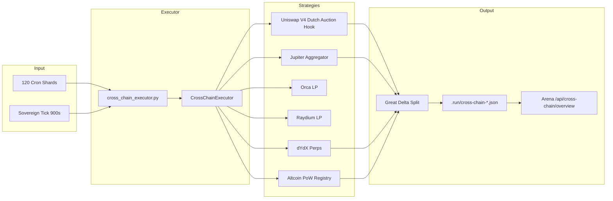

# Cross-Chain Execution — God Prompt P

YieldSwarm expansion: **Uniswap V4 hooks**, **Solana DEX liquidity**, **dYdX perps**, and **altcoin PoW mining** — integrated with Sovereign Loops, Great Delta (50/30/15/5), and the 30-day multi-cloud plan.

---

## Objectives

1. Multi-chain yield + execution engine (liquidity, strategies, perps, mining)
2. All revenue flows through **Great Delta 50/30/15/5**
3. Async execution via **cron shards** + **Sovereign Loop** ticks
4. Secrets via **HashiCorp Vault** — never in git
5. Telemetry in **Arena** via `/api/cross-chain/*`

---

## Architecture



---

## 1. Uniswap V4 Hooks + Auction Mechanics

### Design

| Mechanism | Purpose |
|-----------|---------|
| **Dutch auction** | Time-decay pricing for LP rebalances and order flow |
| **TWAP slices** | Large trades split across hook windows |
| **Sealed-bid** | Commit-reveal for MEV-sensitive flow |

### Contract

`contracts/hooks/YieldSwarmAuctionHook.sol` — scaffold with:

- `createDutchAuction()` / `currentPrice()` / `settleAuction()`
- Fee routing to `GreatDeltaEmissionRouter` beneficiary
- `beforeSwapHook()` placeholder for v4 `IHooks` integration

### Agent integration

```yaml
# config/cross_chain/strategies.yaml
uniswap_v4_hook:
  params:
    auction_type: dutch
    mev_protection: true
    duration_seconds: 300
```

Env: `UNISWAP_V4_HOOK_ADDRESS`, `YIELDSWARM_CROSS_CHAIN_API_URL`

### MEV protection

- Dutch decay limits sandwich window
- Hook-enforced minimum output per block
- Future: Flashbots/private mempool for EVM settlement

---

## 2. Solana Liquidity (Orca + Raydium + Jupiter)

### Stack

| Venue | Role |
|-------|------|
| **Jupiter** | Best-route swap aggregation (v6 quote API) |
| **Orca** | Concentrated liquidity positions |
| **Raydium** | AMM pool LP + yield farming |

### Implementation

`services/cross_chain/strategies/solana_liquidity.py`:

- Live Jupiter quotes when `JUPITER_API_KEY` set
- LP actions scaffolded for Orca/Raydium
- Dry-run default (`CROSS_CHAIN_DRY_RUN=1`)

### Vault paths

```
yieldswarm/data/rpc/solana   { url, helius_api_key, jupiter_api_key }
yieldswarm/data/rpc/jupiter  { api_key }
yieldswarm/data/rpc/raydium  { api_key }
```

---

## 3. dYdX Perps Integration

### Capabilities

| Action | Use case |
|--------|----------|
| `open` | Directional yield on BTC/ETH/SOL |
| `close` | Take profit / stop loss |
| `hedge` | Offset spot/mining exposure |

### Implementation

`services/cross_chain/strategies/dydx_perps.py` — PnL estimates feed Great Delta split.

### Vault

```
yieldswarm/data/integrations/dydx  { api_key, api_secret, passphrase }
```

Env: `DYDX_API_KEY`, `DYDX_API_BASE`

### Treasury link

Perp PnL → `route_revenue_to_treasury()` → insurance bucket for drawdown reserves.

---

## 4. Altcoin PoW Mining Expansion

### Registry

| Coin | Status | Hardware | Revenue |
|------|--------|----------|---------|
| **bittensor** | Live | RTX 3090 | TAO emissions |
| **grass** | Planned | CPU | DePIN points |
| **flux** | Candidate | GPU | Block rewards |
| **kaspa** | Candidate | GPU | Block rewards |
| **ironfish** | Candidate | GPU | Block rewards |
| **prn_depin** | Research | CPU/GPU | Network rewards |

### Unified routing

`services/cross_chain/strategies/altcoin_pow.py` + `mining/equipment-wallet-connector.py` (extend for multi-pool).

Env: `POW_MINING_COINS=bittensor,grass`

---

## 5. Sovereign Loops + Great Delta Integration

### Sovereign tick flow

```
swarm_runner.py tick
  → cross_chain_executor.tick()
  → run_scheduled_strategies(shard_id=AGENT_SHARD_ID)
  → persist .run/cross-chain-last-run.json
  → iteration_100_sovereign_loops (treasury rebalance reads totals)
```

### Great Delta invariant

From `agents/governance/gospel.py`:

```python
TREASURY_SPLIT_BPS = (5000, 3000, 1500, 500)  # 50/30/15/5
```

Every `ExecutionReceipt` includes `treasury_split` from `route_revenue_to_treasury()`.

---

## 6. API + Telemetry

| Endpoint | Purpose |
|----------|---------|
| `GET /api/cross-chain/health` | Service status |
| `GET /api/cross-chain/overview` | Strategies, receipts, treasury totals |
| `POST /api/cross-chain/telemetry` | Ingest external execution events |
| `GET /api/arena/overview` | Includes `crossChain` connection |

---

## 7. Security & Risk

| Risk | Mitigation |
|------|------------|
| Hot wallet exposure | Vault AppRoles; TEE signing (`tee_signing_key`) |
| Perp liquidation | Position caps; hedge mode default; insurance bucket |
| MEV on EVM | Dutch auctions; private mempool (future) |
| Solana slippage | `slippage_bps` cap; Jupiter route validation |
| Dry-run bypass | `CROSS_CHAIN_DRY_RUN` default `1`; live requires API keys |
| 80ms guardrail | Gospel `LATENCY_GUARDRAIL_MS` on telemetry ingest |

---

## 8. 30-Day Rollout Plan

Works alongside multi-cloud GPU utilization:

| Week | Focus | Deliverable |
|------|-------|-------------|
| **1** | Solana quick wins | Jupiter quotes live; dry-run → quoted |
| **1** | PoW status | Bittensor telemetry in cross-chain dashboard |
| **2** | Uniswap V4 | Deploy hook testnet; agent Dutch auctions |
| **2** | Akash revenue | Mining rewards → Great Delta split |
| **3** | dYdX hedge | Enable perps with position limits |
| **3** | Grass DePIN | Azure/GCP nodes in pow registry |
| **4** | On-chain anchor | Deploy `GreatDeltaEmissionRouter` |
| **4** | Live execution | `CROSS_CHAIN_DRY_RUN=0` with council 9/14 approval |

### Commands

```bash
./scripts/cross-chain-preflight.sh
python3 agents/cross_chain_executor.py
make cross-chain-run          # if Makefile target added
curl -s localhost:8080/api/cross-chain/overview | jq .
```

---

## 9. File Reference

| Path | Purpose |
|------|---------|
| `services/cross_chain/executor.py` | Job runner + persistence |
| `services/cross_chain/great_delta.py` | 50/30/15/5 routing |
| `services/cross_chain/strategies/*.py` | Per-venue strategies |
| `agents/cross_chain_executor.py` | Sovereign agent |
| `contracts/hooks/YieldSwarmAuctionHook.sol` | V4 hook scaffold |
| `config/cross_chain/strategies.yaml` | Strategy config |
| `backend/src/adapters/crossChain.js` | API telemetry |
| `tests/test_cross_chain.py` | Unit tests |

---

## 10. Parallel Agent Ownership

| Agent | Owns | Does NOT own |
|-------|------|--------------|
| Cross-Chain God P | `services/cross_chain/`, `docs/CROSS_CHAIN_EXECUTION.md` | Akash SDL |
| God Prompt H | `sovereign_runtime.py` hardening | Strategy implementations |
| God Prompt G | Postgres payments | Wallet signing |
| Multi-cloud | GPU burst | On-chain execution |

---

## Gospel expansion

Cross-chain venues added to `agents/governance/gospel.py`:

```python
CROSS_CHAIN_VENUES = ("uniswap_v4", "jupiter", "orca", "raydium", "dydx", "pow_mining")
CROSS_CHAIN_DRY_RUN_DEFAULT = True
```

**Philosophy:** Compute generates inference + mining yield; execution layers compound it across chains; Great Delta ensures every dollar respects the 50/30/15/5 covenant.

---

## Next steps

1. Merge this PR + wire `YIELDSWARM_CROSS_CHAIN_API_URL` live executor
2. Deploy `GreatDeltaEmissionRouter` to anchor on-chain splits
3. Enable `CROSS_CHAIN_DRY_RUN=0` per strategy with 9/14 council gate
4. Extend Arena UI with cross-chain strategy cards
