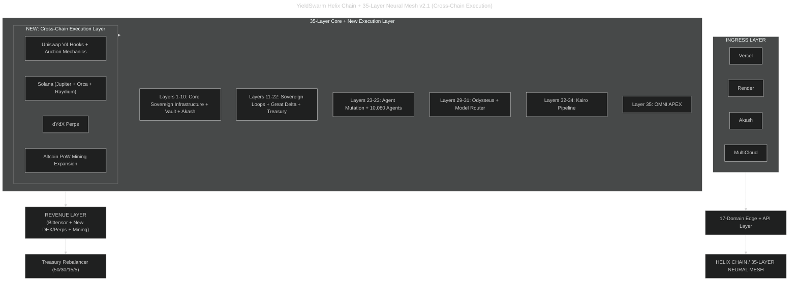

# Cross-Chain Execution MVP

> Status: June 2026 · **Priority 1–2 live** (Uniswap V4 hook skeleton + Jupiter quotes)  
> Revenue routes through **Great Delta 50/30/15/5** on every execution path.

## Tactical scope (7–14 day MVP)

| Priority | Vector | Status | Path |
|----------|--------|--------|------|
| 1 | Uniswap V4 Hooks + auction | MVP skeleton | `contracts/cross-chain/YieldSwarmAuctionHook.sol`, `services/cross_chain/uniswap_v4.py` |
| 2 | Solana Jupiter + Raydium/Orca | Quote + swap build | `services/cross_chain/jupiter.py` |
| 3 | dYdX perps | Planned | agent stub in sovereign loop backlog |
| 4 | Altcoin PoW mining | Existing | `mining/equipment-wallet-connector.py` |

## Architecture



## Gospel v2.1 — The Expanded Harvest

We believe in **sustainable high-yield optimized compute** — and **aggressive, intelligent expansion** when opportunity appears.

**Original vision:**
- Ethical sourcing of compute and yield
- Real infrastructure (DePIN, hardware, energy)
- Farmers and operators earning through better systems
- Four fundamentals: Proportion, Compute Load, Cost, Vector Accelerants

**v2.1 addition:** Cross-chain execution alpha — Uniswap V4 hooks, Solana liquidity (Orca, Raydium, Jupiter), dYdX perps, altcoin PoW mining — as **additional Helix vectors**, not separate verticals.

> “We will use every ethical advantage — custom smart contract hooks, fast Solana execution, leveraged perps, or raw PoW hashpower — to compound yield for the treasury and the agents that serve it.”

## Integration points

### Sovereign loops

- `agents/cross_chain_execution_loop.py` — runs each Iteration 100 cycle
- `agents/cross_chain_mvp.py` — standalone agent (also in `swarm_runner.py`)
- Report: `.run/cross-chain-mvp.json`

### API

| Endpoint | Method | Purpose |
|----------|--------|---------|
| `/api/dex/health` | GET | Jupiter + Uniswap V4 live/configured |
| `/api/dex/quote` | POST | Quote / auction sim + Great Delta split |
| `/dex/quote` | POST | Tool adapter backend |

### Odysseus tools

- `yieldswarm_dex_quote` — `{ "chain": "solana" \| "ethereum" }`
- `yieldswarm_dex_swap` — dry-run by default

Set `YIELDSWARM_DEX_API_URL=http://127.0.0.1:8080` to route tools through the integration backend.

## Environment variables

```bash
JUPITER_API_KEY=...
JUPITER_API_URL=https://quote-api.jup.ag/v6
SOLANA_RPC_URL=...
SLIPPAGE_TOLERANCE=50          # basis points for Jupiter
UNISWAP_V4_POOL_MANAGER=0x...
UNISWAP_V4_HOOK_ADDRESS=0x...
UNISWAP_V4_AUCTION_SECONDS=300
EVM_RPC_URL=...
CROSS_CHAIN_MVP_ENABLED=true
CROSS_CHAIN_DRY_RUN=true       # agent default
YIELDSWARM_DEX_API_URL=http://127.0.0.1:8080
```

Secrets seed via Vault (`vault/scripts/seed-secrets.sh`) and inject through `akash/templates/runtime.env.ctmpl`.

## Run locally

```bash
# Agent strategy (dry-run)
python3 agents/cross_chain_mvp.py

# Sovereign loop (includes cross-chain each cycle)
SOVEREIGN_ONESHOT=true python3 deploy/runtime/swarm_runner.py

# API health
curl -s http://127.0.0.1:8080/api/dex/health | jq

# Jupiter quote (SOL → USDC, 0.001 SOL)
curl -s -X POST http://127.0.0.1:8080/api/dex/quote \
  -H 'Content-Type: application/json' \
  -d '{"chain":"solana","input_mint":"So11111111111111111111111111111111111111112","output_mint":"EPjFWdd5AufqSSqeM2qN1xzybapC8G4wEGGkZwyTDt1v","amount":"1000000"}' | jq
```

## Monitoring

- `.run/cross-chain-mvp.json` — last sovereign cycle executions + treasury routes
- `GET /api/dex/health` — `configured_count`, `live_count` per provider
- Sovereign report includes `cross_chain_metrics` each cycle

## Next steps (post-MVP)

1. **Deploy `YieldSwarmAuctionHook.sol`** to testnet; wire `UNISWAP_V4_HOOK_ADDRESS`
2. **Enable live Jupiter swaps** — set `CROSS_CHAIN_DRY_RUN=false`, fund hot wallet, Vault-inject `SOLANA_HOT_WALLET_PUBKEY`
3. **Raydium/Orca LP** — extend `services/cross_chain/` with pool deposit helpers
4. **dYdX perps** — add `services/cross_chain/dydx.py` + sovereign agent strategy
5. **PoW vector** — connect highest-ROI altcoin pool to existing mining connector
6. **Telemetry** — POST execution fees to `/api/great-delta/telemetry` on each live swap

## Tests

```bash
python3 -m unittest tests.test_cross_chain_mvp -v
```
