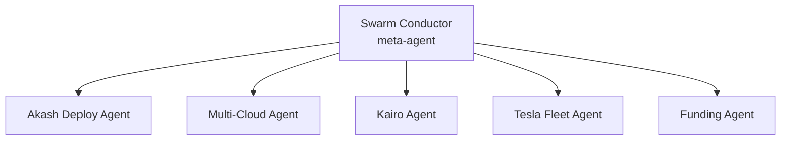

# Cursor Cloud Environment Setup

Configure Cursor for **parallel agent execution** across YieldSwarm's multi-cloud deployment.

---

## Quick setup (5 minutes)

### 1. Load MCP config

Copy the repo MCP config into Cursor:

**macOS / Linux:**
```bash
mkdir -p ~/.cursor
cp .cursor/mcp-config-top12.json ~/.cursor/mcp.json
# Or merge mcpServers into your existing ~/.cursor/mcp.json
```

**Cursor UI:** Settings → MCP → Edit Config → paste contents of `.cursor/mcp-config-top12.json`

### 2. Set environment variables for MCP servers

Add to your shell profile or Cursor env (never commit secrets):

```bash
# Required for GitHub MCP
export GITHUB_PERSONAL_ACCESS_TOKEN="ghp_..."

# Optional — enable cloud MCPs as you add keys
export RUNPOD_API_KEY="..."
export VAST_API_KEY="..."
export VAULT_TOKEN="..."          # short-lived; rotate often
export LINEAR_API_KEY="..."       # if using Linear MCP
```

### 3. Activate Swarm Conductor

Open a **dedicated Composer agent** tab → paste the full prompt from `docs/SWARM_CONDUCTOR.md`.

Name it **Swarm Conductor**. Keep it open while running parallel agents.

### 4. Verify MCP

In any Cursor agent chat:
```
List available MCP tools and confirm yieldswarm + filesystem are connected.
```

---

## MCP servers included (top 12)

| # | Server | Purpose | Auth |
|---|--------|---------|------|
| 1 | **yieldswarm** | Akash leases, treasury, wallet, telemetry tools | `.env` / Vault |
| 2 | **filesystem** | Repo file read/write | None |
| 3 | **github** | PRs, issues, branches | `GITHUB_PERSONAL_ACCESS_TOKEN` |
| 4 | **linear** | Issue tracking (YieldSwarm workspace) | `LINEAR_API_KEY` |
| 5 | **fetch** | HTTP fetch for API docs / status pages | None |
| 6 | **memory** | Cross-session agent memory | None |
| 7 | **sequential-thinking** | Complex multi-step reasoning | None |
| 8 | **brave-search** | Web search for provider docs | `BRAVE_API_KEY` (optional) |
| 9 | **postgres** | Neon DB queries (payments) | `DATABASE_URL` |
| 10 | **akasha-docs** | Fetch Akash/Terraform docs | None (fetch-based) |
| 11 | **vault-hint** | Reminds agents of Vault paths (read-only) | None |
| 12 | **time** | Scheduling / cron alignment | None |

Built-in **Linear** MCP is also available in Cursor Cloud if authenticated via the IDE.

---

## Parallel agent layout



| Agent tab | God Prompt | Branch prefix |
|-----------|------------|---------------|
| Swarm Conductor | `docs/SWARM_CONDUCTOR.md` | — |
| Akash live deploy | `docs/AKASH_DEPLOY.md` + P0 checklist | `cursor/akash-*` |
| Multi-cloud 30-day | `docs/MULTI_CLOUD_30DAY_PLAN.md` | `cursor/multi-cloud-*` |
| Tesla pairing | `docs/TESLA_FLEET_INTEGRATION.md` follow-up | `cursor/tesla-*` |
| Kairo | `KAIRO_FRONTEND.md` | `cursor/kairo-*` |
| Postgres payments | God Prompt G | `cursor/postgres-*` |
| Sovereign hardening | God Prompt H | `cursor/sovereign-*` |

**Rule:** One agent per file-ownership area. Conductor resolves conflicts.

---

## God Prompt — Cursor Cloud Environment Setup

Copy into a new Composer agent named **Cursor Cloud Setup**:

```
You are a Cursor cloud environment architect for YieldSwarm.

Task: Verify and complete the Cursor + MCP setup for parallel multi-cloud agent execution.

Steps:
1. Confirm `.cursor/mcp-config-top12.json` exists and list each MCP server.
2. Document which servers need API keys and which are ready out of the box.
3. Verify `docs/SWARM_CONDUCTOR.md` merge order matches open PRs on `cursor/*-9c82`.
4. Create a "Parallel Agent Launch Board" in docs/CURSOR_AGENT_BOARD.md with:
   - Agent name, branch, file ownership, status, blocker
5. Ensure human gates are surfaced: VAULT_TOKEN, Akash wallet, cloud API keys.
6. Do NOT paste secrets. Reference Vault paths only.

Output: docs/CURSOR_AGENT_BOARD.md + any fixes to mcp-config-top12.json
```

---

## Cloud Agent (Cursor Background) tips

When using **Cursor Cloud Agents** (this environment):

1. Agents auto-create branches `cursor/<name>-9c82` — one branch per task.
2. Commit + push + draft PR after each iteration.
3. Human gates (wallet, Vault token) cannot be completed by agents — surface them clearly.
4. Run `make multicloud-preflight` before any live cloud deploy agent work.

---

## Troubleshooting

| Symptom | Fix |
|---------|-----|
| MCP server won't start | Check `npx` / `python3` in PATH; read Cursor MCP logs |
| yieldswarm tools fail | Set `VAULT_ADDR` + ensure repo root is MCP cwd |
| GitHub MCP 401 | Regenerate `GITHUB_PERSONAL_ACCESS_TOKEN` with repo scope |
| Agents edit same file | Tell Swarm Conductor; enforce file ownership table |
| Linear auth needed | Authenticate Linear in Cursor desktop IDE MCP panel |

---

## Related

- `docs/SWARM_CONDUCTOR.md` — meta-agent prompt
- `docs/30DAY_EXECUTION_CHECKLIST.md` — master 30-day tracker
- `docs/MULTI_CLOUD_30DAY_PLAN.md` — deployment strategy
- `.cursor/mcp-config-top12.json` — MCP server definitions
