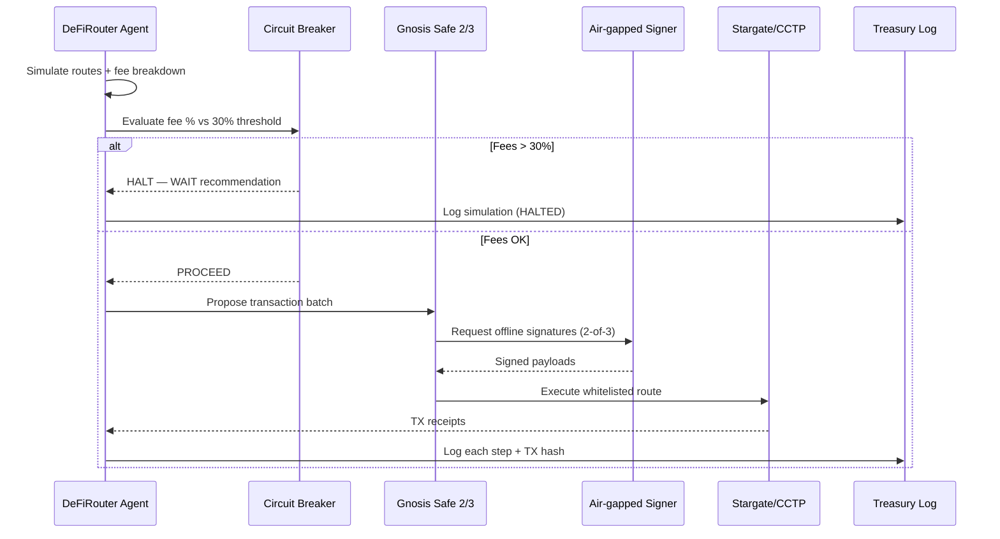

# YieldSwarm DeFiRouter — Security Architecture

Five-layer security stack for treasury routing across bridges and DEX aggregators.

---

## Layer stack

```
Layer 1: Air-gapped signing (hardware wallet / offline HSM)
Layer 2: Gnosis Safe multi-sig (2-of-3 required)
Layer 3: Session keys (ERC-4337, 1-hour expiry, scope-limited)
Layer 4: Circuit breaker (30% fee threshold → auto-halt)
Layer 5: Audit trail (all TX → Notion treasury hub)
```

| Layer | Component | Repo anchor |
|-------|-----------|-------------|
| 1 | Offline HSM / Ledger | Operator procedure — keys never in git |
| 2 | Gnosis Safe 2-of-3 | `defi-router/src/security.ts` |
| 3 | ERC-4337 session keys | `defi-router/src/security.ts` |
| 4 | Circuit breaker | `services/cross_chain/defi_router/circuit_breaker.py` |
| 5 | Notion audit log | `services/cross_chain/defi_router/notion_logger.py` |

---

## Threat model

| Threat | Mitigation |
|--------|------------|
| Private key theft | Keys never touch internet; HSM + air-gap signing |
| Malicious bridge | Whitelist audited protocols only (Stargate: 13 audits, CCTP: Circle official) |
| MEV extraction | 1inch Fusion / RFQ routing eliminates mempool exposure |
| Session key compromise | Time-bound (1h) + value-capped ($1,000 max per session) |
| Fake DEX pool | Liquidity depth verification before routing |
| Fee drag on small portfolios | Circuit breaker halts at >30% projected fees |

---

## Whitelisted providers

### Bridges

| Provider | Audits | Notes |
|----------|--------|-------|
| Stargate (LayerZero) | 13 | ETH→Arbitrum primary |
| Circle CCTP | Official | USDC burn/mint cross-chain |
| Symbiosis | 8 | Fast settlement (33s) |
| deBridge | 6 | 0-TVL routing |

### Swaps

| Provider | Platform fee | Notes |
|----------|--------------|-------|
| 1inch | 0% | Best rate aggregation; Fusion for MEV protection |
| Curve | 0.04% pool | Stablecoin exits |
| Uniswap V3/V4 | Pool fee | Fallback mainnet |

---

## Execution flow



---

## Environment variables (Vault paths)

| Variable | Vault path | Purpose |
|----------|------------|---------|
| `NOTION_API_KEY` | `yieldswarm/data/integrations/notion` | Treasury audit log |
| `NOTION_TREASURY_DATABASE_ID` | same | Target database |
| `DEFI_ROUTER_FEE_THRESHOLD_PCT` | — | Default `30` |
| `DEFI_ROUTER_DRY_RUN` | — | Default `1` (simulate only) |
| `GNOSIS_SAFE_ADDRESS` | `yieldswarm/data/treasury/gnosis` | Multi-sig contract |
| `ONEINCH_API_KEY` | `yieldswarm/data/integrations/1inch` | Live swap quotes |

Never commit keys or wallet material to git. See `SECRETS.md`.

---

## Related docs

- [`CROSS_CHAIN_EXECUTION.md`](CROSS_CHAIN_EXECUTION.md) — God Prompt P execution layer
- [`VAULT_SECRET_STRUCTURE.md`](VAULT_SECRET_STRUCTURE.md) — secret layout
- [`config/cross_chain/defi-router.json`](../config/cross_chain/defi-router.json) — default portfolio profile
