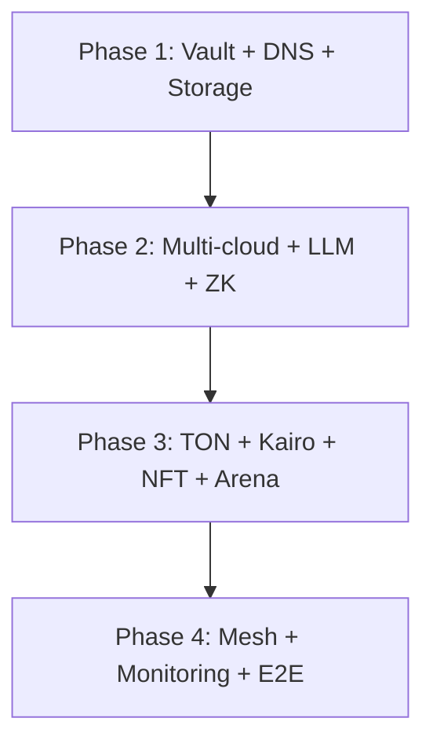

# Deployment Priority & Order — Full Stack

> **Sequence:** D → A → C → B  
> **Env template:** `deploy/env/layered.env.example`  
> **Plug-and-play:** `deploy/deploy-full-stack.sh` + `deploy/templates/`  
> **Vault migration:** `docs/VAULT_ENV_INJECTION.md`

This document is the canonical **deployment sequence** for YieldSwarm AgentSwarm OS v2. It minimizes risk by respecting infrastructure dependencies across the four coordinate axes (Greek D¹, Eastern E¹, Paradigm Shift Z¹, Rosetta W).

---

## Phase 1: Foundation (do this first)

| Priority | Component | Focus | Notes |
|----------|-----------|-------|-------|
| **1** | Cloud infrastructure (base VMs + networks) | 18 providers | Terraform + provider keys in Vault `providers/*` |
| **2** | HashiCorp Vault + secrets setup | ~1 hr | **Critical before anything else** — see `docs/VAULT_ENV_INJECTION.md` |
| **3** | Database / storage layer | Neon, IPFS, Arweave, Pinata | `NEON_DATABASE_URL`, `PINATA_*`, `ARWEAVE_KEY` |
| **4** | Core networking + 17 domains | DNS + Cloudflare | `CLOUDFLARE_*`, `UD_API_KEY` |

**Gate:** Vault seeded (`./vault/scripts/seed-secrets.sh`), DNS resolving, storage smoke test passes.

```bash
export TARGET_ENV=production
./deploy/deploy-full-stack.sh --phase 1
```

---

## Phase 2: Core infrastructure

| Priority | Component | Focus | Notes |
|----------|-----------|-------|-------|
| **5** | Multi-cloud orchestration | Plug-and-play templates | `deploy/templates/cloud/{akash,azure,aws,vast}/` |
| **6** | LLM routing layer (18 APIs) | Odysseus + LiteLLM | `deploy/templates/llm-router/` |
| **7** | ZK entropy proof system | Circuit + prover + verifier | `docs/ZK_ENTROPY_SETUP.md`, `deploy/templates/zk-entropy/` |
| **8** | Sovereign optimizer v6 | Intelligence layer | `scripts/start-sovereign-loops.sh` |

**Gate:** `npm run test:helix`, `npm run test:entropy`, backend `/api/health` OK.

```bash
./deploy/deploy-full-stack.sh --phase 2
```

---

## Phase 3: Application & product layers

| Priority | Component | Focus | Notes |
|----------|-----------|-------|-------|
| **9** | TON mini game + reward system | User acquisition | `deploy/templates/ton-kairo/` |
| **10** | Kairo driver system | Real-world telemetry | `KAIRO_TELEMETRY_ENDPOINT`, Tesla fleet |
| **11** | Mutating agent NFT contracts | ZK proof verification | `MutationController.sol`, Sepolia verifier |
| **12** | Arena + telemetry dashboard | Frontend + API | Backend `:8080`, Arena `/arena` |

**Gate:** `./scripts/deploy-and-test-pillars.sh`, Arena overview connected.

```bash
./deploy/deploy-full-stack.sh --phase 3
```

---

## Phase 4: Final integration & hardening

| Priority | Component | Focus | Notes |
|----------|-----------|-------|-------|
| **13** | Full service mesh (454 services) | Connect everything | `deploy/deploy-swarm-monolith.yaml` last |
| **14** | Monitoring, logging & alerts | Mainnet readiness | `deploy/monitoring/`, Sentry, Prometheus |
| **15** | Security hardening + access control | Greek layer enforcement | `GREEK_LAYER__*` env vars |
| **16** | End-to-end testing | Full flow | `./scripts/master-smoke-test.sh` |

**Gate:** All smoke tests green, Vault Agent injection verified on Akash leases.

```bash
./deploy/deploy-full-stack.sh --phase 4
./scripts/master-smoke-test.sh
```

---

## Recommended Akash sub-order (within Phase 2–3)

From `docs/VAULT_AKASH_DEPLOY.md`:

| Order | SDL | Script | Vault role |
|-------|-----|--------|------------|
| 1 | `deploy/akash-bittensor-miner.sdl.yml` | `scripts/deploy-bittensor.sh` | `bittensor-runtime` |
| 2 | `deploy/akash-backend.sdl.yml` | `scripts/deploy-backend-akash.sh` | `integration-backend` |
| 3 | `deploy/akash-odysseus.sdl.yml` | `scripts/deploy-odysseus-vault-akash.sh` | `odysseus-runtime` |
| 4 | `deploy/deploy-swarm-monolith.yaml` | `scripts/deploy-to-akash.sh` | `akash-runtime` |

---

## 14-pillar solenoid map (Helix Phase 1)

| # | Pillar | Layer emphasis |
|---|--------|----------------|
| 01 | `greek_vaults` | D¹ — zero-trust boundaries |
| 02 | `infra_oracles` | D¹ — isolation |
| 03 | `zk_mayhem_core` | Z¹ — entropy proofs |
| 04 | `akash_gpu_workers` | E¹ — telemetry ingest |
| 05 | `arena_leaderboard` | W — i18n dashboards |
| 06 | `cross_chain_exec` | Z¹ — execution mesh |
| 07 | `depin_orchestration` | E¹ — workload shedding |
| 08 | `emission_routing` | Z¹ — treasury flow |
| 09 | `agentswarm_os` | All axes |
| 10 | `security_tee_mpc` | D¹ — enclave separation |
| 11 | `telemetry_observability` | E¹ — continuous ingest |
| 12 | `governance` | W — multilingual consensus |
| 13 | `treasury_yield` | Z¹ — yield routing |
| 14 | `valhalla_portal` | W — portal i18n |

Validate all pillars:

```bash
./scripts/deploy-and-test-pillars.sh devnet
```

---

## Quick reference

| Task | Command |
|------|---------|
| Copy layered env | `cp deploy/env/layered.env.example .env` |
| Render templates | `./deploy/templates/lib/render-template.sh all` |
| Full stack (dry run) | `DRY_RUN=1 ./deploy/deploy-full-stack.sh` |
| Full stack (phase N) | `./deploy/deploy-full-stack.sh --phase N` |
| Vault seed | `./vault/scripts/seed-secrets.sh` |
| Hardware guardian | `./deploy/entrypoint.monitor.sh` |

---

## Dependency graph



**Do not skip Phase 1.** Every downstream component assumes Vault paths and DNS are live.
