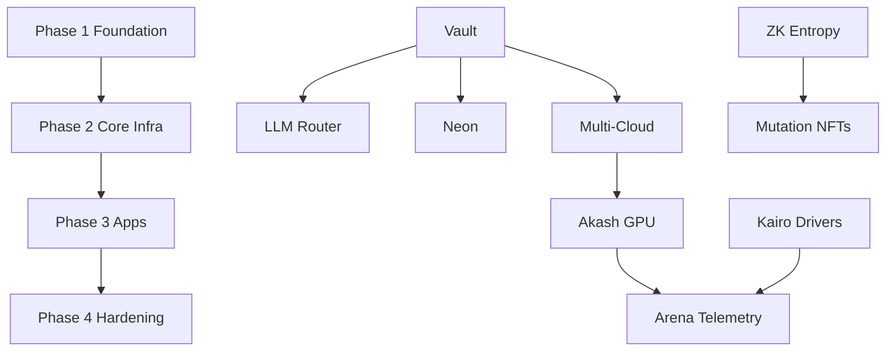

# Full-Stack Deployment Priority Order

> **Order:** D (this doc) → layered env → plug-and-play templates → Vault injection  
> **Canonical scripts:** `deploy/deploy-full-stack.sh`, `scripts/deploy-production-full.sh`  
> **Last updated:** 2026-06-16

This sequence minimizes risk and respects dependencies across 18 cloud providers, 17 domains, ZK Mayhem Mode, and the 35-layer neural mesh.

---

## Phase 1 — Foundation (do first)

| # | Component | Script / path | Depends on | Verify |
|---|-----------|---------------|------------|--------|
| 1 | **Cloud base (networks + VMs)** | `deploy/terraform/`, `deploy/terraform-tfc/` | Provider credentials | `terraform plan` |
| 2 | **HashiCorp Vault + secrets** | `scripts/deploy-production.sh vault`, `vault/scripts/seed-secrets.sh` | `VAULT_ADDR`, admin token | `vault status` |
| 3 | **Database / storage** | Neon `DATABASE_URL`, IPFS/Arweave keys | Vault `internal/database` | `python3 -m services.neon_store --migrate` |
| 4 | **17 domains + DNS** | `scripts/sync-environment-branches.sh`, Cloudflare | Domain registrar | `curl -I https://api.yieldswarm.crypto/health` |

**Gate:** Vault reachable, `DATABASE_URL` verified, at least one domain resolves.

---

## Phase 2 — Core infrastructure

| # | Component | Script / path | Depends on | Verify |
|---|-----------|---------------|------------|--------|
| 5 | **Multi-cloud orchestration** | `make tfc-init`, `deploy/templates/cloud/*` | Phase 1 | Akash lease or Azure VMSS up |
| 6 | **LLM routing (18 APIs)** | Odysseus + LiteLLM (`deploy/templates/llm-router/`) | Vault LLM keys | `curl :4000/v1/models` |
| 7 | **ZK entropy proof system** | `circuits/`, `src/infrastructure/zk-entropy-prover.js` | GPU telemetry path | `npm run test:unit` |
| 8 | **Sovereign optimizer + loops** | `deploy/runtime/swarm_runner.py`, `make sovereign-up` | Akash workers | `.run/sovereign.heartbeat` |

**Gate:** `npm run test:unit` + `cd backend && npm test` green; sovereign tick increments.

---

## Phase 3 — Application & product layers

| # | Component | Script / path | Depends on | Verify |
|---|-----------|---------------|------------|--------|
| 9 | **TON mini game + rewards** | `ton-mmorpg/` (server + contracts + client) | TON API, `PLAYER_SBT_ADDRESS`, Toncenter key | TonConnect + `docs/ARCHITECTURE.md` |
| 10 | **Kairo driver system** | `kairo/`, `agents/mandelbrot_bot.py` | Identity store, Neon | `bash scripts/run-mandelbrot-bot.sh` |
| 11 | **Mutating Agent NFTs** | `contracts/MutationController.sol` | ZK verifier deployed | `forge test --match-contract MutationController` |
| 12 | **Arena + telemetry** | `frontend/src/routes/Arena.tsx`, `/api/arena/overview` | Integration backend :8080 | Arena Helix + ZK cards live |

**Gate:** Arena overview returns `connectionsHealthy >= 4`; Kairo ingest accepts signed telemetry.

---

## Phase 4 — Integration & hardening

| # | Component | Script / path | Depends on | Verify |
|---|-----------|---------------|------------|--------|
| 13 | **Service mesh wiring** | `deploy/deploy-full-stack.sh --phase mesh` | Phases 1–3 | `bash tests/integration/smoke_test.sh` |
| 14 | **Monitoring + alerts** | `make monitoring-up`, `deploy/monitoring/` | Prometheus targets | Grafana dashboard loads |
| 15 | **Security hardening (D¹)** | Vault policies, `GREEK_LAYER__*` env | Greek layer flags | Secrets scan CI green |
| 16 | **End-to-end testing** | `npm test`, integration smoke, `forge test` | All above | `PRODUCTION_READINESS.md` checklist |

**Gate:** All env branches (`development` → `MAINNET`) synced to `main`; bug bounty intake ready (`docs/BUG_BOUNTY_V1.md`).

---

## Dependency graph



---

## Quick deploy (single command)

```bash
# Copy layered env, fill secrets (or use Vault export)
cp config/layered.env.example .env

# Full stack (respects phase order; supports --phase N and --dry-run)
bash deploy/deploy-full-stack.sh

# Production pipeline (Vault → Akash → Vercel → Neon)
bash scripts/deploy-production-full.sh
```

---

## PR / integration branch order

When merging open PRs, use an integration branch — **never** bulk-merge stale branches into `main`:

```bash
bash scripts/deploy-pending-prs.sh integration/$(date +%Y-%m-%d) --to-main
```

See `docs/PR_CLOSE_CHECKLIST.md` for superseded PRs (#10, #43, #38) and selective merges (#4, #9, #8).

---

## References

| Doc | Purpose |
|-----|---------|
| `config/layered.env.example` | Layered env (A) |
| `deploy/deploy-full-stack.sh` | Plug-and-play deploy (C) |
| `docs/VAULT_ENV_INJECTION.md` | Vault injection (B) |
| `docs/DEPLOYMENT_GUIDE.md` | Akash + TFC bootstrap |
| `docs/MAYHEM_14_PILLAR_ZK.md` | ZK entropy system |
| `docs/BUG_BOUNTY_V1.md` | Post-deploy security program |
