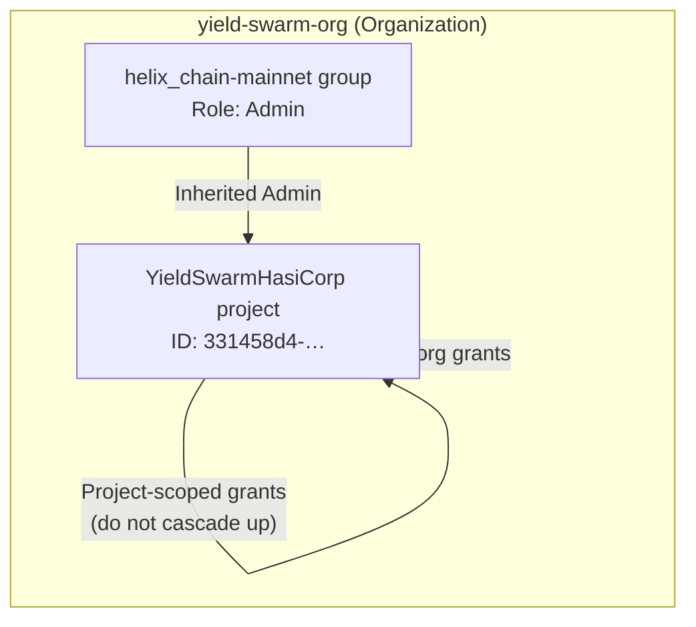

# HashiCorp Cloud Platform — Organization & IAM

Operator reference for the **yield-swarm-org** tenant on HashiCorp Cloud Platform (HCP). Captures project structure, group membership, and how permissions flow to Vault, Terraform, and fleet deploy paths in this repo.

## Tenant overview

| Field | Value |
|-------|-------|
| **Organization** | `yield-swarm-org` |
| **Project name** | `YieldSwarmHasiCorp` |
| **Project description** | Massive Agentic Ai PoW Blockchain |
| **Project ID** | `331458d4-6c74-4e95-9497-cf2d6b846f31` |
| **Status** | Active (created 2026-06-14) |
| **Credit budget** | ~$500 HCP promotional credit (size clusters accordingly) |

## Active resources (YieldSwarmHasiCorp)

| Resource | Type | Provider | Region | Quadrilateral corner |
|----------|------|----------|--------|----------------------|
| `vault-cluster` | Vault Dedicated | AWS | Tokyo (`ap-northeast-1`) | **Secrets** (primary) |
| `boundary-cluster` | Boundary | AWS | N. Virginia (`us-east-1`) | **Access** (ZTNA) |
| `HCYSRL` | HVN | AWS | Tokyo (`ap-northeast-1`) | **Network** (primary mesh) |
| `demo-hvn` | HVN | Azure | West US 2 (`westus2`) | **Network** (failover mesh) |
| Packer registry | Packer | — | — | **Supply chain** |
| Vagrant registry + box | Vagrant | — | — | **Dev supply chain** |

See [`HCP_QUADRILATERAL_ARCHITECTURE.md`](HCP_QUADRILATERAL_ARCHITECTURE.md) for parallel wiring and redundancy.

## Group structure

| Group | Scope | Members | Role | Notes |
|-------|-------|---------|------|-------|
| `helix_chain-mainnet` | Organization | 1 | **Admin** | Mainnet integration target; full org admin via inheritance |

## IAM permission hierarchy

HCP grants permissions at three scopes. Understanding which scope a grant uses determines whether it cascades to child resources.



### 1. Project scope (`YieldSwarmHasiCorp`)

- **Granted at:** Project level only.
- **Effect:** Applies to this project; does **not** cascade upward to the parent organization.
- **Use for:** Project-specific Terraform workspaces, Vault clusters, or service principals that should not affect sibling projects.

### 2. Organization scope (`yield-swarm-org`)

- **Granted at:** Organization level (shown as **Inherited** in the console).
- **Effect:** Automatically inherited by all projects in the org, including `YieldSwarmHasiCorp`.
- **Use for:** Org-wide policies, billing, cross-project IAM, and default operator access.

### 3. Group scope (`helix_chain-mainnet`)

- **Granted at:** Organization / group level (shown as **Inherited**).
- **Effect:** Members of `helix_chain-mainnet` inherit **Admin** on the organization and all nested resources.
- **Use for:** Mainnet operators who need full control over Vault, Terraform, and HCP project settings.

## Role definitions

| Role | Capabilities |
|------|----------------|
| **Admin** | Full access to resources, IAM policies, user invites, role management. Assigned to `helix_chain-mainnet`. |
| **Owner** | All Admin permissions, plus delete organization and promote/demote other Owners. |

## Repo mapping

| Concern | Repo path / env | HCP console |
|---------|-----------------|-------------|
| Quadrilateral manifest | `infra/hcp/quadrilateral-manifest.json` | Active resources table |
| Wire script | `scripts/hcp/wire-quadrilateral.sh` | Preflight + parallel track activation |
| Terraform remote state | `infra/terraform/backend.tf` | Workspace `Helixchainprod` |
| Vault operator runbook | `SECRETS.md`, `VAULT_ADDR` | `vault-cluster` |
| Packer images | `infra/packer/` | HCP Packer registry |
| Fleet bootstrap | `scripts/azure/vmss-worker-bootstrap.sh` | AppRole from Vault |

### Recommended operator env

```bash
export HCP_ORGANIZATION=yield-swarm-org
export HCP_PROJECT=YieldSwarmHasiCorp
export HCP_PROJECT_ID=331458d4-6c74-4e95-9497-cf2d6b846f31

export TF_CLOUD_ORGANIZATION=yield-swarm-org
export TF_WORKSPACE=Helixchainprod
export TF_TOKEN_app_terraform_io=<hcp-terraform-api-token>

export VAULT_ADDR=<vault-cluster-public-endpoint>
export BOUNDARY_ADDR=<boundary-cluster-public-endpoint>
```

## Security notes

- **Admin** on the org is equivalent to root on all Vault and Terraform resources in the tenant. Restrict `helix_chain-mainnet` membership.
- Prefer **AppRole** + wrapped SecretIDs for CI, Akash, and fleet nodes — not personal Admin tokens. See [`SECRETS.md`](../SECRETS.md).
- Never commit `TF_TOKEN_app_terraform_io`, `VAULT_TOKEN`, `HCP_CLIENT_SECRET`, or Boundary recovery keys.

## Related docs

- [`HCP_QUADRILATERAL_ARCHITECTURE.md`](HCP_QUADRILATERAL_ARCHITECTURE.md) — parallel quadrilateral wiring
- [`SECRETS.md`](../SECRETS.md) — Vault bootstrap, AppRoles
- [`infra/hcp/README.md`](../infra/hcp/README.md) — operator quick start
- [`infra/README.md`](../infra/README.md) — multi-cloud Terraform + Packer
