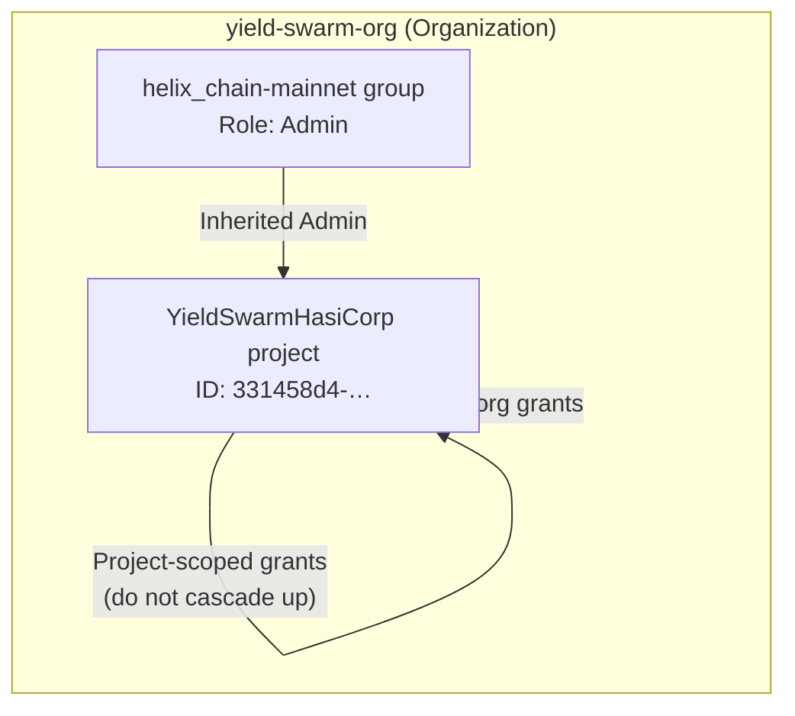

# HashiCorp Cloud Platform — Organization & IAM

Operator reference for the **yield-swarm-org** tenant on HashiCorp Cloud Platform (HCP). Captures project structure, group membership, and how permissions flow to Vault, Terraform, and fleet deploy paths in this repo.

## Tenant overview

| Field | Value |
|-------|-------|
| **Organization** | `yield-swarm-org` |
| **Project name** | `YieldSwarmHasiCorp` |
| **Project description** | Massive Agentic Ai PoW Blockchain |
| **Project ID** | `331458d4-6c74-4e95-9497-cf2d6b846f31` |
| **Status** | Active (created 2026-06-14) |

## Group structure

| Group | Scope | Members | Role | Notes |
|-------|-------|---------|------|-------|
| `helix_chain-mainnet` | Organization | 1 | **Admin** | Mainnet integration target; full org admin via inheritance |

## IAM permission hierarchy

HCP grants permissions at three scopes. Understanding which scope a grant uses determines whether it cascades to child resources.



### 1. Project scope (`YieldSwarmHasiCorp`)

- **Granted at:** Project level only.
- **Effect:** Applies to this project; does **not** cascade upward to the parent organization.
- **Use for:** Project-specific Terraform workspaces, Vault clusters, or service principals that should not affect sibling projects.

### 2. Organization scope (`yield-swarm-org`)

- **Granted at:** Organization level (shown as **Inherited** in the console).
- **Effect:** Automatically inherited by all projects in the org, including `YieldSwarmHasiCorp`.
- **Use for:** Org-wide policies, billing, cross-project IAM, and default operator access.

### 3. Group scope (`helix_chain-mainnet`)

- **Granted at:** Organization / group level (shown as **Inherited**).
- **Effect:** Members of `helix_chain-mainnet` inherit **Admin** on the organization and all nested resources.
- **Use for:** Mainnet operators who need full control over Vault, Terraform, and HCP project settings.

## Role definitions

| Role | Capabilities |
|------|----------------|
| **Admin** | Full access to resources, IAM policies, user invites, role management. Assigned to `helix_chain-mainnet`. |
| **Owner** | All Admin permissions, plus delete organization and promote/demote other Owners. |

## Access flow summary

Members of **helix_chain-mainnet** receive **Admin** at the **organization** level. Because **YieldSwarmHasiCorp** is a project inside **yield-swarm-org**, group members automatically inherit administrative control over:

- HCP Vault clusters bound to the project
- HCP Terraform workspaces under the org
- Project IAM and service accounts

Project-scoped grants apply only within `YieldSwarmHasiCorp` and do not elevate permissions at the org level.

## Repo mapping

This repository consumes HCP in two places. Operators should align console org/project with these env vars.

| Concern | Repo path / env | Current default | HCP console |
|---------|-----------------|-----------------|-------------|
| Terraform remote state | `infra/terraform/backend.tf`, `TF_CLOUD_ORGANIZATION`, `TF_WORKSPACE` | Org: `HelixChainProd` · Workspace: `Helixchainprod` | Verify workspace lives under `yield-swarm-org` or migrate |
| Vault operator runbook | `SECRETS.md`, `VAULT_ADDR` | `https://vault.yieldswarm.io:8200` | HCP Vault or self-hosted cluster in `YieldSwarmHasiCorp` |
| TFC bootstrap module | `deploy/terraform-tfc/` | `HelixChainProd` / `Helixchainprod` | Same as above |
| Fleet / VMSS bootstrap | `scripts/azure/vmss-worker-bootstrap.sh` | `VAULT_ADDR` injected at deploy | AppRole tokens from Vault in this project |

### Recommended operator env

```bash
# HCP platform (from console)
export HCP_ORGANIZATION=yield-swarm-org
export HCP_PROJECT=YieldSwarmHasiCorp
export HCP_PROJECT_ID=331458d4-6c74-4e95-9497-cf2d6b846f31

# Terraform Cloud / HCP Terraform (confirm org hosts Helixchainprod workspace)
export TF_CLOUD_ORGANIZATION=yield-swarm-org   # or HelixChainProd if workspace not migrated
export TF_WORKSPACE=Helixchainprod
export TF_TOKEN_app_terraform_io=<hcp-terraform-api-token>

# Vault (HCP Vault cluster or self-hosted endpoint)
export VAULT_ADDR=https://vault.yieldswarm.io:8200
```

If the `Helixchainprod` workspace still resides under legacy org `HelixChainProd`, keep `TF_CLOUD_ORGANIZATION=HelixChainProd` until the workspace is moved to `yield-swarm-org`. The HCP project ID above is for API/CLI calls against the **YieldSwarmHasiCorp** project regardless of Terraform org name.

## Security notes

- **Admin** on the org is equivalent to root on all Vault and Terraform resources in the tenant. Restrict `helix_chain-mainnet` membership.
- Prefer **AppRole** + wrapped SecretIDs for CI, Akash, and fleet nodes — not personal Admin tokens. See [`SECRETS.md`](../SECRETS.md).
- Never commit `TF_TOKEN_app_terraform_io`, `VAULT_TOKEN`, or HCP service principal keys.

## Related docs

- [`SECRETS.md`](../SECRETS.md) — Vault bootstrap, AppRoles, path reference
- [`docs/VAULT_ENV_INJECTION.md`](VAULT_ENV_INJECTION.md) — runtime secret injection
- [`infra/README.md`](../infra/README.md) — HCP Terraform backend for multi-cloud fallback
- [`docs/DEPLOYMENT_GUIDE.md`](DEPLOYMENT_GUIDE.md) — Akash + Terraform Cloud flow
