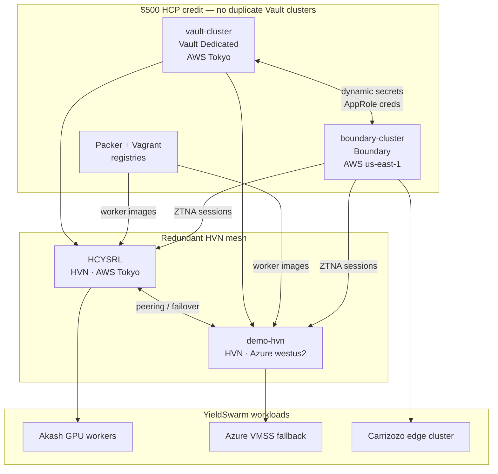

# HCP Quadrilateral Architecture — Redundant Parallel Wiring

**Organization:** `yield-swarm-org` · **Project:** `YieldSwarmHasiCorp`  
**Budget:** ~$500 HCP promotional credit — size for redundancy, not duplication.

## Concept

The **quadrilateral** is four HashiCorp corners that run **in parallel** (independent lifecycles, simultaneous heartbeats) but **helically interconnect** (Vault credentials flow to Boundary targets; Packer images deploy across both HVNs; Terraform orchestrates all four).

This mirrors the four-swarm domain model in [`FOUR_SWARM_HELICAL_ARCHITECTURE.md`](FOUR_SWARM_HELICAL_ARCHITECTURE.md) at the **control-plane** layer:

| HCP corner | Domain swarm analog | Active resource |
|------------|---------------------|-----------------|
| **Vault** (secrets) | SWARM 2 Mining Pools treasury | `vault-cluster` · AWS Tokyo |
| **Boundary** (access) | SWARM 1 Physical Core edge | `boundary-cluster` · AWS us-east-1 |
| **HVN mesh** (network) | SWARM 1 + 3 connectivity | `HCYSRL` (AWS Tokyo) + `demo-hvn` (Azure) |
| **Packer** (supply chain) | SWARM 3 Marketplace fulfillment | HCP Packer + Vagrant registries |

## Quadrilateral topology



## Parallel development tracks

Four tracks wire simultaneously — failures on one track do not block the others.

### Track A — Secrets lane (Vault + Tokyo HVN)

| Step | Action |
|------|--------|
| A1 | Point `VAULT_ADDR` at `vault-cluster` public endpoint |
| A2 | Run `vault/scripts/bootstrap.sh` or `terraform -chdir=vault/terraform-vault-config apply` |
| A3 | Attach `HCYSRL` HVN routes so Tokyo workers reach Vault without public internet |
| A4 | Seed Carrizozo/Tesla/Z15 secrets into KV paths (see `vault/scripts/seed-secrets.sh`) |

**Redundancy:** Vault Dedicated includes HA within the cluster; do **not** provision a second Vault cluster on $500 credit.

### Track B — Access lane (Boundary + Azure HVN)

| Step | Action |
|------|--------|
| B1 | Point `BOUNDARY_ADDR` at `boundary-cluster` |
| B2 | Create Boundary scopes: `carrizozo-edge`, `akash-workers`, `terraform-ops` |
| B3 | Register targets on `demo-hvn` Azure mesh for West US fallback workers |
| B4 | Store Boundary controller creds in Vault (`secret/boundary/controller`) |

**Redundancy:** Boundary us-east-1 is the ZTNA control plane; `demo-hvn` provides network failover when Tokyo path degrades.

### Track C — Supply chain lane (Packer + Vagrant)

| Step | Action |
|------|--------|
| C1 | `packer init` in `infra/packer/` with HCP registry auth |
| C2 | Push golden images to HCP Packer registry (`yieldswarm-worker`) |
| C3 | Reference registry image IDs in `infra/terraform` (`azure_source_image_id`, etc.) |
| C4 | Vagrant box `6338a520-…` for local Carrizozo edge dev parity |

**Redundancy:** Same image manifest deployed to both AWS Tokyo and Azure West US 2 via parallel `packer build` targets.

### Track D — Orchestration lane (Terraform)

| Step | Action |
|------|--------|
| D1 | `TF_CLOUD_ORGANIZATION=yield-swarm-org` · workspace `Helixchainprod` |
| D2 | Store provider creds as sensitive workspace variables (not in git) |
| D3 | `terraform apply` provisions fallback VMSS/MIG only when Akash saturated |
| D4 | Output Boundary target IDs + HVN attachment IDs back to manifest |

## Credit-conscious sizing ($500)

| Resource | Cost profile | Recommendation |
|----------|--------------|----------------|
| Vault Dedicated | Highest | **Keep one** `vault-cluster`; use namespaces + policies for isolation |
| Boundary | Medium | **Keep one** cluster; scope-based RBAC instead of second cluster |
| HVN × 2 | Medium | **Required** for redundancy — primary AWS Tokyo + failover Azure |
| Packer registry | Low | Primary image store; avoids rebuilding on every deploy |
| Vagrant box | Low | Dev-only; no runtime credit burn |

**Do not** spin up duplicate Vault or Boundary clusters until credit is replenished. Redundancy comes from the **dual HVN mesh**, not from quadrupling control planes.

## Redundancy matrix

| Failure | Primary path | Failover |
|---------|--------------|----------|
| Tokyo HVN (`HCYSRL`) down | AWS worker → Vault via public TLS | Route via `demo-hvn` Azure peering |
| Azure HVN (`demo-hvn`) down | Azure VMSS via public endpoint | Tokyo HVN carries cross-region traffic |
| Boundary unavailable | Direct SSH with break-glass keys (rotate immediately) | Re-enable Boundary from Vault-stored recovery |
| Vault sealed | Unseal with Shamir keys (split across operators) | No hot failover — design for HA within cluster |
| Packer registry unreachable | Use last-known cloud snapshot IDs in Terraform vars | Rebuild from `infra/packer/docker/` |

## Helical state integration

Quadrilateral health is mirrored in `dashboard/helical-state.json` under each swarm's `metrics.hcp`:

```json
{
  "swarms": {
    "physical-core": {
      "metrics": { "hcp": { "boundary": "active", "hvnPrimary": "HCYSRL" } }
    },
    "mining-pools": {
      "metrics": { "hcp": { "vault": "vault-cluster" } }
    }
  }
}
```

Run `make hcp-quadrilateral-preflight` to refresh the manifest from the HCP API.

## Quick start

```bash
# 1. Authenticate
hcp auth login

# 2. Preflight — verify all four corners reachable
make hcp-quadrilateral-preflight

# 3. Wire parallel tracks (dry-run by default)
make hcp-wire-quadrilateral

# 4. Apply with intent to mutate console config
DRY_RUN=false bash scripts/hcp/wire-quadrilateral.sh
```

## Related

- [`HCP_ORGANIZATION.md`](HCP_ORGANIZATION.md) — IAM and project ID
- [`infra/hcp/quadrilateral-manifest.json`](../infra/hcp/quadrilateral-manifest.json) — machine-readable inventory
- [`SECRETS.md`](../SECRETS.md) — Vault bootstrap
