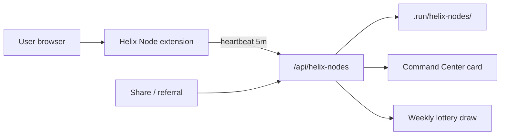

# Helix Nodes — Grass-Style Growth Layer

**Brand:** **Helix Nodes** (sub-brand of YieldSwarm)  
**Tagline:** Run a node, earn lottery tickets while you sleep.

---

## Product decisions (recommended defaults — confirm with Baris)

| # | Question | Recommended answer |
|---|----------|-------------------|
| 1 | **What does the node do?** | **Lightweight network health tasks** (RPC ping relay, tri-solenoid status probes) — **not** bandwidth resale. Optional Phase 2: idle GPU micro-tasks when user opts in. Aligns with existing Grass/DePIN registry in `mining/config.py` and IoT Hub. |
| 2 | **How simple?** | **Phase 1:** Chrome MV3 extension (`extensions/helix-node/`). **Phase 2:** Tauri desktop app for GPU mode. |
| 3 | **Rewards / lottery** | **1 ticket/hour** uptime + bonuses (referral +5, share/repost +2, signup friend +3). **Weekly weighted lottery** — prizes: USDC, SOL, cloud credits, token airdrops. `HELIX_NODES_DRY_RUN=1` until go-live. |
| 4 | **Tech / backend** | **Express :8080** + `services/helix_nodes/` file store (`.run/helix-nodes/`). Same command-center dashboard. Upgrade path: Postgres/Supabase when scale demands. |
| 5 | **Branding** | **Helix Nodes** under YieldSwarm; extension title "Helix Nodes by YieldSwarm". |
| 6 | **Legal** | Honest copy in extension popup: no bandwidth resale, simulated prizes in dry-run, clear terms link before mainnet prizes. |

---

## Architecture



---

## API

| Method | Path | Purpose |
|--------|------|---------|
| `GET` | `/api/helix-nodes/health` | Liveness + summary |
| `POST` | `/api/helix-nodes/register` | Create node + referral code |
| `POST` | `/api/helix-nodes/heartbeat` | Uptime + ticket accrual |
| `GET` | `/api/helix-nodes/status/:nodeId` | Node detail |
| `GET` | `/api/helix-nodes/leaderboard` | Top ticket holders |
| `POST` | `/api/helix-nodes/actions` | `share`, `repost`, `referral`, `signup_friend` |
| `GET` | `/api/helix-nodes/lottery/current` | Current draw pool |
| `POST` | `/api/helix-nodes/lottery/draw?confirm=1` | Run draw (`HELIX_NODES_DRY_RUN=0`) |

---

## Quick start

```bash
# Backend (if not already running)
make production   # or backend on :8080

# CLI smoke test
python3 services/helix_nodes/cli.py register
python3 services/helix_nodes/cli.py summary

# Extension
# chrome://extensions → Load unpacked → extensions/helix-node/

curl http://127.0.0.1:8080/api/helix-nodes/health
open http://127.0.0.1:8080/dashboard/helix-nodes.html
```

---

## Ticket economics

| Action | Tickets |
|--------|---------|
| Node online (per hour) | 1 |
| Referral (friend registers with your code) | 5 |
| Share / repost | 2 each |
| Sign up a friend | 3 |
| 7-day streak (planned) | +10 bonus |

Points = tickets × 10 (display / leaderboard).

---

## Environment

| Variable | Default | Purpose |
|----------|---------|---------|
| `HELIX_NODES_DRY_RUN` | `1` | Simulated lottery draws |
| `HELIX_NODES_TICKETS_PER_HOUR` | `1` | Uptime accrual rate |
| `HELIX_NODES_STATE_DIR` | `.run/helix-nodes` | Persistence |

---

## Related

- `mining/config.py` — Grass lineups (separate DePIN track)
- `services/iot_hub/` — device registry pattern
- `kairo/` — signed telemetry for driver nodes (heavier DePIN path)
- `docs/ARCHITECTURE_FULL.md` — canonical stack diagram
