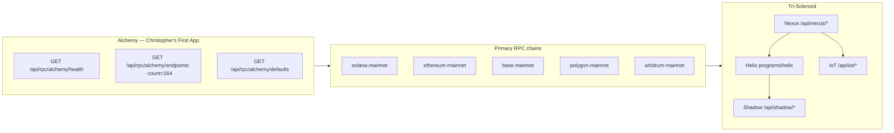
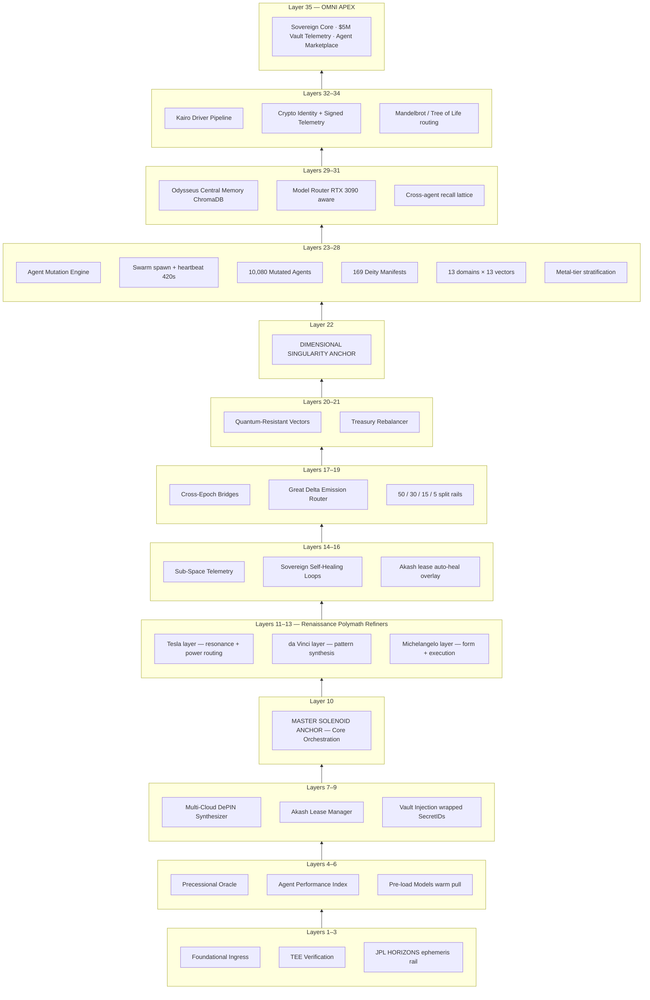
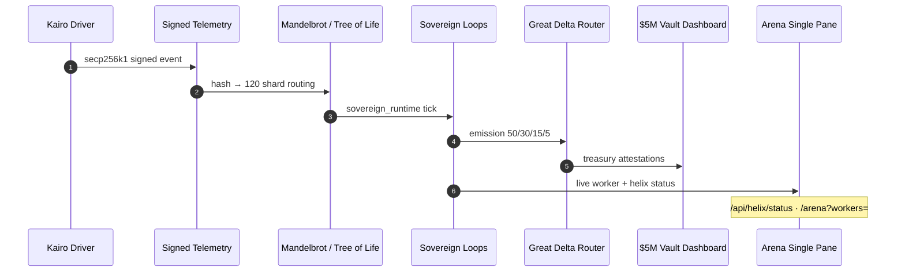

# Helix Chain — Single Pane of Glass (detail) v2.1

> **Canonical diagram:** [`SINGLE_PANE_OF_GLASS.md`](../SINGLE_PANE_OF_GLASS.md) · [`docs/ARCHITECTURE.md`](ARCHITECTURE.md) · [`docs/RPC_ALCHEMY_STUDY.md`](RPC_ALCHEMY_STUDY.md) · [`docs/TRI_SOLENOID_ARCHITECTURE.md`](TRI_SOLENOID_ARCHITECTURE.md)

**YieldSwarm AgentSwarm OS v2** — layer detail, domain breakdown, and supporting diagrams.

```mermaid
flowchart TB
  classDef ingress fill:#1a1f3d,stroke:#5b7fff,color:#e8ecff
  classDef edge fill:#152238,stroke:#00d4aa,color:#e8ecff
  classDef helix fill:#1f1530,stroke:#c77dff,color:#f5e8ff
  classDef intel fill:#1a2818,stroke:#6bcf6b,color:#e8ffe8
  classDef secrets fill:#2a1810,stroke:#ff9f43,color:#fff3e8
  classDef rpc fill:#0d2137,stroke:#00b4d8,color:#e8ecff
  classDef solenoid fill:#1b1033,stroke:#b388ff,color:#f5e8ff
  classDef mining fill:#1a2f1a,stroke:#69db7c,color:#e8ffe8

  subgraph TITLE["YIELDSWARM HELIX CHAIN + 35-LAYER NEURAL MESH — Single Pane of Glass"]
    direction TB

    subgraph INGRESS["USER / INGRESS LAYER — 17 Domains"]
      direction LR
      VCL["Vercel Next.js<br/>Payments + dApp"]
      RND["Render<br/>Integration API fallback"]
      AKT["Akash RTX 3090<br/>GPU + Bittensor miners"]
      MCL["Azure · GCP · RunPod<br/>Multi-cloud fallback"]
      UD["Unstoppable Domains<br/>17 custom domains"]
    end

    subgraph EDGE["17-DOMAIN EDGE ROUTING + API LAYER"]
      direction TB
      FE9["Frontend Zones ×9"]
      BE8["Backend Fluid Compute ×8"]
      DIN["Dynamic incomingDomain routing"]
      RPC["api.* → /api/rpc/alchemy/*"]
      FE9 --- BE8
      BE8 --- DIN
      BE8 --- RPC
    end

    subgraph RPCMESH["RPC MESH — ALCHEMY 164 NETWORKS"]
      direction LR
      AK["ALCHEMY_API_KEY Vault"]
      DEF["defaults: SOL · ETH · Base · Poly · Arb"]
      AK --> DEF
    end

    subgraph TRISOL["TRI-SOLENOID"]
      direction TB
      S1["Nexus — 521 agents"]
      S2["Helix — mining roots + IoTeX"]
      S3["Shadow Arena — Kyle chain"]
      IOT["IoT Hub FWA_37KN9S"]
      S1 --> S2 --> S3
      S1 --> IOT
    end

    subgraph MINE["MINE WITH US"]
      direction LR
      MT["Treasury Solana"]
      MR["10 mining roots manifest"]
      BT["Bittensor BT_NETUID=1"]
      MR --> MT
      BT --> MR
    end

    subgraph HELIX["HELIX CHAIN / 35-LAYER NEURAL MESH CORE"]
      direction TB

      L13["Layers 1–3<br/>Ingress · TEE Verification · JPL HORIZONS"]
      L46["Layers 4–6<br/>Precessional Oracle · Agent Performance Index · Pre-load Models"]
      L79["Layers 7–9<br/>Multi-Cloud DePIN · Akash Lease Manager · Vault Injection"]
      L10["Layer 10<br/>MASTER SOLENOID ANCHOR<br/>Core Orchestration"]
      L1113["Layers 11–13<br/>Renaissance Polymath Refiners<br/>Tesla · da Vinci · Michelangelo"]
      L1416["Layers 14–16<br/>Sub-Space Telemetry · Sovereign Self-Healing Loops"]
      L1719["Layers 17–19<br/>Cross-Epoch Bridges · Great Delta Router 50/30/15/5"]
      L2021["Layers 20–21<br/>Quantum-Resistant Vectors · Treasury Rebalancer"]
      L22["Layer 22<br/>DIMENSIONAL SINGULARITY ANCHOR"]
      L2328["Layers 23–28<br/>Agent Mutation · 10,080 Agents · 169 Deity Manifests"]
      L2931["Layers 29–31<br/>Odysseus ChromaDB · Model Router RTX 3090"]
      L3234["Layers 32–34<br/>Kairo Pipeline · Crypto Identity · Mandelbrot Telemetry"]
      L35["Layer 35<br/>OMNI APEX<br/>Sovereign Core · $5M Vault · Agent Marketplace"]

      L13 --> L46 --> L79 --> L10 --> L1113 --> L1416 --> L1719 --> L2021 --> L22 --> L2328 --> L2931 --> L3234 --> L35
    end

    FLOW["Data Flow: Signed Kairo Telemetry → Mandelbrot / Tree of Life → Sovereign Loops → Treasury"]

    subgraph INTEL["INTELLIGENCE + EXECUTION LAYER"]
      direction LR
      I1["Odysseus LiteLLM + ChromaDB"]
      I2["10,080 Agents + 169 Deities"]
      I3["Model Router Akash RTX 3090"]
      I4["Sovereign Runtime self-healing"]
      I5["Great Delta Emission Router"]
      I6["Treasury Rebalancer 50/30/15/5"]
      I7["Iteration-100 Sovereign Core"]
      I8["Kairo → YieldSwarm Pipeline"]
    end

    subgraph SECRETS["SECRETS + INFRA LAYER"]
      direction TB
      VAULT["HashiCorp Vault Runtime Injection"]
      VA["akash-runtime AppRole"]
      VB["bittensor-runtime AppRole"]
      VC["Wrapped SecretIDs → tmpfs /run/secrets"]
      MC["Multi-Cloud: Azure VMSS · GCP · RunPod · Vultr"]
      DEP["Deploy: GHCR · Makefile · deploy-all.sh"]
      VAULT --> VA & VB & VC
    end

    subgraph REVENUE["REVENUE + PAYMENTS LAYER"]
      direction LR
      R1["Payments Next.js Square Wise Web3"]
      R2["1% Customer Fee + 2× Driver Pay Kairo"]
      R3["Agent Marketplace D2C"]
      R4["Holographic Starbucks Coffee Variables"]
      R5["$5M Vault Telemetry Dashboard"]
    end

    INGRESS --> EDGE --> RPCMESH --> TRISOL --> HELIX
    S2 --> MINE
    L35 --> FLOW
    FLOW --> INTEL --> SECRETS --> REVENUE
  end

  class INGRESS ingress
  class EDGE edge
  class RPCMESH,AK,DEF rpc
  class TRISOL,S1,S2,S3,IOT solenoid
  class MINE,MT,MR,BT mining
  class HELIX,L10,L22,L35 helix
  class INTEL intel
  class SECRETS,VAULT secrets
  class REVENUE revenue
```

---

## RPC mesh + tri-solenoid (operator view)

Full study: [`docs/RPC_ALCHEMY_STUDY.md`](RPC_ALCHEMY_STUDY.md).

---

## Ingress detail — 17 domains

```mermaid
flowchart LR
  subgraph FE["Frontend Zones ×9"]
    direction TB
    f1["yieldswarm.crypto apex"]
    f2["app.* payments wallet"]
    f3["arena.* live telemetry"]
    f4["portal.* operator SSO"]
    f5["kairo.* driver app"]
    f6["dashboard.* sovereign admin"]
    f7["council.* Helix status"]
    f8["staging.* pre-prod"]
    f9["docs.* runbooks"]
  end

  subgraph BE["Backend Fluid Compute ×8"]
    direction TB
    b1["api.* integration backend"]
    b2["kairo-api.* identity telemetry"]
    b3["helix.* genesis YSLR"]
    b4["vault.* secrets ops"]
    b5["odysseus.* research GPU"]
    b6["sovereign.* treasury loops"]
    b7["cdn.* asset edge"]
    b8["monitor.* observability"]
  end

  UD["Unstoppable Domains<br/>crypto.ETH · SOL · TON"]
  FE --> BE
  UD -.-> FE & BE
```

---

## 35-layer neural mesh — helix ascent

---

## Data flow (telemetry → treasury)

---

## Quick legend

| Term | Meaning |
|------|---------|
| **Helix Chain** | Ascending computational solenoid — data accelerates upward through layers |
| **35-Layer Neural Mesh** | Full sovereign architecture from ingress to Omni Apex |
| **17 Domains** | 9 frontend zones + 8 backend fluid compute (+ UD crypto records) |
| **Single Pane of Glass** | One view for operators, investors, and Swarm Conductor |
| **Layer 10** | Master Solenoid Anchor — core orchestration hub |
| **Layer 22** | Dimensional Singularity Anchor — worker mesh singularity |
| **Layer 35** | Omni Apex — sovereign core + marketplace |
| **RPC Mesh** | 164 Alchemy networks — auto-bootstrap at backend load |
| **Tri-Solenoid** | Nexus · Helix · Shadow (+ IoT Hub solenoid 4) |

---

## Operator URLs (live pane)

| Surface | Endpoint |
|---------|----------|
| RPC health | `GET /api/rpc/alchemy/health` |
| RPC catalog | `GET /api/rpc/alchemy/endpoints` |
| RPC in use | `GET /api/rpc/alchemy/defaults` |
| Nexus | `GET /api/nexus/health` · `services/nexus/cli.py status` |
| Helix genesis | `GET /api/helix/status` · `./scripts/activate-helix.sh` |
| Shadow | `GET /api/shadow/status` |
| IoT Hub | `GET /api/iot/health` |
| Council | `/council/status.html` |
| Arena | `/arena?workers=<akash-lease-uri>` |
| Sovereign | `GET /api/sovereign/state` |
| Bittensor | `./scripts/deploy-bittensor.sh` |
| Mine with us | `README.md` · `config/TREASURY_MANIFEST.json` |
| Vault runtime | `docs/VAULT_AKASH_RUNTIME.md` |
| Deploy | `make deploy-akash-europlots` |

---

## Repo anchors

| Concept | Code / doc |
|---------|------------|
| RPC mesh study | `docs/RPC_ALCHEMY_STUDY.md` |
| Alchemy wiring | `backend/src/lib/alchemy.js` · `docs/ALCHEMY_CHRISTOPHERS_FIRST_APP.md` |
| Tri-solenoid | `docs/TRI_SOLENOID_ARCHITECTURE.md` |
| Mining roots | `config/TREASURY_MANIFEST.json` |
| Helix activation | `backend/src/adapters/helix.js` |
| 35-layer blueprint | `docs/YieldSwarm_v1_v2_Trident_Layer35_Blueprint.md` |
| 169 deities | `agents/system/deity_manifests.py` |
| Kairo Mandelbrot | `kairo/services/pipeline.py` |
| Sovereign loops | `services/sovereign_runtime.py` |
| 17-domain DNS | `DOMAINS.md` |
