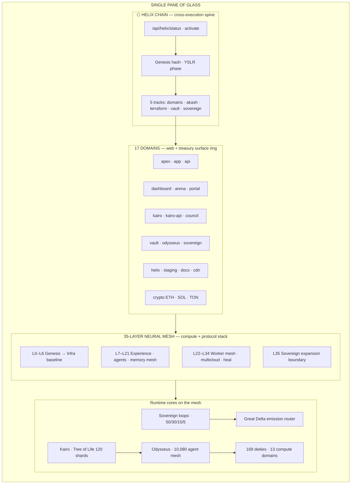
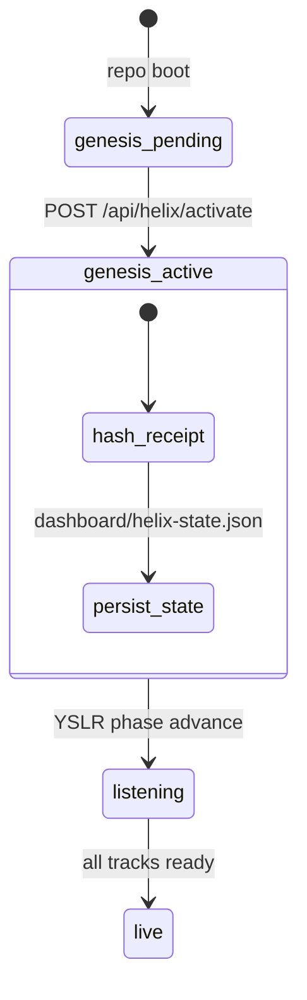
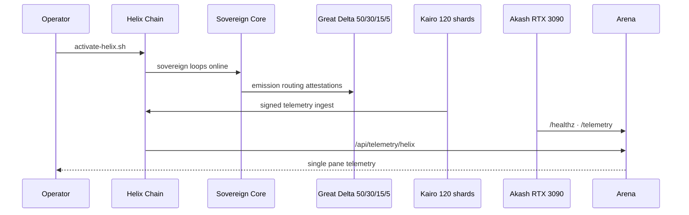
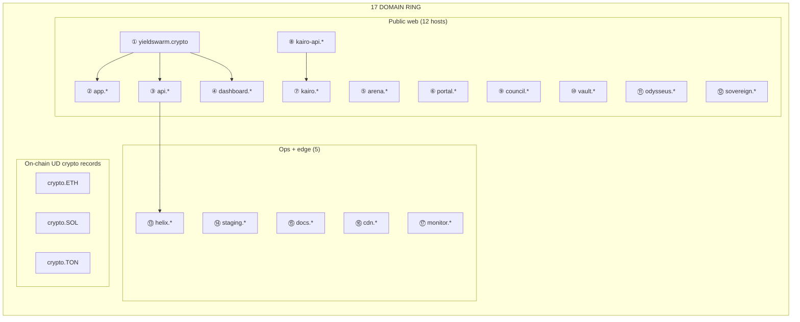
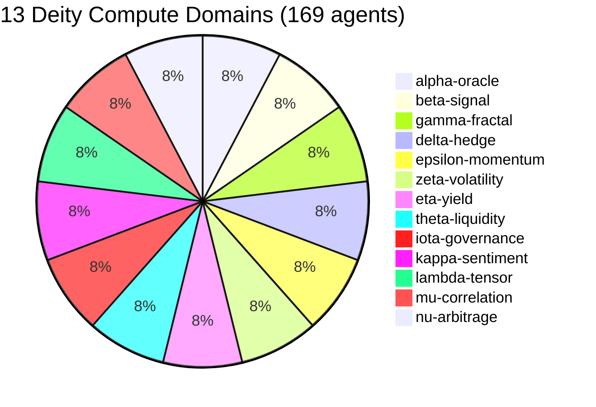
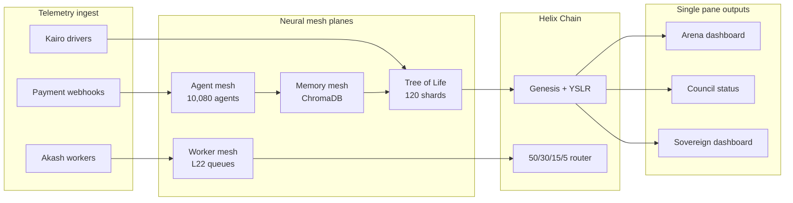

# Helix Chain — Single Pane of Glass

**YieldSwarm AgentSwarm OS v2** — unified view of Helix Chain, **17 domains**, and **35-layer neural mesh**.  
Sources: `backend/src/adapters/helix.js`, `docs/YieldSwarm_v1_v2_Trident_Layer35_Blueprint.md`, `agents/system/deity_manifests.py`, `DOMAINS.md`, `kairo/services/pipeline.py`.

> Layers marked *(scaffold)* extend the Trident blueprint where the repo has not yet named them explicitly. Deity compute domains (13) and UD web domains (17) are **different rings** on the same helix.

---

## Master view (one screen)



---

## Helix Chain (spine)

Helix Chain is the **activation + orchestration layer** that binds sovereign treasury, emissions, telemetry, and multicloud fallback into one operational milestone.



| Component | Role | Artifact |
|-----------|------|----------|
| **Genesis** | SHA-256 receipt `helix-genesis:{ts}:{source}` | `dashboard/helix-state.json` |
| **YSLR** | Signal phase `pending` → `listening` | Helix state `yslr` block |
| **Activation** | One command | `./scripts/activate-helix.sh` |
| **API** | Status + control | `GET/POST /api/helix/*` |
| **Council UI** | Live poll 15s | `council/status.html` |

### Five Helix activation tracks

| Track | Measures | Ready when |
|-------|----------|------------|
| **domains** | UD / app URL wiring | `APP_URL` or `NEXT_PUBLIC_APP_URL` set |
| **akash** | GPU worker fleet | `AKASH_OWNER` + live lease |
| **terraform** | Multicloud IaC | `TF_CLOUD_ORGANIZATION` or Fly enabled |
| **vault** | Secret injection | `VAULT_ADDR` reachable |
| **sovereign** | $5M treasury loops | `sovereign_runtime` / iteration-100 |

### Cross-execution data flow



**Invariants (gospel):** 80ms p95 latency · 50/30/15/5 treasury · 420s agent heartbeat · 9/14 council threshold.

---

## 17 domains (web + treasury ring)

Two interpretations exist in-repo; the **17-domain ring** is the **Unstoppable Domains + product surface** map used in Council status and production readiness.



| # | Domain | Purpose | Primary host |
|---|--------|---------|--------------|
| 1 | `yieldswarm.crypto` | Apex / marketing | Vercel |
| 2 | `app.*` | Payments + wallet | Vercel |
| 3 | `api.*` | Integration backend + Arena API | Akash / Cloudflare |
| 4 | `dashboard.*` | $5M sovereign admin | Static / Vercel |
| 5 | `arena.*` | Live GPU telemetry pane | Next.js `/arena` |
| 6 | `portal.*` | Operator portal + SSO | Vite frontend |
| 7 | `kairo.*` | Driver/customer DePIN app | Netlify/Vercel |
| 8 | `kairo-api.*` | Driver identity + telemetry | Akash :8100 |
| 9 | `council.*` | 14-Council + Helix status | `council/status.html` |
| 10 | `vault.*` | Vault UI / proxy (ops) | HashiCorp |
| 11 | `odysseus.*` | Research workspace | Docker GPU |
| 12 | `sovereign.*` | Treasury loop control | iteration-100 API |
| 13 | `helix.*` | Genesis + YSLR control plane | `/api/helix/*` |
| 14 | `staging.*` | Pre-prod stack | Vercel preview |
| 15 | `docs.*` | Runbooks + API docs | Static |
| 16 | `cdn.*` | Asset edge | Cloudflare |
| 17 | `monitor.*` | Grafana / alerts | Observability stack |

**Treasury crypto records** (UD on-chain, parallel to DNS): `crypto.ETH`, `crypto.SOL`, `crypto.TON` — see `DOMAINS.md`.

### Inner ring: 13 deity compute domains

Orthogonal to the 17 web domains — these partition **169 Single-Origin Deities** (`agents/system/deity_manifests.py`):



Each deity also carries a **compass vector** (north → west, 13 bearings) and a **metal skin** tier — forming the **13×13 deity lattice** inside Layer 35.

---

## 35-layer neural mesh

The mesh is the **full stack from genesis to sovereign expansion** — not a single service named “neural mesh,” but the union of agent mesh, memory mesh, worker mesh, and Tree-of-Life routing.

```mermaid
flowchart TB
  subgraph L0_6["FOUNDATION L0–L6 (documented)"]
    L0["L0 Genesis · 14-Council origin"]
    L1["L1 Governance · YSLR · Kimiclaw"]
    L2["L2 Agent infra · spawn · heartbeat"]
    L3["L3 Revenue · arena · marketplace"]
    L4["L4 Automation · audit · cron"]
    L5["L5 Blockchain · HELIX L1/L2 bridge"]
    L6["L6 Tech stack · API · dashboards"]
  end

  subgraph L7_15["TRIDENT EXPANSION L7–L15"]
    L7["L7 Akash GPU runtime *(T-A1)*"]
    L8["L8 Worker Docker + warm pull *(T-A2)*"]
    L9["L9 Multicloud deploy *(T-A3)*"]
    L10["L10 Great Delta contract *(T-B4)*"]
    L11["L11 Treasury 50/30/15/5 *(T-B5)*"]
    L12["L12 Cross-system constants *(T-B6)*"]
    L13["L13 Governance automation *(doc)*"]
    L14["L14 Arena hydration *(T-C7)*"]
    L15["L15 Great Delta API *(T-C8)*"]
  end

  subgraph L16_24["AGENT + MESH L16–L24"]
    L16["L16 Telemetry schema *(T-C9)*"]
    L17["L17 Agent mesh 10,080 *(scaffold)*"]
    L18["L18 Odysseus ChromaDB memory mesh *(scaffold)*"]
    L19["L19 Model router RTX 3090 *(scaffold)*"]
    L20["L20 Kairo Tree of Life 120 shards *(scaffold)*"]
    L21["L21 Webhook + payment rails *(scaffold)*"]
    L22["L22 Worker mesh + queue *(doc)*"]
    L23["L23 Vault secrets plane *(scaffold)*"]
    L24["L24 Multicloud failover *(doc)*"]
  end

  subgraph L25_35["SOVEREIGN TOP L25–L35"]
    L25["L25 Bittensor axon :8091 *(scaffold)*"]
    L26["L26 Sovereign treasury loop *(scaffold)*"]
    L27["L27 Emission attestations *(scaffold)*"]
    L28["L28 Multichain wallets EVM/SOL/TON *(scaffold)*"]
    L29["L29 Domain/DNS automation *(scaffold)*"]
    L30["L30 Integrations lattice *(scaffold)*"]
    L31["L31 Treasury emission routing *(doc)*"]
    L32["L32 Observability lattice *(doc)*"]
    L33["L33 Auto-heal + lease manager *(scaffold)*"]
    L34["L34 Council consensus 9/14 *(scaffold)*"]
    L35["L35 Sovereign expansion · polymath/voxel/deity *(doc)*"]
  end

  L0 --> L1 --> L2 --> L3 --> L4 --> L5 --> L6
  L6 --> L7 --> L8 --> L9 --> L10 --> L11 --> L12
  L12 --> L13 --> L14 --> L15 --> L16
  L16 --> L17 --> L18 --> L19 --> L20 --> L21 --> L22
  L22 --> L23 --> L24 --> L25 --> L26 --> L27 --> L28
  L28 --> L29 --> L30 --> L31 --> L32 --> L33 --> L34 --> L35
```



### Layer index (all 35)

| Layer | Name | Mesh function | Repo anchor |
|-------|------|---------------|-------------|
| **0** | Genesis / Origin | Helix root signatures, audit receipts | `helix.js`, Layer-35 blueprint |
| **1** | Governance / Identity | 14-Council, YSLR, 9/14 writes | `gospel.py`, `consensus_engine.py` |
| **2** | Agent Infrastructure | Cohorts, heartbeat 420s, metal tiers | `agents/`, `swarm-manifest.json` |
| **3** | Revenue Streams | Arena, marketplace, DeFi vaults | Payments app, `frontend/arena/` |
| **4** | Automation Engine | Cron, marketing, reconciliation | `backend/src/jobs/`, crons |
| **5** | Blockchain Layer | HELIX bridge, multichain monitor | `contracts/`, wallet adapters |
| **6** | Tech Stack / Infra | Express API, Next.js, observability | `backend/`, `src/` |
| **7** | Akash GPU Runtime | RTX 3090 worker leases | `deploy/deploy-swarm-monolith.yaml` |
| **8** | Container Runtime | Docker worker + model warm-pull | `depin/docker/`, `akash/Dockerfile` |
| **9** | Multicloud Deploy | Vercel + Render + Akash wrappers | `scripts/deploy-all.sh` |
| **10** | Great Delta Contract | On-chain emission router | `contracts/quadrant-iv/` |
| **11** | Treasury Split Rails | 50/30/15/5 hard-coded | `gospel.py`, `emissionRouter.js` |
| **12** | Cross-system Constants | API + contract alignment | `backend/src/config.js` |
| **13** | Governance Automation | Council dispatch | Layer-35 blueprint |
| **14** | Arena Hydration | Live worker telemetry UI | `src/app/arena/page.tsx` |
| **15** | Great Delta API | health · telemetry · heartbeat | `/api/great-delta/*` |
| **16** | Telemetry Schema | Collector + normalized metrics | `telemetry/great-delta/` |
| **17** | Agent Mesh | 10,080 mutated agents | `agents/mutated-swarm/` |
| **18** | Memory Mesh | ChromaDB vector recall | `agents/odysseus_memory.py` |
| **19** | Model Router | GPU-aware LLM routing | `services/odysseus/brain.py` |
| **20** | Tree of Life Router | Kairo 120 Mandelbrot shards | `kairo/services/pipeline.py` |
| **21** | Webhook Ingestion | Stripe · Square · Wise · Kairo | `backend/src/routes/api.js` |
| **22** | Worker Mesh | Distributed queue routing | Layer-35 blueprint |
| **23** | Vault Secrets Plane | Wrap → AppRole → tmpfs | `docs/VAULT_AKASH_RUNTIME.md` |
| **24** | Multicloud Topography | Azure · GCP · failover policy | `infra/terraform/` |
| **25** | Bittensor Axon | Miner :8091 + telemetry :8080 | `deploy/akash-bittensor-miner.sdl.yml` |
| **26** | Sovereign Treasury Loop | $5M rebalance overlay | `services/sovereign_runtime.py` |
| **27** | Emission Attestations | Router proofs + splits | `emissionRouter.js` |
| **28** | Multichain Settlement | EVM · Solana · TON | `src/lib/web3/` |
| **29** | Domain Automation | UD + Cloudflare wiring | `DOMAINS.md` |
| **30** | Integrations Lattice | Sentry · Pinata · Tenderly · RPC | `services/integrations/` |
| **31** | Treasury Emission Routing | Allocation attestations | Great Delta router |
| **32** | Observability Lattice | Grafana · Arena · Council | `deploy/monitoring/` |
| **33** | Auto-heal / Lease Mgr | Dead lease recovery | `akash/lease-manager.py` |
| **34** | Council Consensus | 9/14 gated writes | `agents/governance/` |
| **35** | Sovereign Expansion | 169 deities · voxels · polymath | `deity_manifests.py` |

*T-A/B/C = Trident Axis A/B/C items from blueprint.*

---

## Neural mesh topology (how layers connect)



### Tree of Life × 13 deity domains

Kairo routes signed telemetry into **120 shards**; shards project to **10 sephirot × 12 paths**. Deities occupy **13 compute domains × 13 compass vectors** — the “neural” cross-product at Layer 35.

```
                    Kether (crown)
                         │
        Chokmah ─────────┼───────── Binah
           │             │             │
        Chesed ──────────┼────────── Gevurah
           │             │             │
        Tiferet ─────────┼────────── Hod
           │             │             │
        Netzach ─────────┼────────── Yesod
                         │
                      Malkuth
                         │
              120 cron shards (telemetry hash % 120)
                         │
              13 domains × 13 vectors → 169 deities
```

---

## Operator single pane (URLs)

| Pane | URL / command | Shows |
|------|---------------|-------|
| **Helix status** | `GET /api/helix/status` | Genesis, tracks, YSLR |
| **Council** | `/council/status.html` | Domains + Helix live |
| **Arena** | `/arena?workers=<lease-uri>` | GPU telemetry |
| **Sovereign** | `GET /api/sovereign/state` | Treasury loop |
| **Domains** | `DOMAINS.md` checklist | 17-host wiring |
| **Activate** | `./scripts/activate-helix.sh` | Full stack genesis |

---

## Legend

| Symbol | Meaning |
|--------|---------|
| **Documented** | Named in `YieldSwarm_v1_v2_Trident_Layer35_Blueprint.md` or core adapters |
| *(scaffold)* | Architecturally implied; implementation partial in repo |
| **17 domains** | UD web/treasury ring (Council / production readiness) |
| **13 domains** | Deity compute partition (agent mesh) |
| **Neural mesh** | Union of agent + memory + worker meshes + Tree of Life routing |

---

*Last aligned to repo: `main` + `cursor/akash-real-deploy-9c82`. For gap-fill source lineage see external `YIELDSWARM___FULL_SYSTEM_MAP_adbb.md` (referenced by blueprint, not committed).*
