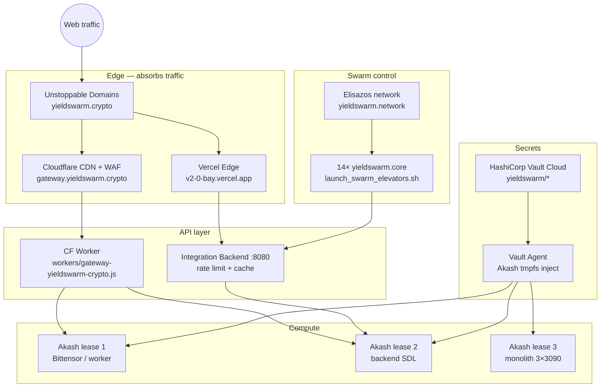
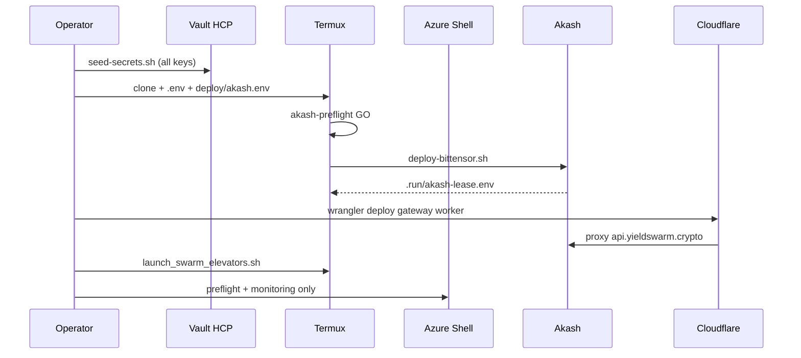
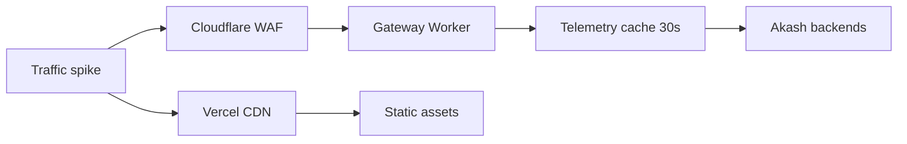

# Production Launch Playbook — Azure · PowerShell · Termux · High Traffic

Single operator guide for cloning, env setup, Vault seed, Akash mining, swarm elevators, and edge scaling before a traffic spike.

**Env template:** `deploy/env/launch-production.env.example`  
**Mining detail:** `docs/MINING_TERMUX_AZURE_SETUP.md`  
**Vault paths:** `docs/ENV_VARS.md` · `vault/scripts/seed-secrets.sh`

---

## Architecture (high-traffic path)



---

## Deploy sequence



---

## Step 0 — Clone (all platforms)

### Azure Cloud Shell (Bash)

```bash
cd ~
rm -rf './~/yieldswarm-agent-swarm-v2' "$HOME/~/yieldswarm-agent-swarm-v2" 2>/dev/null || true
test -d ~/yieldswarm-agent-swarm-v2 || \
  git clone https://github.com/Yield-Swarm/yieldswarm-agent-swarm-v2.git ~/yieldswarm-agent-swarm-v2
cd ~/yieldswarm-agent-swarm-v2
git pull --ff-only
pwd && ls deploy/akash-bittensor-miner.sdl.yml scripts/deploy-to-akash.sh
```

### Azure Cloud Shell (PowerShell)

```powershell
Set-Location $HOME
Remove-Item -Recurse -Force @(
  (Join-Path $HOME '~/yieldswarm-agent-swarm-v2'),
  (Join-Path $HOME 'yieldswarm-agent-swarm-v2\~\yieldswarm-agent-swarm-v2')
) -ErrorAction SilentlyContinue

$repo = Join-Path $HOME 'yieldswarm-agent-swarm-v2'
if (-not (Test-Path $repo)) {
  git clone https://github.com/Yield-Swarm/yieldswarm-agent-swarm-v2.git $repo
}
Set-Location $repo
git pull --ff-only
Get-ChildItem deploy\akash-bittensor-miner.sdl.yml, scripts\deploy-to-akash.sh
```

### Termux (Bash)

```bash
pkg update -y && pkg install -y git curl wget jq python openssl-tool
cd ~
test -d ~/yieldswarm-agent-swarm-v2 || \
  git clone https://github.com/Yield-Swarm/yieldswarm-agent-swarm-v2.git ~/yieldswarm-agent-swarm-v2
cd ~/yieldswarm-agent-swarm-v2
git pull --ff-only
```

### Windows PowerShell (local — not Cloud Shell)

```powershell
cd $env:USERPROFILE
if (-not (Test-Path 'yieldswarm-agent-swarm-v2')) {
  git clone https://github.com/Yield-Swarm/yieldswarm-agent-swarm-v2.git
}
cd yieldswarm-agent-swarm-v2
git pull --ff-only
```

---

## Step 1 — Create `.env` files

### Bash (Azure / Termux / Linux / macOS)

```bash
cd ~/yieldswarm-agent-swarm-v2
cp deploy/env/launch-production.env.example .env
cp deploy/akash.env.example deploy/akash.env
chmod 600 .env deploy/akash.env

# Edit — replace REPLACE_* placeholders
nano .env
nano deploy/akash.env
```

### PowerShell

```powershell
Set-Location ~/yieldswarm-agent-swarm-v2
Copy-Item deploy/env/launch-production.env.example .env
Copy-Item deploy/akash.env.example deploy/akash.env

notepad .env
notepad deploy/akash.env
```

### Load env in current shell

**Bash:**

```bash
set -a && source .env && source deploy/akash.env && set +a
```

**PowerShell:**

```powershell
Get-Content .env | ForEach-Object {
  if ($_ -match '^\s*([^#=]+)=(.*)$') {
    [Environment]::SetEnvironmentVariable($matches[1].Trim(), $matches[2].Trim(), 'Process')
  }
}
Get-Content deploy/akash.env | ForEach-Object {
  if ($_ -match '^\s*([^#=]+)=(.*)$') {
    [Environment]::SetEnvironmentVariable($matches[1].Trim(), $matches[2].Trim(), 'Process')
  }
}
```

### Load from Vault HCP (preferred)

**Bash:**

```bash
export VAULT_ADDR="https://YOUR-CLUSTER.vault.hashicorp.cloud:8200"
export VAULT_NAMESPACE="admin"
export VAULT_TOKEN="hvs...."   # operator — unset after

./vault/scripts/seed-secrets.sh

# Export runtime profile into current shell
source scripts/lib/vault-env.sh 2>/dev/null || true
eval "$(python3 scripts/vault-export-env.py backend 2>/dev/null)" || true

# Swarm keys
export SWARM_API_KEY_PRIMARY="$(vault kv get -field=api_key_primary yieldswarm/runtime/swarm)"
export SWARM_API_KEY_BACKEND="$(vault kv get -field=api_key_backend yieldswarm/runtime/swarm 2>/dev/null || true)"
unset VAULT_TOKEN
```

**PowerShell:**

```powershell
$env:VAULT_ADDR = "https://YOUR-CLUSTER.vault.hashicorp.cloud:8200"
$env:VAULT_NAMESPACE = "admin"
$env:VAULT_TOKEN = "hvs...."

bash ./vault/scripts/seed-secrets.sh

$env:SWARM_API_KEY_PRIMARY = vault kv get -field=api_key_primary yieldswarm/runtime/swarm
$env:SWARM_API_KEY_BACKEND = vault kv get -field=api_key_backend yieldswarm/runtime/swarm
Remove-Item Env:VAULT_TOKEN
```

---

## Step 2 — Install tooling

| Tool | Termux | Azure Bash | PowerShell |
|------|--------|------------|------------|
| Akash CLI | `curl -sSL .../install.sh \| bash` | same + `export PATH=$HOME/bin:$PATH` | Use WSL or Azure Bash |
| Node 22 | `pkg install nodejs` | preinstalled | `winget install OpenJS.NodeJS` |
| Wrangler | `npm i -g wrangler` | same | same |

**Akash install (Bash):**

```bash
curl -sSL https://raw.githubusercontent.com/akash-network/akash/main/install.sh | bash
export PATH="$HOME/bin:$PATH"
provider-services version
```

---

## Step 3 — Preflight (GO / NO-GO)

**Bash:**

```bash
cd ~/yieldswarm-agent-swarm-v2
set -a && source .env && source deploy/akash.env && set +a
chmod +x scripts/*.sh scripts/mining/*.sh launch_swarm_elevators.sh

./scripts/akash-preflight.sh deploy/akash-bittensor-miner.sdl.yml
npm run mining:preflight 2>/dev/null || ./scripts/start-mining.sh preflight
```

**PowerShell:**

```powershell
Set-Location ~/yieldswarm-agent-swarm-v2
bash ./scripts/akash-preflight.sh deploy/akash-bittensor-miner.sdl.yml
```

Fix every **NO-GO** before mainnet deploy.

---

## Step 4 — Launch stack (recommended order)

| # | Action | Where to run |
|---|--------|--------------|
| 1 | Seed Vault | Any (once) |
| 2 | Akash Bittensor miner | **Termux** |
| 3 | Deploy CF gateway worker | Laptop / Azure |
| 4 | Wire UD DNS | UD dashboard |
| 5 | Swarm elevators | Termux or server |
| 6 | Vercel prod deploy | CI or local |
| 7 | Sovereign loops + monitoring | Server |

### 4a — Akash Bittensor miner (Termux — live deploy)

```bash
cd ~/yieldswarm-agent-swarm-v2
set -a && source .env && source deploy/akash.env && set +a

export BT_NETUID=1
export VAULT_TOKEN="hvs...."    # mint wrap only
./scripts/start-mining.sh
unset VAULT_TOKEN

source .run/akash-lease.env
echo "Workers: $AKASH_WORKER_URLS"
./scripts/verify-akash-lease.sh
```

**PowerShell (delegates to bash):**

```powershell
bash -lc 'cd ~/yieldswarm-agent-swarm-v2 && set -a && source .env && source deploy/akash.env && set +a && export BT_NETUID=1 && ./scripts/start-mining.sh'
```

### 4b — Cloudflare gateway (high-traffic API path)

```bash
cd ~/yieldswarm-agent-swarm-v2
source .run/akash-lease.env
export AKASH_ORIGIN="${AKASH_WORKER_URLS%%,*}"
npx wrangler deploy workers/gateway-yieldswarm-crypto.js
npx wrangler secret put AKASH_ORIGIN
# optional: npx wrangler secret put AKASH_ORIGIN_FALLBACK
```

### 4c — Swarm elevators (14 book roots)

```bash
cd ~/yieldswarm-agent-swarm-v2
export SWARM_API_KEY_PRIMARY="$(vault kv get -field=api_key_primary yieldswarm/runtime/swarm 2>/dev/null || grep SWARM_API_KEY_PRIMARY .env | cut -d= -f2)"
./launch_swarm_elevators.sh
./launch_swarm_elevators.sh status
```

### 4d — Backend + frontend (traffic spike)

```bash
# Backend health
curl -sf "${API_BASE}/api/health" | jq .

# Vercel production
npm ci && npm run build:all
npx vercel --prod

# Sovereign loops + monitoring
./deploy/scripts/start-monitoring.sh
./deploy/scripts/start-sovereign-loops.sh start
```

**PowerShell:**

```powershell
curl.exe -sf "$env:API_BASE/api/health"
npm ci; npm run build:all
npx vercel --prod
bash ./deploy/scripts/start-monitoring.sh
```

### 4e — 3× RTX 3090 monolith (scale-up)

```bash
./scripts/start-mining.sh monolith
# Vault-wrapped:
USE_VAULT_AKASH=1 ./scripts/akash-deploy-with-vault.sh
```

---

## Step 5 — High-traffic checklist

Apply these **before** marketing push or viral event:

| Setting | Production value | Why |
|---------|------------------|-----|
| `RATE_LIMIT_RPM` | `300`–`600` | Backend throttle per client |
| `TELEMETRY_CACHE_TTL_MS` | `30000`+ | Reduces Akash poll storms |
| `YIELDSWARM_SYNC_AKASH_WORKERS` | `true` | Auto-discover lease URLs |
| `AKASH_WORKER_URLS` | 2+ origins | CF Worker failover |
| `NETWORK_LOCKDOWN_MODE` | `true` | Blocks risky endpoints |
| `ALCHEMY_REVEAL_URLS` | `0` | No key leakage in API |
| `SECURE_COOKIES` | `true` | Production auth |
| Cloudflare WAF | ON | DDoS + bot fight |
| Vercel | Edge caching ON | Static + ISR |
| Sentry | `traces_sample_rate=0.05` | Error visibility without noise |



**Verify under load:**

```bash
# Health matrix
curl -sf https://yieldswarm.crypto/api/health
curl -sf https://gateway.yieldswarm.crypto/healthz
curl -sf https://gateway.yieldswarm.crypto/api/telemetry/akash

# Process matrix
ps aux | grep -E 'yieldswarm|provider-services' || true
./launch_swarm_elevators.sh status
./scripts/mining/status.sh
```

---

## Step 6 — Azure vs Termux roles

| Task | Termux | Azure Cloud Shell | Windows PS local |
|------|--------|-------------------|------------------|
| Akash wallet / keys | **Primary** | Session-only | Use WSL |
| Live miner deploy | **Yes** | No (ephemeral) | WSL only |
| Preflight / scripts | Yes | Yes | Via `bash -lc` |
| Vault seed | Yes (with token) | Yes | Yes |
| Wrangler / Vercel | Possible | Yes | Yes |
| Swarm elevators 24/7 | **Yes** | No | Server/WSL |

---

## One-shot launch scripts

**Bash — full preflight + mining dry-run:**

```bash
cd ~/yieldswarm-agent-swarm-v2 && \
  cp -n deploy/env/launch-production.env.example .env && \
  cp -n deploy/akash.env.example deploy/akash.env && \
  set -a && source .env && source deploy/akash.env && set +a && \
  ./scripts/akash-preflight.sh deploy/akash-bittensor-miner.sdl.yml && \
  MINING_DRY_RUN=1 ./scripts/start-mining.sh
```

**Bash — production mining (after wallet funded):**

```bash
cd ~/yieldswarm-agent-swarm-v2 && \
  set -a && source .env && source deploy/akash.env && set +a && \
  export BT_NETUID=1 && \
  ./scripts/start-mining.sh && \
  ./launch_swarm_elevators.sh
```

**PowerShell — preflight only:**

```powershell
bash -lc @'
cd ~/yieldswarm-agent-swarm-v2
set -a && source .env && source deploy/akash.env && set +a
./scripts/akash-preflight.sh deploy/akash-bittensor-miner.sdl.yml
'@
```

---

## Vault KV map (copy to HCP)

| ENV variable(s) | Vault path | Field(s) |
|-----------------|------------|----------|
| `SWARM_API_KEY_PRIMARY`, `SWARM_API_KEY_BACKEND` | `runtime/swarm` | `api_key_primary`, `api_key_backend` |
| `ALCHEMY_API_KEY`, `ALCHEMY_APP_NAME` | `integrations/alchemy` | `api_key`, `app_name` |
| `UD_API_KEY` | `integrations/unstoppable` | `api_key` |
| `VERCEL_API_TOKEN` | `integrations/vercel` | `token` |
| `CLOUDFLARE_*` | `integrations/cloudflare` | `api_token`, `zone_id`, … |
| `PINATA_*` | `integrations/pinata` | `api_key`, `secret`, `jwt` |
| `TELEGRAM_BOT_TOKEN` | `integrations/telegram` | `bot_token` |
| `AGENTSWARM_MASTER_KEY` | `runtime/core` | `agentswarm_master_key` |
| `YIELDSWARM_ROUTER_API_KEY` | `runtime/odysseus` | `router_api_key` |
| LLM keys | `runtime/llm` | `openai_api_key`, … |
| Akash wallet | `runtime/akash` | `owner_address`, `mnemonic`, `key_name` |
| Bittensor | `runtime/bittensor` | `netuid`, `wallet_name`, … |

---

## Related docs

- `deploy/env/launch-production.env.example` — full production `.env` template
- `docs/MINING_TERMUX_AZURE_SETUP.md` — mining-specific paths
- `docs/SWARM_ELEVATORS_LAUNCH.md` — 14 elevator registry
- `DOMAINS.md` — UD + Vercel + gateway records
- `docs/AKASH_SDL_BUDGETS.md` — GPU cost tiers
- `docs/VAULT_ENV_INJECTION.md` — Akash Agent injection
- `workers/README.md` — gateway worker deploy
