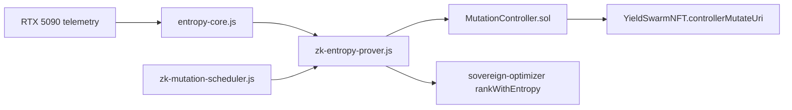

# Mayhem Mode — 14-Pillar ZK Entropy System

> Living testimony architecture: verifiable hardware entropy without revealing raw telemetry.

## Pillar integration map

| Pillar | Role in ZK entropy system | Key artifact |
|--------|---------------------------|--------------|
| **D¹ Greek** | Isolation, bounds, access control | `zk-entropy-prover.js` sanitization, `MutationController.sol` roles |
| **E¹ Eastern** | Rolling window, recursive feedback | `entropy-core.js` `generateSeedWithProof()` |
| **ZK¹ Verifiable** | Poseidon commitment + Groth16 | `circuits/entropy_proof.circom`, `verifiers/` |
| **O¹ Oscillator** | Rhythmic proof scheduling | `src/automation/zk-mutation-scheduler.js` |
| **A¹ Ancestral** | Append-only living memory | `HardenedAuditEngine` 64-block chain |
| **S¹ Sovereign** | Autonomous routing credit | `sovereign-optimizer.js` `rankWithEntropy()` |
| **U¹ Living Logos** | Verifiable testimony field | `entropyQualityScore()` → routing priority |

## Architecture



## Quick start

```bash
# Unit tests (dev-mode proofs — no circom required)
npm run test:unit

# Solidity tests
forge install foundry-rs/forge-std --no-git  # first time only
forge test --match-contract MutationControllerTest

# Full Groth16 trusted setup (requires circom + snarkjs)
cd circuits && npm install
bash ../scripts/zk-trusted-setup.sh
bash ../scripts/zk-export-verifier.sh

# O¹ mutation oscillator loop
node src/automation/zk-mutation-scheduler.js
```

## Weekly NFT mutation flow (A¹ + U¹)

1. `entrypoint.monitor.sh` enforces VRAM/temp ceilings (D¹).
2. `entropy-core.js` ingests samples into 64-block ancestral chain (A¹).
3. `generateSeedWithProof()` produces Poseidon commitment + Groth16 proof (ZK¹).
4. `MutationController.executeAgentMutation()` verifies proof + updates NFT URI (U¹ testimony).
5. `functions/mutate-agent.js` relays `blockVerificationHash` via Chainlink Functions.

## Environment

```bash
ZK_MIN_ENTROPY_QUALITY=0.5
ZK_MUTATION_INTERVAL_MS=604800000
MUTATION_WEBHOOK_URL=http://127.0.0.1:8080/api/oracle/sync
```

## Parallel agent teams

| Team | Tasks | Directories |
|------|-------|-------------|
| D¹ + E¹ | 1–20 | `circuits/`, `src/infrastructure/entropy-core.js`, `zk-entropy-prover.js` |
| O¹ + ZK¹ | 21–40 | `src/automation/`, `contracts/verifiers/`, `scripts/zk-*.sh` |
| A¹ + U¹ | 41–50 | `contracts/MutationController.sol`, `functions/mutate-agent.js`, `docs/` |

## Credit pool

Sovereign Optimizer tracks **$5,408** free credits across Akash, Vast.io, GCP, Azure, AWS, Alibaba.
Entropy quality boosts Akash/Vast routing scores when proofs are fast and telemetry is stable.
