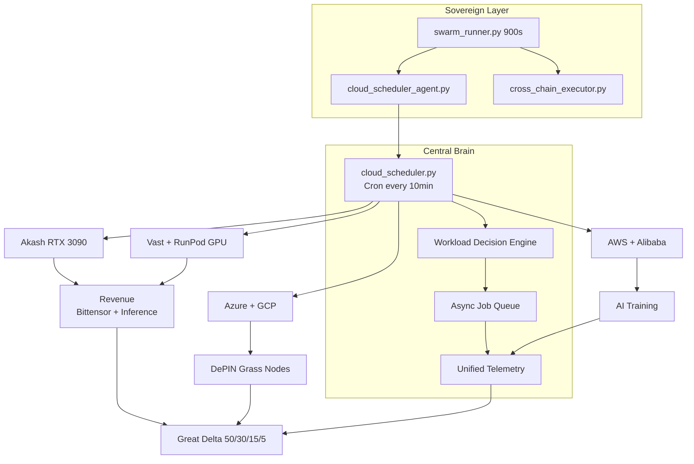

# 30-Day Multi-Cloud Utilization Master Plan

**Asynchronous + cron-orchestrated** maximum credit harvest across Akash, Vast.io, RunPod, Azure, Google Cloud, AWS, and Alibaba — feeding revenue and telemetry into Sovereign Loops + Great Delta.

---

## Core principles

| Principle | Implementation |
|-----------|----------------|
| **Asynchronous-first** | `services/async_jobs/queue.py` — file-based job queue |
| **Cron-orchestrated** | `scripts/run-cloud-scheduler.sh` every 10 min |
| **Revenue > utilization** | Bittensor + inference prioritized over filler |
| **Self-healing** | Failed jobs migrate to fallback providers |
| **Central brain** | Sovereign Loops + Great Delta 50/30/15/5 |

---

## Architecture



---

## Week-by-week execution

### Week 1 — Foundation & max GPU

| Day | Action |
|-----|--------|
| 1–2 | Fund Akash wallet; `make deploy-akash-europlots` |
| 2–3 | Enable scheduler: `./scripts/run-cloud-scheduler.sh` |
| 3–5 | Burst Vast/RunPod training (`WORKLOAD=training`) |
| 5–7 | Bittensor on Akash; baseline telemetry in `.run/cloud-telemetry.json` |

```bash
export CLOUD_SCHEDULER_DRY_RUN=1
export CLOUD_SCHEDULER_WEEK=1
make cloud-scheduler-tick
```

### Week 2 — Scale + async automation

- Install cron: `crontab crons/cloud-scheduler.cron.example`
- Grass nodes on Azure/GCP (`WORKLOAD=grass`)
- Async queue drains failed jobs with provider migration
- Wire worker metrics → Sovereign Loops

```bash
export CLOUD_SCHEDULER_WEEK=2
make cloud-scheduler-tick
```

### Week 3 — Optimization + revenue focus

- Decision engine shifts to highest ROI provider daily
- Scale Bittensor subnet participation
- Vault secrets for all cloud API keys
- Cross-chain revenue merges into Great Delta

### Week 4 — Harvest + documentation

- Maximize remaining credits per provider budget cap
- `make cloud-scheduler-report` — what worked
- Prepare paid continuation playbook

---

## Technical components

### 1. Central Scheduler — `services/cloud_scheduler/`

| Module | Role |
|--------|------|
| `scheduler.py` | Cron tick: decide → enqueue → process |
| `decision_engine.py` | Week-aware ROI decisions |
| `providers.py` | Launch + budget caps |
| `telemetry.py` | Unified metrics aggregator |

### 2. Async Job Queue — `services/async_jobs/queue.py`

- Durable JSON queue at `.run/async-jobs.json`
- Retry up to 3 attempts
- Auto-migrate to `fallback_providers` on exhaustion
- Celery/Redis upgrade path documented below

### 3. Unified Telemetry

Workers report:

| Metric | Use |
|--------|-----|
| `hashrate` | Mining performance |
| `earnings_usd` | Revenue tracking |
| `credit_burn_usd` | Budget enforcement |
| `temperature_c` | Health / throttle |

Feeds Great Delta via `to_great_delta_input()`.

---

## Commands

```bash
make cloud-scheduler-tick      # one scheduler cycle
make cloud-scheduler-report    # last tick + telemetry
./scripts/run-cloud-scheduler.sh
crontab crons/cloud-scheduler.cron.example
```

---

## Provider priority

| Priority | Provider | Workloads |
|----------|----------|-----------|
| 1 | Akash | Bittensor, inference |
| 2 | Vast.io, RunPod | Training, burst GPU |
| 3 | Azure, GCP | Grass, training |
| 4 | AWS | Training, batch |
| 5 | Alibaba | Filler capacity |

---

## Human gates

| Gate | Action |
|------|--------|
| Akash | Wallet ≥0.5 AKT, `VAULT_TOKEN` |
| Vast/RunPod | API keys in Vault |
| Live mode | `CLOUD_SCHEDULER_DRY_RUN=0` + council 9/14 |

---

## Upgrade path: Celery + Redis

When queue volume exceeds file-based limits:

```bash
# Future: pip install celery redis
# Point CELERY_BROKER_URL at Redis; wrap AsyncJobQueue.enqueue as Celery task
```

---

## Related docs

- `docs/ARCHITECTURE.md` — full system Mermaid
- `docs/CROSS_CHAIN_EXECUTION.md` — on-chain revenue layer
- `config/cloud_scheduler/schedule.yaml` — schedule config
- `agents/governance/gospel.py` — harvest phase constants
