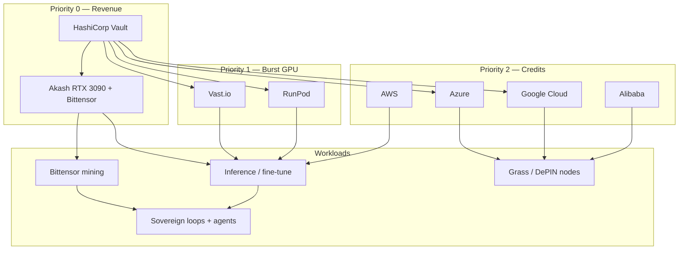

# Multi-Cloud 30-Day Utilization Plan

Aggressive free-credit utilization across Akash, Vast.io, RunPod, Azure, Google Cloud, AWS, Alibaba, and HashiCorp Vault — with **Akash first** for real GPU revenue (Bittensor + inference).

**Window:** 30 days from first live deploy  
**Goal:** Maximize credit burn → real revenue + trained models + DePIN nodes + sovereign agent loops at scale

---

## Strategy overview



| Priority | Provider | Best workloads | Revenue path |
|----------|----------|----------------|--------------|
| **1** | **Akash** | RTX 3090 Bittensor miner + inference | TAO emissions + agent marketplace |
| **2** | **Vast.io** | Cheap high-end GPU training / mining | Training artifacts → product |
| **3** | **RunPod** | GPU training + burst inference | Same |
| **4** | **Azure** | Grass nodes, CPU workloads, training | DePIN rewards |
| **5** | **Google Cloud** | Training, Grass, MIG fallback | Credits → models |
| **6** | **AWS** | Training, general burst | Credits → models |
| **7** | **Alibaba** | Asia-region filler capacity | Low priority burst |

**Vault is not a compute provider** — it is the secrets hub for every provider above.

---

## Week-by-week timeline

### Week 1 — Foundation (Days 1–7)

| Day | Focus | Commands / artifacts |
|-----|-------|---------------------|
| 1 | Vault + Akash human gates | `export VAULT_TOKEN=...` · fund wallet ≥0.5 AKT |
| 1 | Akash preflight GO | `make akash-preflight` |
| 2 | Live europlots lease | `make deploy-akash-europlots` |
| 2 | Post-deploy verify | `make akash-verify` |
| 3 | Arena + sovereign loops | `make sovereign-up` · `/arena?workers=...` |
| 4 | Cursor MCP + Swarm Conductor | `docs/CURSOR_CLOUD_SETUP.md` |
| 5 | RunPod burst (1× 4090) | `make multicloud-launch PROVIDER=runpod WORKLOAD=bittensor` |
| 6 | Cost baseline | `make multicloud-cost-report` |
| 7 | Review + scale decision | `make multicloud-preflight` |

**Week 1 exit criteria:** One live Akash lease with Vault injection, Bittensor port reachable, Arena wired, cost report baseline saved.

### Week 2 — Scale GPU revenue (Days 8–14)

| Focus | Action |
|-------|--------|
| Akash scale | Add Bittensor miner SDL or second worker pool |
| Vast.io | Launch 1–2 RTX 3090/4090 training pods via `scripts/multicloud/providers/vast.sh` |
| RunPod | Fine-tune job via `infra/terraform/` or `terraform/runpod.tf` |
| Monitoring | `make monitoring-up` · Grafana dashboards |
| Tesla Fleet | Merge PR #30 · register domain · pair vehicles (follow-up) |

**Week 2 exit criteria:** ≥2 GPU workers producing telemetry; Bittensor axon responding on at least one host.

### Week 3 — DePIN + training burst (Days 15–21)

| Focus | Action |
|-------|--------|
| Grass nodes | Azure VM or GCP MIG — `WORKLOAD=grass` |
| Training | Vast/RunPod fine-tune with Vault-injected API keys |
| Fallback fleet | `cd infra/terraform && terraform apply` when Akash saturated |
| Postgres payments | God Prompt G — Neon persistence |
| Credit tracking | Daily `make multicloud-cost-report` |

**Week 3 exit criteria:** Grass nodes online; one completed training run; fallback terraform tested in staging.

### Week 4 — Optimize + revenue proof (Days 22–30)

| Focus | Action |
|-------|--------|
| Cost optimization | Tear down idle pods; shift to Akash where cheaper |
| Revenue dashboard | Bittensor emissions + marketplace GMV in Arena |
| Alibaba filler | Asia-region burst only if credits remain |
| Investor materials | Update `funding/` with live traction numbers |
| 30-day retrospective | Fill checklist in `docs/30DAY_EXECUTION_CHECKLIST.md` |

**Week 4 exit criteria:** Documented revenue or emissions; credit utilization ≥70%; runbook validated.

---

## Terraform roots (pick by scenario)

The repo has **three** Terraform stacks. Use this precedence:

| Scenario | Stack | Path | Trigger |
|----------|-------|------|---------|
| Akash unhealthy → Fly/Render/Hetzner | Production fallback | `deploy/terraform/` | `make terraform-apply` |
| Vault-fed Azure + RunPod + Vultr | Full stack | `terraform/` | Manual with Vault creds |
| Akash saturated → capacity deficit | Worker fallback | `infra/terraform/` | `akash_current_workers < desired` |

**Rule:** Akash is always primary. Fallback stacks only spin up when deficit > 0 or Akash health fails.

---

## Workload placement matrix

| Workload | Primary | Secondary | Config |
|----------|---------|-----------|--------|
| Bittensor miner (RTX 3090) | Akash | Vast.io | `deploy/akash-bittensor-miner.sdl.yml` |
| Agent inference (3090/4090) | Akash | RunPod | `deploy/deploy-swarm-monolith.yaml` |
| Model fine-tuning | Vast.io | RunPod, GCP | `config/multicloud/workloads.yaml` |
| Grass Linux node | Azure | GCP | `WORKLOAD=grass` |
| CPU mining / batch | Azure | AWS | `WORKLOAD=cpu-batch` |
| Sovereign loops | Local / Akash sidecar | Azure VM | `make sovereign-up` |
| Odysseus brain | Akash GPU SDL | Azure Container Apps | `deploy/multicloud/odysseus.yaml` |

---

## Vault secret paths (all providers)

Store in Vault KV — never in git or Terraform state plaintext:

| Path | Keys | Used by |
|------|------|---------|
| `kv/yieldswarm/cloud/akash` | wallet mnemonic, JWT | Akash deploy |
| `kv/yieldswarm/cloud/runpod` | `api_key` | RunPod pods |
| `kv/yieldswarm/cloud/vast` | `api_key` | Vast.io |
| `kv/yieldswarm/cloud/azure` | `client_id`, `client_secret`, `subscription_id` | Azure VMSS / Container Apps |
| `kv/yieldswarm/cloud/gcp` | `project_id`, service account JSON | GCP MIG |
| `kv/yieldswarm/cloud/aws` | `access_key_id`, `secret_access_key` | ECS (future) |
| `kv/yieldswarm/cloud/alibaba` | `access_key_id`, `access_key_secret` | ECS (future) |
| `kv/yieldswarm/integrations/tesla` | `client_id`, `client_secret`, private key ref | Tesla Fleet |

Bootstrap: `vault/scripts/seed-secrets.sh` or `make vault-check` then manual `vault kv put`.

---

## Operator runbook (daily)

```bash
# Morning — health + cost
make multicloud-preflight
make multicloud-cost-report

# If Akash degraded
make akash-heal                    # auto-heal lease
make akash-verify

# If Akash saturated (deficit > 0)
cd infra/terraform
terraform plan -var="akash_current_workers=40" -var="desired_total_workers=120"
terraform apply

# Burst GPU training (Vast/RunPod)
make multicloud-launch PROVIDER=vast WORKLOAD=training GPU=RTX_4090
make multicloud-launch PROVIDER=runpod WORKLOAD=inference GPU=RTX_4090

# Evening — tear down idle burst
make multicloud-teardown PROVIDER=vast
```

---

## Cost tracking

`scripts/multicloud-cost-report.sh` aggregates:

- Akash lease spend (from `provider-services query deployment`)
- `.run/multicloud-*.json` launch records
- Provider API estimates where keys are set
- Credit burn rate vs 30-day budget

Output: `.run/multicloud-cost-report.json` + human-readable summary.

Set budgets in `config/multicloud/budgets.env.example`:

```bash
MULTICLOUD_DAILY_BUDGET_USD=50
MULTICLOUD_AKASH_MAX_AKT=5
MULTICLOUD_RUNPOD_MAX_USD=200
MULTICLOUD_VAST_MAX_USD=150
```

---

## Scripts reference

| Script | Purpose |
|--------|---------|
| `scripts/multicloud-preflight.sh` | GO/NO-GO across Vault + Akash + optional cloud APIs |
| `scripts/multicloud-cost-report.sh` | Daily utilization + spend summary |
| `scripts/multicloud/launch-worker.sh` | Route workload to provider |
| `scripts/multicloud/providers/*.sh` | Per-provider launch/teardown |
| `scripts/akash-preflight.sh` | Akash-specific gate (unchanged) |
| `scripts/deploy-to-akash.sh` | Live Akash deploy |
| `scripts/verify-akash-lease.sh` | Post-deploy smoke tests |

### Makefile targets

```bash
make multicloud-preflight      # all-provider GO/NO-GO
make multicloud-cost-report    # utilization snapshot
make multicloud-launch         # PROVIDER=... WORKLOAD=...
make deploy-akash-europlots    # P0 revenue path
make sovereign-up              # agent loops
```

---

## Human gates (stop agents, ask human)

| Gate | Condition | Fix |
|------|-----------|-----|
| Vault | `VAULT_TOKEN` unset | `export VAULT_TOKEN=...` |
| Akash wallet | balance < 0.5 AKT | Fund `yieldswarm-admin` |
| Akash preflight | NO-GO | Follow fix commands in output |
| RunPod / Vast | API key missing | `vault kv put kv/yieldswarm/cloud/runpod api_key=...` |
| Azure / GCP | creds missing | Add to Vault; export for terraform |
| Credit budget | daily spend > budget | `make multicloud-teardown` |

---

## Parallel agent streams (Cursor)

Keep **Swarm Conductor** open (`docs/SWARM_CONDUCTOR.md`). Assign God Prompts by ownership:

| Prompt | Owns | Does NOT own |
|--------|------|--------------|
| O (this plan) | `docs/MULTI_CLOUD_*`, `scripts/multicloud*` | Akash SDL internals |
| F (scale) | `akash/lease-manager.py`, worker pools | `deploy-to-akash.sh` |
| G (Postgres) | `src/lib/db/` | Akash scripts |
| H (sovereign) | `services/sovereign_runtime.py` | funding/ |
| Tesla follow-up | vehicle pairing, telemetry ingest | multicloud scripts |

---

## Related docs

- `docs/30DAY_EXECUTION_CHECKLIST.md` — master checkbox tracker
- `docs/CURSOR_CLOUD_SETUP.md` — MCP + parallel agents
- `docs/AKASH_DEPLOY.md` — Akash production deploy
- `docs/VAULT_AKASH_RUNTIME.md` — Vault injection
- `infra/README.md` — fallback capacity math
- `TODAY_EXECUTION_PLAN.md` — day-one P0 steps
- `funding/USE_OF_FUNDS.md` — investor allocation alignment
