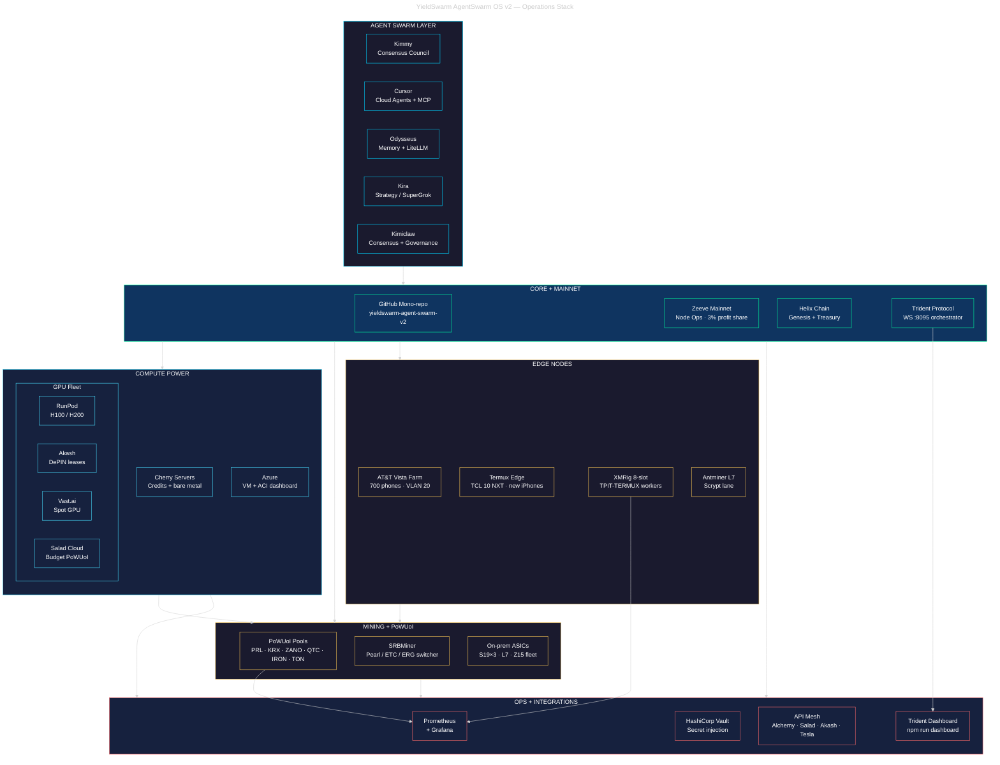
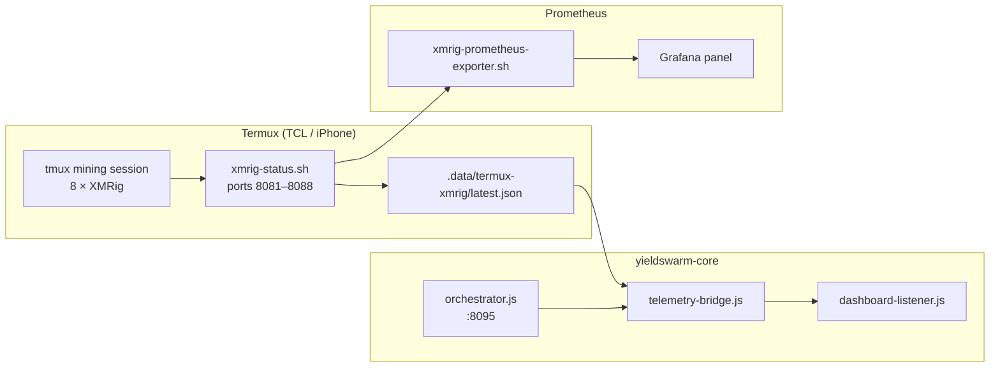

# YieldSwarm Operations Stack

Operational view of the live production stack — agent orchestration, mainnet core, cloud GPU fleet, edge miners, and observability. Complements the 35-layer neural mesh in [`ARCHITECTURE.md`](ARCHITECTURE.md).

**Edit this file directly on GitHub** — Mermaid renders in the preview tab.

---

## Full stack (operator view)

---

## Detail: edge + telemetry path

---

## Repo anchors

| Layer | Component | Repo path |
|-------|-----------|-----------|
| Agent swarm | Trident orchestrator | `yieldswarm-core/src/orchestrator.js` |
| Agent swarm | Profitability switcher | `yieldswarm-core/src/swarm-switcher.js` |
| Mainnet | Helix genesis | `scripts/activate-helix.sh`, `backend/src/adapters/helix.js` |
| Zeeve | Profit share (3%) | `services/business/profit_share.py` |
| Cherry | Credits packet export | `scripts/cherry-servers/export-cloud-specs.sh` |
| Azure | VM dashboard runbook | `docs/AZURE_VM_DASHBOARD.md` |
| GPU fleet | Akash SDL + deploy | `deploy/akash/`, `make deploy-akash-europlots` |
| GPU fleet | Salad $100 deploy | `scripts/salad/deploy-pouw-budget.sh` |
| PoWUoI | Pool registry + launcher | `config/mining/pouw-coins.json`, `mining/pouw_launcher.py` |
| Pearl | SRBMiner deploy | `scripts/mining/deploy-pearl-srbminer.sh` |
| Edge | Termux XMRig 8-slot | `scripts/termux/xmrig-start-8.sh` |
| Edge | Termux fleet daemon | `scripts/termux/mining-daemon.sh` |
| Ops | Prometheus stack | `deploy/monitoring/`, `make monitoring-up` |
| Ops | Vault injection | `docs/VAULT_AKASH_RUNTIME.md` |

---

## Related docs

| Doc | Purpose |
|-----|---------|
| [`ARCHITECTURE.md`](ARCHITECTURE.md) | 35-layer neural mesh + investor view |
| [`YieldSwarm_Full_Stack_Deployment_Overview.md`](YieldSwarm_Full_Stack_Deployment_Overview.md) | Zeeve outreach + 14-pillar summary |
| [`MINING_INFRASTRUCTURE.md`](MINING_INFRASTRUCTURE.md) | Mining roots + pool wiring |
| [`CHERRY_SERVERS_CLOUD_SPECS_RESEARCH.md`](CHERRY_SERVERS_CLOUD_SPECS_RESEARCH.md) | Cherry credits packet |
| [`outreach/email-zeeve-ravi.md`](outreach/email-zeeve-ravi.md) | Zeeve mainnet call prep |
