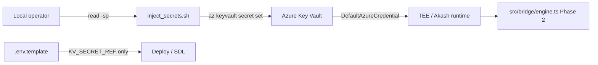

# Phase 1 — Secure `.env.template` & TEE / Azure Key Vault Injection

> **God Tasks 1–5 (lockdown)** — strip production plaintext from git; map every secret name to `KV_SECRET_REF:` placeholders; inject via `scripts/inject_secrets.sh`.

## Quick start

```bash
# 1. Copy the secure template (no real secrets)
cp .env.template .env

# 2. Set non-secret config in .env (domain, shard counts, feature flags)

# 3. Log in to Azure and inject secrets interactively
az login
export AZURE_KEYVAULT_NAME=your-unique-keyvault
./scripts/inject_secrets.sh

# 4. Preview names without writing
./scripts/inject_secrets.sh --dry-run

# 5. Inject a subset after rotation
./scripts/inject_secrets.sh --only kimiclaw-consensus-key,grok-api-key
```

## Architecture



| Layer | File | Role |
|-------|------|------|
| Template | `.env.template` | Committed; `KV_SECRET_REF:name` placeholders only |
| Local bootstrap | `.env` | Gitignored; non-secrets + refs |
| Injection | `scripts/inject_secrets.sh` | Interactive Azure KV upload; no plaintext logs |
| Runtime | Phase 2 bridge | `@azure/identity` resolves refs at execution time |
| Legacy | `vault/scripts/seed-secrets.sh` | HashiCorp Vault parallel path |

## Key Vault secret ↔ environment variable

| Key Vault name | `.env` variable |
|----------------|-----------------|
| `agentswarm-master-key` | `AGENTSWARM_MASTER_KEY` |
| `kimiclaw-consensus-key` | `KIMICLAW_CONSENSUS_KEY` |
| `grok-api-key` | `GROK_API_KEY` |
| `openai-api-key` | `OPENAI_API_KEY` |
| `gemini-api-key` | `GEMINI_API_KEY` |
| `openrouter-api-key` | `OPENROUTER_API_KEY` |
| `tee-signing-key` | `TEE_SIGNING_KEY` |
| `database-encryption-key` | `DATABASE_ENCRYPTION_KEY` |
| `helix-chain-bridge-key` | `HELIX_CHAIN_BRIDGE_KEY` |
| `pinata-api-key` | `PINATA_API_KEY` |
| `pinata-secret` | `PINATA_SECRET` |
| `pinata-jwt` | `PINATA_JWT` |
| `resend-api-key` | `RESEND_API_KEY` |
| `cf-access-client-id` | `CLOUDFLARE_ACCESS_CLIENT_ID` |
| `cf-access-client-secret` | `CLOUDFLARE_ACCESS_CLIENT_SECRET` |
| `cloudflare-api-token` | `CLOUDFLARE_API_TOKEN` |
| `sentry-dsn` | `SENTRY_DSN` |
| `notion-api-key` | `NOTION_API_KEY` |
| `telegram-bot-token` | `TELEGRAM_BOT_TOKEN` |
| `qn-solana-rpc` | `QUICKNODE_SOLANA_RPC_URL` |
| `quicknode-api-key` | `QUICKNODE_API_KEY` |
| `solana-rpc-url` | `SOLANA_RPC_URL` |
| `helius-api-key` | `HELIUS_API_KEY` |
| `jupiter-api-key` | `JUPITER_API_KEY` |
| `infura-project-id` | `INFURA_PROJECT_ID` |
| `infura-api-key` | `INFURA_API_KEY` |
| `infura-sol-mainnet-rpc` | `INFURA_SOL_MAINNET_RPC` |
| `ankr-api-key` | `ANKR_API_KEY` |
| `ankr-rpc-multichain` | `ANKR_RPC_MULTICHAIN` |
| `tenderly-api-key` | `TENDERLY_API_KEY` |
| `tenderly-project` | `TENDERLY_PROJECT` |
| `tenderly-project-url` | `TENDERLY_PROJECT_URL` |
| `apn-mint-address` | `APN_MINT_ADDRESS` |
| `pump-fun-coin-id` | `PUMP_FUN_COIN_ID` |

Source mapping: `SecretProd` inventory (June 2026) + `.env.example` council wishlist. **Never commit live values.**

## Security rules

1. **Rotate** any credential that appeared in `SecretProd` PDFs or chat logs — treat them as compromised.
2. **Never** `echo`, `printf`, or `set -x` secret values in scripts or CI.
3. **Never** pass secrets as CLI arguments (`az ... --value "$X"` exposes argv).
4. Use **stdin** (`--file /dev/stdin`) for `az keyvault secret set` (implemented in `inject_secrets.sh`).
5. Grant **Key Vault Secrets Officer** only to deployment principals; runtime uses **get** via managed identity.
6. `NETWORK_LOCKDOWN_MODE=true` blocks manual cross-chain txs in Phase 2; autonomous TEE shards may continue when crypto validation passes.

## Azure RBAC checklist

```bash
# Managed identity on YieldSwarmProd VM / Akash worker
az role assignment create \
  --role "Key Vault Secrets User" \
  --assignee-object-id "<managed-identity-object-id>" \
  --scope "/subscriptions/<sub>/resourceGroups/YieldSwarmProd/providers/Microsoft.KeyVault/vaults/<vault>"
```

## Related docs

- Phase 2 paste prompt: `docs/cursor-prompts/PHASE2_HELIX_CHAIN_BRIDGE.md`
- HashiCorp path: `docs/VAULT_ENV_INJECTION.md`
- Deploy order: `docs/DEPLOYMENT_PRIORITY_ORDER.md`
- Cross-chain MVP: `docs/CROSS_CHAIN_MVP.md`

## Kiosk command station (ops layout)

| Hardware | Display |
|----------|---------|
| Apple TV + Vizio | Helix Explorer + block monitor (120 shards) |
| Fire Stick + Samsung | Frontend/backend + payment rails (Coinbase, Kraken, Robinhood latency) |
| Google Pixel 10a | Master admin dashboard — uptime + deploy commands |
