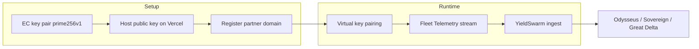
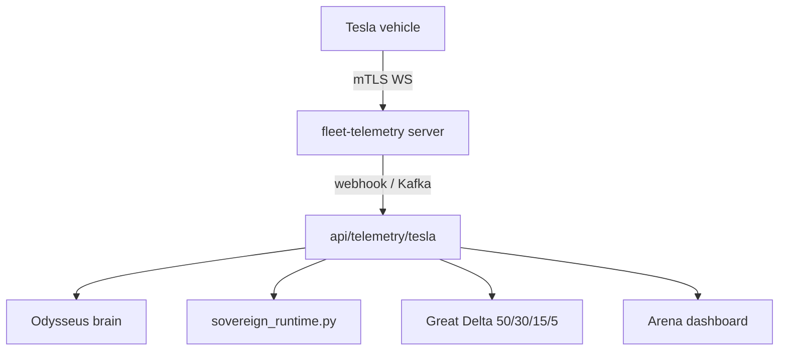

# Tesla Fleet API Integration

Complete guide for **YieldSwarm** Tesla Fleet API setup: EC key hosting, partner registration, and Fleet Telemetry foundation.

**Official docs:** https://developer.tesla.com/docs/fleet-api

---

## Overview



| Phase | What | Script / artifact |
|-------|------|-------------------|
| 1 | Key pair + hosting | `scripts/setup-tesla-keys.sh` |
| 2 | Partner token + register | `scripts/register-tesla-fleet.sh` |
| 3 | Telemetry config | `config/tesla/fleet-telemetry.sample.json` |
| 4 | Pairing + streaming | See [Next steps](#next-steps-pairing--telemetry-streaming) |

---

## Prerequisites

1. Tesla developer account: https://developer.tesla.com
2. Application with **Client ID** + **Client Secret**
3. **Allowed origins** on developer.tesla.com matching your Vercel domain
4. `openssl`, `curl`, `jq` in Codespace

---

## Part 1 — Public / private key pair + hosting

### Generate keys

```bash
./scripts/setup-tesla-keys.sh
```

Creates:

| File | Committed? | Purpose |
|------|------------|---------|
| `tesla/keys/private-key.pem` | **Never** (gitignored) | Signs vehicle commands + telemetry config |
| `public/.well-known/appspecific/com.tesla.3p.public-key.pem` | **Yes** (exception in `.gitignore`) | Tesla domain verification |

### Public key URL (required by Tesla)

Must be live at:

```
https://<your-domain>/.well-known/appspecific/com.tesla.3p.public-key.pem
```

For this project (Vercel preview example):

```
https://yieldswarm-agent-swarm-v2-51zx4tmk-support-6930s-projects.vercel.app/.well-known/appspecific/com.tesla.3p.public-key.pem
```

### Deploy to Vercel

The public key is served from Next.js `public/` (see `vercel.json` route). After generating keys:

```bash
git add public/.well-known/appspecific/com.tesla.3p.public-key.pem
git commit -m "chore(tesla): add Fleet API public key"
git push
vercel --prod
```

Verify:

```bash
curl -sf "https://<your-vercel-domain>/.well-known/appspecific/com.tesla.3p.public-key.pem" | openssl ec -pubin -text -noout | head -3
```

### Key rotation

```bash
./scripts/setup-tesla-keys.sh --rotate
# Re-deploy public key to Vercel
# Re-register with Tesla in ALL regions (na, eu, cn)
./scripts/register-tesla-fleet.sh all
```

Old private keys: store in Vault (`yieldswarm/integrations/tesla`) — never in git.

---

## Part 2 — Partner authentication + registration

### Environment variables

```bash
export TESLA_CLIENT_ID="your-client-id"
export TESLA_CLIENT_SECRET="your-client-secret"
# Root domain only — NO https:// prefix (must match allowed_origins)
export TESLA_DOMAIN="yieldswarm-agent-swarm-v2-51zx4tmk-support-6930s-projects.vercel.app"
export TESLA_REGION="na"   # na | eu | cn
```

Add to Vault / Vercel secrets — **never commit** `TESLA_CLIENT_SECRET` or `private-key.pem`.

### Regional Fleet API bases

| Region | `TESLA_REGION` | Fleet API base | Auth URL |
|--------|----------------|----------------|----------|
| North America / APAC | `na` | `https://fleet-api.prd.na.vn.cloud.tesla.com` | `https://fleet-auth.prd.vn.cloud.tesla.com/oauth2/v3/token` |
| Europe / ME / Africa | `eu` | `https://fleet-api.prd.eu.vn.cloud.tesla.com` | same as NA |
| China | `cn` | `https://fleet-api.prd.cn.vn.cloud.tesla.cn` | `https://auth.tesla.cn/oauth2/v3/token` |

Register in **all regions** you support: `./scripts/register-tesla-fleet.sh all`

### Manual curl (Codespace)

**Step 1 — Partner token (NA):**

```bash
export TESLA_CLIENT_ID="..."
export TESLA_CLIENT_SECRET="..."
export AUDIENCE="https://fleet-api.prd.na.vn.cloud.tesla.com"

curl --request POST \
  --header 'Content-Type: application/x-www-form-urlencoded' \
  --data-urlencode 'grant_type=client_credentials' \
  --data-urlencode "client_id=${TESLA_CLIENT_ID}" \
  --data-urlencode "client_secret=${TESLA_CLIENT_SECRET}" \
  --data-urlencode 'scope=openid vehicle_device_data vehicle_cmds vehicle_charging_cmds' \
  --data-urlencode "audience=${AUDIENCE}" \
  'https://fleet-auth.prd.vn.cloud.tesla.com/oauth2/v3/token' | jq .
```

**Step 2 — Register domain:**

```bash
export PARTNER_TOKEN="<access_token from step 1>"
export TESLA_DOMAIN="your-domain.com"

curl --request POST \
  --header 'Content-Type: application/json' \
  --header "Authorization: Bearer ${PARTNER_TOKEN}" \
  --data "{\"domain\":\"${TESLA_DOMAIN}\"}" \
  'https://fleet-api.prd.na.vn.cloud.tesla.com/api/1/partner_accounts' | jq .
```

**Step 3 — Verify public key registration:**

```bash
curl --request GET \
  --header "Authorization: Bearer ${PARTNER_TOKEN}" \
  "https://fleet-api.prd.na.vn.cloud.tesla.com/api/1/partner_accounts/public_key?domain=${TESLA_DOMAIN}" | jq .
```

### Automated script

```bash
./scripts/register-tesla-fleet.sh na
# or all regions:
./scripts/register-tesla-fleet.sh all
```

Saves to `.run/` (gitignored):

- `tesla-partner-token-<region>.json`
- `tesla-registration-<region>.json`
- `tesla-public-key-verify-<region>.json`

---

## Part 3 — Fleet Telemetry configuration

Fleet Telemetry streams **directly from vehicles** to your self-hosted server (mTLS WebSocket). Configuration is **signed** with your private key via the [vehicle-command proxy](https://github.com/teslamotors/vehicle-command).

### Recommended signals (YieldSwarm)

| Field | Interval | Use case |
|-------|----------|----------|
| `Location` | 10s | Kairo routing, sovereign geo policy |
| `VehicleSpeed` | 10s | Safety + agent decisions |
| `Soc` / `EstBatteryRange` | 60s | Energy / DePIN scoring |
| `DetailedChargeState` / `ChargeAmps` | 30s | Charging optimization |
| `Odometer` | 300s | Fleet analytics |
| `EnergyRemaining` | 60s | Great Delta treasury signals |

Sample config: `config/tesla/fleet-telemetry.sample.json`

### Telemetry server requirements

1. **Hostname** must be a **subdomain** of your registered partner domain  
   - e.g. register `app.yieldswarm.crypto` → use `telemetry.app.yieldswarm.crypto`
2. **mTLS** — vehicles connect via WebSocket with client certs; use Layer-4 LB, not Layer-7 path rewriting
3. **CA certificate** — PEM in config `ca` field; validate with Tesla's `check_server_cert.sh`
4. **Apply config** through vehicle-command proxy (signs with `private-key.pem`)

### Security

- Private key only on secure hosts (Vault-injected Akash container or HSM)
- Public key on Vercel is intentional and required by Tesla
- Telemetry endpoint should authenticate mTLS clients only
- Never log raw VIN + location without user consent (GDPR/CCPA)

### Data flow into YieldSwarm



Planned ingest path: `POST /api/telemetry/tesla` on integration backend (future PR).

---

## Environment variable reference

| Variable | Required | Description |
|----------|----------|-------------|
| `TESLA_CLIENT_ID` | Yes | developer.tesla.com application ID |
| `TESLA_CLIENT_SECRET` | Yes | Application secret (Vault only) |
| `TESLA_DOMAIN` | Yes | Registered root domain (no `https://`) |
| `TESLA_REGION` | No | `na` (default), `eu`, `cn` |
| `TESLA_PRIVATE_KEY_PATH` | Yes (commands) | Default `tesla/keys/private-key.pem` |
| `TESLA_KEY_DIR` | No | Key storage directory |
| `TESLA_SCOPE` | No | OAuth scopes for partner token |
| `TESLA_TELEMETRY_HOSTNAME` | Telemetry | e.g. `telemetry.yourdomain.com` |
| `TESLA_VEHICLE_COMMAND_PROXY` | Telemetry | e.g. `http://127.0.0.1:4443` |

See `.env.example` and `vault/scripts/seed-secrets.sh` path `integrations/tesla`.

---

## Makefile targets (optional)

```bash
make tesla-keys      # ./scripts/setup-tesla-keys.sh
make tesla-register   # ./scripts/register-tesla-fleet.sh na
```

---

## Troubleshooting

| Symptom | Fix |
|---------|-----|
| Register 4xx | Domain must match `allowed_origins` root domain |
| Public key 404 | Deploy Vercel; check `vercel.json` `.well-known` route |
| Token fails | Wrong `audience` for region; check client secret |
| Telemetry 412 | Send config via vehicle-command proxy, not direct API |
| mTLS fails | Hostname must be subdomain of registered domain; no URL paths in hostname |

---

## Next steps (pairing + telemetry streaming)

**Follow-up God Prompt** — run after this integration lands:

1. Pair virtual key to vehicles (Tesla app flow)
2. Run `vehicle-command` proxy with `TESLA_PRIVATE_KEY_PATH`
3. Deploy `fleet-telemetry` server on Akash or Azure
4. `POST /api/1/vehicles/fleet_telemetry_config` via proxy
5. Wire ingest → Odysseus → Sovereign loops

---

## Related docs

- `docs/KAIRO_AKASH_COORDINATION.md` — parallel deploy tracks
- `KAIRO_TELEMETRY.md` — driver DePIN telemetry
- `docs/VAULT_AKASH_RUNTIME.md` — secret injection for telemetry workers
