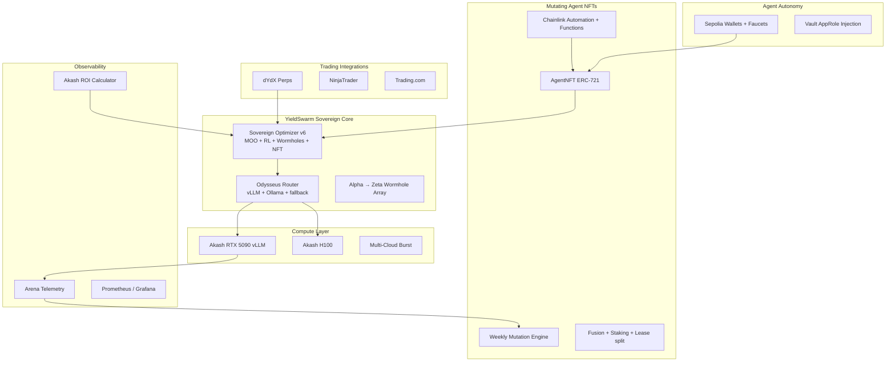

# YieldSwarm Alpha → Omega — Session Consolidation

Full additions from the SuperGrok / Apollo rapid-fire session (0 → now).

---

## System architecture (Mermaid)



---

## Major additions (by domain)

### Infra & RTX 5090 cluster

| # | Deliverable | Repo path |
|---|-------------|-----------|
| 1 | vLLM Dockerfile + entrypoint (continuous batching) | `deploy/vllm-rtx5090/` |
| 2 | Akash SDL (vLLM OpenAI :8000) | `deploy/akash-rtx5090-vllm.sdl.yml` |
| 3 | Ollama SDL + apt recovery (legacy) | `deploy/akash-rtx5090-ollama.sdl.yml`, `scripts/akash-buster-apt-recovery.sh` |
| 4 | Image build script | `scripts/build-vllm-rtx5090-image.sh` |
| 5 | Akash ROI calculator | `services/akash_roi.py`, `make akash-roi-5090` |
| 6 | Vault secret structure + Beefcake bootstrap | `docs/VAULT_SECRET_STRUCTURE.md`, `scripts/bootstrap-beefcake.sh` |

### Agentic core

| # | Deliverable | Repo path |
|---|-------------|-----------|
| 7 | Odysseus router (vLLM + scoring + fallback) | `backend/src/infrastructure/odysseus-router.js` |
| 8 | RTX 5090 telemetry (vLLM metrics) | `backend/src/adapters/rtx5090Telemetry.js` |
| 9 | Sovereign Optimizer v6 | `services/sovereign_optimizer_v6.py` |
| 10 | Cloud scheduler + async queue | `services/cloud_scheduler/`, `services/async_jobs/` |
| 11 | Multi-cloud burst scripts | `scripts/multicloud/` |

### Mutating Agent NFTs

| # | Deliverable | Repo path |
|---|-------------|-----------|
| 12 | AgentNFT Solidity (mint, mutate, lease) | `contracts/agent-nft/AgentNFT.sol` |
| 13 | Chainlink Functions source | `functions-source/mutate-agent.js` |
| 14 | Chainlink setup guide | `docs/CHAINLINK_AGENT_NFT.md` |
| 15 | Sepolia agent wallet | `src/agent/wallet/sepolia-agent-wallet.js` |

### Trading (scoped, not yet implemented)

| Platform | Phase 1 | Phase 2 |
|----------|---------|---------|
| dYdX | Signal generation in Arena | Semi-auto execution + risk limits |
| NinjaTrader | Strategy export | Backtest on H100/5090 |
| Trading.com | Signal distribution | Copy-trading bridge |

### Oracles

| Use | Primary | Secondary |
|-----|---------|-----------|
| NFT weekly mutation | Chainlink Functions + Automation | Off-chain batch + `triggerWeeklyMutation` |
| Trading prices | Pyth | Chainlink Data Feeds |
| Arena performance | Custom API → Functions DON | RedStone (future) |

---

## RTX 5090 economics (Oracle summary)

At **$0.72/hr** (~$518/mo @ 24/7):

- Break-even requires **~70–90 tokens/sec** sustained at **$0.20–0.30 / 1M tokens** with **>75% utilization**.
- Biggest lever today: **utilization**, not cheaper providers.
- vLLM + AWQ 4-bit + continuous batching typically beats Ollama 2–4× on throughput.

```bash
make akash-roi-5090
```

---

## Task index (270+ generated — top priorities for Cursor)

**P0 — Do now**

1. Fix apt on live 5090 container → `scripts/akash-buster-apt-recovery.sh`
2. Build + deploy vLLM image → `make build-vllm-rtx5090`, `make deploy-akash-rtx5090-vllm`
3. Set `RTX5090_VLLM_BASE_URL` on integration backend
4. Wire Arena to `/api/telemetry/5090` + `/api/inference/route`
5. Fund Akash wallet + `make akash-preflight`

**P1 — This week**

6. Prometheus scrape vLLM `:9090/metrics`
7. Sovereign Optimizer integration in `cloud_scheduler_agent.py`
8. Deploy AgentNFT on Sepolia + Chainlink subscription
9. Vault AppRole on 5090 SDL
10. dYdX signal-only module

**P2 — Scale**

11. H100 vLLM sibling deployment
12. Agent NFT marketplace UI
13. LayerZero bridge exploration
14. NinjaTrader strategy export API

---

## Related docs

- [`MASTER_GOD_PROMPT.md`](MASTER_GOD_PROMPT.md) — drop into Cursor for 560+ parallel agents
- [`AKASH_RTX5090_DEPLOY.md`](AKASH_RTX5090_DEPLOY.md) — deploy runbook
- [`ARCHITECTURE.md`](ARCHITECTURE.md) — Single Pane of Glass v2.0
- [`CHAINLINK_AGENT_NFT.md`](CHAINLINK_AGENT_NFT.md) — oracle + mutation automation
