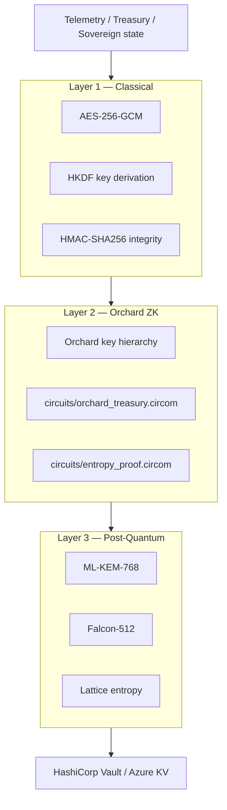

# YSLR — YieldSwarm Sovereign Layered Resilience

> Multi-layer encryption for sovereign loops, Kairo telemetry, treasury splits, and Helix state.

## Architecture



## Three layers

| Layer | Technology | Purpose |
|-------|------------|---------|
| **L1** | AES-256-GCM + HKDF + HMAC | Fast symmetric encryption + integrity |
| **L2** | Orchard-style keys + Groth16 circuits | Shielded commitments; prove valid splits/bounds without revealing values |
| **L3** | ML-KEM-768 + Falcon-512 + lattice entropy | Post-quantum hybrid; sovereign mutation seeding |

## API endpoints

### Backend (`:8080`)

| Method | Path | Description |
|--------|------|-------------|
| `GET` | `/api/yslr/status` | YSLR layer status |
| `POST` | `/api/yslr/encrypt` | Full 3-layer encrypt |
| `POST` | `/api/yslr/decrypt` | Decrypt + verify |
| `POST` | `/api/yslr/keys` | Generate key hierarchy |
| `POST` | `/api/yslr/telemetry` | Encrypt telemetry batch |
| `POST` | `/api/zk/verify` | Verify ZK proof bundle |
| `POST` | `/api/zk/prove/treasury` | Prove 50/30/15/5 split |
| `GET` | `/api/zk/circuits` | Circuit catalog |

### Kairo Python (`:8091`)

Mirrors above at `/api/yslr/*` and `/api/zk/*`.

## Quick start

```bash
export KAIRO_PQC_STUB=1          # dev without liboqs
export YSLR_CLASSICAL_KEY=...    # or Vault path

# Encrypt sample telemetry
curl -s -X POST http://127.0.0.1:8080/api/yslr/encrypt \
  -H 'Content-Type: application/json' \
  -d '{"data":{"driver_id":"drv-1","speed":55},"include_zk":true}'

# Prove treasury split
curl -s -X POST http://127.0.0.1:8080/api/zk/prove/treasury \
  -H 'Content-Type: application/json' \
  -d '{"total":1000000}'
```

## Python modules

| Module | Role |
|--------|------|
| `kairo/services/yslr.py` | Core encrypt/decrypt |
| `kairo/services/pqc.py` | ML-KEM + Falcon |
| `kairo/services/orchard_keys.py` | Orchard key hierarchy |
| `kairo/services/zk_treasury.py` | Treasury + telemetry proofs |
| `kairo/services/yslr_api.py` | HTTP handlers |

## Circuits

| Circuit | Path | Proves |
|---------|------|--------|
| Entropy | `circuits/entropy_proof.circom` | Telemetry within bounds |
| Orchard treasury | `circuits/orchard_treasury.circom` | 50/30/15/5 BPS split |

Build:

```bash
cd circuits && npm run build
# orchard_treasury: add to compile.sh
```

## Formal verification

Recommend **Ironwood-style** formal verification for Orchard circuits before MAINNET — see Zcash Orchard audit history.

## Vault paths

```
yieldswarm/runtime/core/yslr_classical_key
yieldswarm/runtime/pqc/kem_secret
yieldswarm/runtime/pqc/sig_secret
yieldswarm/runtime/orchard/spending_key   # never export
```

## Integration

- **Kairo registration** — `yslr_keys` in registration response (`identity.py`)
- **Helix YSLR phase** — encrypt before `signalsProcessed` increment
- **Great Delta** — ZK-verified emission splits via `prove_treasury_split`
- **Sovereign loops** — `sovereign_mutation_seed()` for Iteration-100

## Related

- `docs/PQC_MIGRATION.md`
- `KAIRO_IDENTITY.md`
- `docs/ZK_ENTROPY_SETUP.md`
