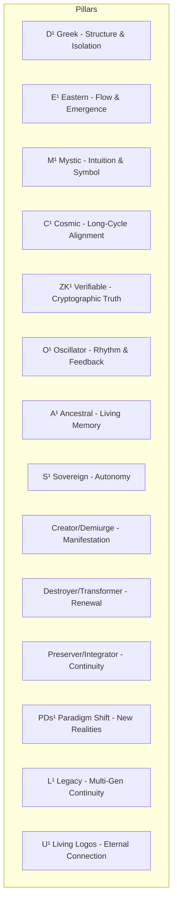

# YieldSwarm – Full Stack Deployment Overview

**Version:** Mayhem Mode v1  
**Date:** June 2026  
**Status:** Mainnet Acceleration Phase (Year 3)

## 1. Executive Summary

YieldSwarm is a 14-pillar helical architecture that unifies on-chain systems, AI agent infrastructure, zero-knowledge verifiable entropy, multi-cloud compute, and long-term memory layers. The system is designed for secure, modular, and scalable mainnet deployment with multi-generational continuity.

**Key Deployment Metrics**

- **17 Custom Domains**
- **18 Cloud Providers** (~$6,000 in active credits)
- **18 LLM APIs** integrated
- **454 Connecting Services** across the stack
- Plug-and-play cloud infrastructure templates
- TON Ecosystem Mini Game + Kairo Driver System fully integrated

## 2. 14-Pillar Helical Architecture

## 3. Deployment Architecture

### Core Components

- **17 Domains** — Edge-routed across frontend and backend services
- **Multi-Cloud Infrastructure** — 18 providers with ~$6,000 in credits
- **18 LLM APIs** — Routed through hardened multi-tenant infrastructure
- **454 Services** — Connected via modular service mesh
- **Plug-and-Play Templates** — Pre-configured for Akash, RunPod, Vast.ai, Azure, AWS, Google Cloud, and others
- **TON Mini Game** — Fully integrated with reward and telemetry loops
- **Kairo Driver System** — Real-world driver nodes feeding into the architecture

### Node Deployment Overview

All nodes can be deployed using pre-built infrastructure templates. The system supports rapid spin-up of:

- Akash GPU/CPU nodes (RTX 5090 / H100 clusters)
- Multi-cloud fallback instances
- TON ecosystem nodes
- Kairo driver telemetry nodes

## 4. Quick Deployment Summary

| Component | Deployment Method | Estimated Time | Notes |
|-----------|-------------------|----------------|-------|
| Cloud Infrastructure | Plug-and-play templates | < 2 hours | 18 providers supported |
| LLM Routing Layer | Pre-configured containers | < 1 hour | 18 APIs integrated |
| TON Mini Game | Pre-built deployment | < 1 hour | Reward + telemetry ready |
| Kairo Driver Nodes | Template + Zeeve support | < 3 hours | 3% profit share model |
| Full Stack (All Services) | Combined templates | < 6 hours | 454 services connected |

## 5. Current Momentum

- **Year 3** of original roadmap
- **90 days** into accelerated execution phase
- Strong operational partnership with **Zeeve** (node operations)
- Mainnet-ready architecture with verifiable entropy and mutating identity systems

---

**This document serves as both a technical reference and a living testimony of the YieldSwarm architecture.**
