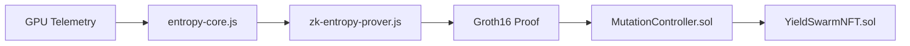

# ZK Entropy Proof Setup

Hardware telemetry entropy seeds can be proven in zero knowledge before NFT mutation. Raw telemetry (temperature, power draw, tokens/sec, error rate) stays private; the chain verifies a Groth16 proof over public `commitment` and `quality`.

## Architecture



| Component | Role |
|-----------|------|
| `src/infrastructure/zk-entropy-core.js` | Rolling 128-sample window → SHA-256 `seed` + `zkInputs` |
| `src/infrastructure/entropy-circuit-inputs.js` | Poseidon commitment + witness shaping |
| `src/infrastructure/zk-entropy-prover.js` | Off-chain `snarkjs` proof generation |
| `circuits/entropy_proof.circom` | Proves bounds + Poseidon chain + quality ∈ [85, 100] |
| `contracts/MutationController.sol` | On-chain verifier gate before `mutate()` |

**Public signals:** `[commitment, quality]`  
**Private inputs:** full 128×5 telemetry window  
**SHA-256 `seed`:** legacy identifier passed alongside the proof (not re-hashed in-circuit)

## Prerequisites

- Node.js ≥ 18
- [circom](https://docs.circom.io/getting-started/installation/) 2.1.x
- [Foundry](https://book.getfoundry.sh/getting-started/installation) (contract tests)

## 1. Compile the circuit

```bash
cd circuits
npm install
npm run build
```

Artifacts land in `circuits/build/`:

- `entropy_proof_js/entropy_proof.wasm`
- `entropy_proof_final.zkey`
- `verification_key.json`

> `circuits/build/` is gitignored. CI or deploy pipelines must run `npm run build`.

## 2. Generate a proof (off-chain)

```js
const { EntropyCore } = require("../src/infrastructure/zk-entropy-core");
const { proveEntropy } = require("../src/infrastructure/zk-entropy-prover");

const core = new EntropyCore();
let result = null;
for (const sample of telemetryBatch) {
  result = core.ingest(sample);
}

if (result) {
  const bundle = await proveEntropy(result);
  // bundle.calldata → { a, b, c, publicSignals }
}
```

Install prover deps at repo root:

```bash
npm install --save-dev circomlibjs snarkjs
```

## 3. Deploy contracts

1. Deploy `MockEntropyVerifier` on Sepolia for integration testing.
2. After trusted setup, export the real verifier:
   ```bash
   cd circuits
   npx snarkjs zkey export solidityverifier build/entropy_proof_final.zkey ../contracts/EntropyVerifier.sol
   ```
3. Deploy `YieldSwarmNFT`, then `MutationController`, then call `nft.setMutationController(controller)`.

## 4. Submit on-chain

```solidity
controller.submitEntropyProof(
    tokenId,
    seed,           // bytes32 SHA-256 prefix from entropy-core
    pubSignals,     // [commitment, quality]
    proofA,
    proofB,
    proofC
);
```

## 5. Run tests

```bash
# JS unit tests (commitment + entropy window)
npm install --save-dev circomlibjs
npm run test:unit

# Solidity (requires forge + forge-std)
forge install foundry-rs/forge-std --no-commit
forge test --match-contract MutationControllerTest
```

## Weekly mutation loop (integration sketch)

1. Ingest live telemetry until `EntropyCore.ingest()` returns a result.
2. Call `proveEntropy(result)` in the miner / backend worker.
3. POST proof bundle to your relayer or submit directly via `MutationController.submitEntropyProof`.
4. Index `Mutation` events from `YieldSwarmNFT` for metadata updates.

## Security notes

- Replace `MockEntropyVerifier` with the snarkjs-generated verifier before mainnet.
- Run an independent trusted setup ceremony for production (`circuits/scripts/trusted-setup.sh` uses Hermez pot14 for dev only).
- Rotate any API keys used for telemetry ingestion; never commit live secrets.
