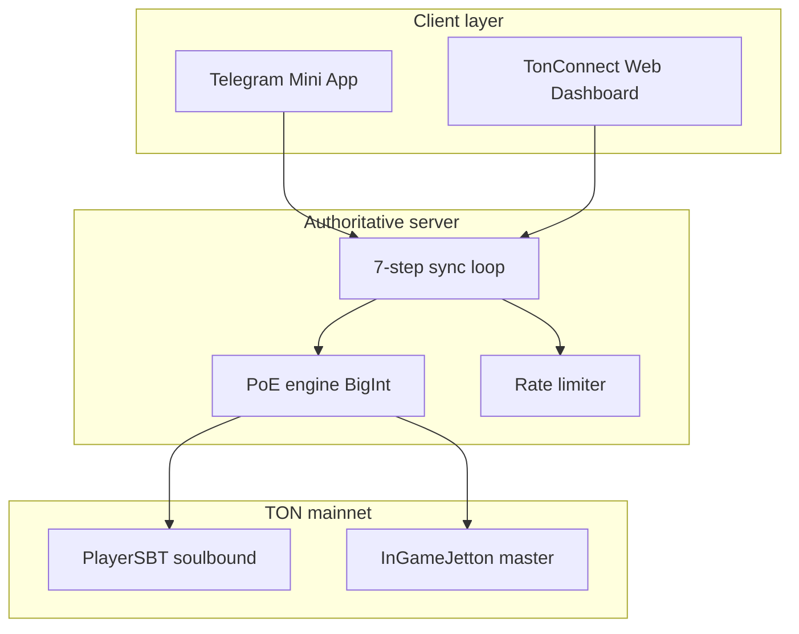

# TON MMORPG Architecture v1.0

Server-authoritative engagement game on TON. Execution runs off-chain; settlement anchors to **PlayerSBT** (soulbound) and **InGameJetton (IGJ)**.

## Principles

1. **Async TON actor model** — batch settlements; clients never mint directly.
2. **Separation** — real-time gameplay off-chain; economic state on-chain.
3. **Server-derived Δt** — read `last_update` from PlayerSBT; clamp; reject clock skew.
4. **Ed25519 session proofs** — bind wallet to server session; replay protection via nonce.

## 3-layer topology

## Secure 7-step synchronization loop

1. **Authenticate** — TonConnect `ton_proof` or TMA `initData` (validated server-side).
2. **Rate-limit** — per-wallet token bucket (Redis / in-memory).
3. **Load session** — server session state (activity score, caps).
4. **Read on-chain timestamp** — `get_last_update(wallet)` from PlayerSBT (**not client clock**).
5. **Compute Δt** — `min(now - last_update, MAX_DELTA_T)`; floor at 0.
6. **PoE accrual** — fixed-point BigInt nano/IGJ from Δt × activity; apply caps.
7. **Settle** — queue on-chain update (or batch); return proof hash + balances to client.

## Dashboard UX (wired in `client/`)

- **Session tag** — "accumulated this session" (server session accumulator).
- **Advanced proof panel** — collapsible; shows engine nano/IGJ values + caps.
- **Character state row** — on-chain hash + "Last synced X ago".

## Smart contracts

| Contract | Purpose |
|----------|---------|
| `PlayerSBT.tact` | Soulbound player record; `last_update`, accumulated nano |
| `InGameJetton.tact` | IGJ jetton master; server-gated mint/burn |

## Security model

| Threat | Mitigation |
|--------|------------|
| Time inflation | On-chain `last_update` for Δt |
| Replay | Nonce + session TTL |
| Rate abuse | Per-wallet limiter |
| Fake mint | Only server signer calls IGJ mint |

## Tech stack

- **Server:** Node.js + TypeScript, `@ton/ton`, Express
- **Contracts:** Tact, `@ton/blueprint`
- **Client:** React + TonConnect UI
- **Deploy:** Vercel (dashboard), Blueprint (contracts)

## Status

| Item | Status |
|------|--------|
| PoE engine (BigInt caps) | Implemented `server/src/poe/engine.ts` |
| On-chain timestamp reader | Implemented `server/src/sync/timestamp-reader.ts` |
| 7-step sync loop | Implemented `server/src/sync/sync-loop.ts` |
| Rate limiter | Implemented `server/src/middleware/rate-limit.ts` |
| Tact skeletons | `contracts/tact/` |
| Dashboard components | `client/src/components/` |
| TMA wrapper | Planned |
| Live IGJ balance reads | Planned |

## Next steps (prioritized)

1. Deploy PlayerSBT testnet + wire `PLAYER_SBT_ADDRESS` in server env.
2. Complete Ed25519 server signer for IGJ mint path.
3. Upstash Redis for distributed rate limits in production.
4. Telegram Mini App `initData` validation middleware.
5. `@ton/blueprint` CI test + testnet deploy script.

## Credential hygiene

Rotate any key ever pasted into chat. Use secret managers only — never commit `.env`.
